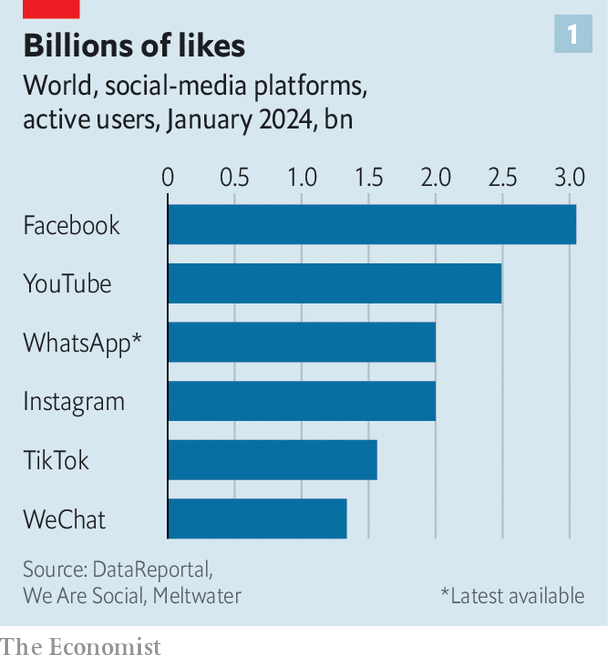
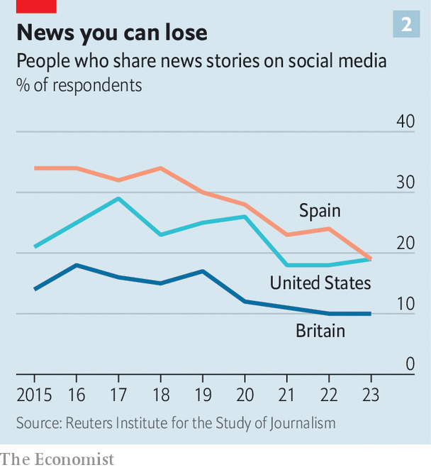

###### Not posting, but watching

# As Facebook turns 20, politics is out; impersonal video feeds are in 

##### Social media are more popular than ever, but social networks are dying 

 

> Feb 1st 2024 

“I’m a little intoxicated, not gonna lie. So what if it’s not even 10pm and it’s a Tuesday night?…Let the hacking begin.” So typed a 19-year-old Mark Zuckerberg, liveblogging from his Harvard dormitory as he began work on a website called Facemash. The site displayed randomly selected pairs of students’ mugshots, harvested from the university’s intranet, and allowed users to vote on who was hotter. It caused a stir and was promptly shut down. But before long, a successor was in the making. On February 4th 2004 Mr Zuckerberg launched a new site: TheFacebook.com.

 


Facebook, as it later became, quickly overtook established social networks such as Friendster and MySpace to become the world’s largest, a position it still holds on its 20th birthday. Today 3bn people—about 60% of all internet users—scroll its infinite feed every month (see chart 1). It has outwitted its rivals, or swallowed them, as it did Instagram and WhatsApp. Six of the ten most-downloaded mobile apps last year belonged to Meta, Facebook’s holding company, which is now the world’s largest seller of advertising after Google. Meta’s market value has surpassed $1trn; in the third quarter of last year it reported revenue of $34bn.

Facebook and its imitators have done more than make money. Social media have become the main way that people experience the internet—and a substantial part of how they experience life. Last year nearly half of mobile screen-time worldwide was spent on social apps (and more than a quarter of waking hours were spent on phones), according to Data.ai, a research company. The networks have become what Mr Zuckerberg and others call a digital “town square”, in which the arguments of the day are thrashed out and public opinion is shaped. Social media have fomented social movements, from #MeToo and #BlackLivesMatter to the Arab spring and the Capitol riot.

Feedster

Now, after two decades of evolution, the town square is being dug up and rebuilt. Following the arrival of competitors such as TikTok, powered by artificial intelligence, Facebook and other incumbents have been forced to reinvent themselves. Platforms that began as places for friends to interact and share their own content are turning into television-like feeds of entertainment, for passive consumption. At the same time, users are moving their conversations and arguments off the open networks and into closed, private groups on platforms like WhatsApp and Telegram. That migration, in turn, will have big implications for politics, in a year when countries with more than half the world’s population are heading to the polls.

Social media are more popular than ever. The average internet user spent nearly two and a half hours a day on social platforms last year, according to GWI, another data company. Usage ticked up during the pandemic and has not returned to pre-covid levels. As more people go online, more are signing up. Total time spent using social apps on Android devices, which account for about 70% of the world’s phones and tablets, has risen by 42% since 2020, to 2.3trn hours last year, according to Data.ai.

But the sort of social networking that Facebook pioneered is disappearing. The most obvious change is the shift to video on today’s networks. The explosive success of TikTok, a Chinese-owned short-video app which launched in 2017 and quickly had young people hooked, has sparked a wave of copycats. Meta has added a video feature called Reels to Facebook and Instagram. Similar products have been bolted onto Pinterest (Watch), Snapchat (Spotlight) and YouTube (Shorts). Elon Musk, who bought Twitter in 2022 and renamed it X, now claims it is a “video-first” platform. Of the 64 minutes per day that the average American spent on social media last year, 40 were spent watching video, up from 28 minutes three years earlier, estimates Bernstein, a broker.

The bigger change to social feeds is under the bonnet. At first, social networks showed chronological updates from users’ contacts: their friend just got engaged, their uncle was storming the Capitol and so on. As the volume of posts grew, the networks employed algorithms to prioritise posts that had proved popular among the user’s friends. Now a new phase has begun. TikTok decided that, rather than guessing what people would like based on their “social graph”—that is, what their family and friends liked—it would use their “interest graph”, which it inferred from the videos they and people like them lingered on. And rather than show content created by people they followed, it would serve up anything it thought they might like.

Every other big platform has followed suit. In 2022 Mr Zuckerberg announced that Facebook’s feed would become a “discovery engine” to seek out engaging content from around the internet. Since last year half of the posts X shows its users come from outside the network of people they follow. Threads, Meta’s Twitter-clone, launched last year with a similar approach. The resulting feeds of unrelated content from strangers can be jarring: “Here’s a healthy breakfast option! You should kill your mom!” quipped Bo Burnham, a YouTube comedian, in a satirical song. But users seem to like it. Time spent on Instagram has risen by 40% since Meta launched Reels. Even the geriatric Facebook somehow added 5m new users in America and Canada last year.

Google -

As users’ newsfeeds become unmoored from their network of friends and family, they are posting less about themselves. “The average user is now more of a consumer,” says Michael Bossetta of Lund University. In a survey last year by Gartner, a market-research company, only 28% of Americans said they liked documenting their life online, down from 40% in 2020. Some 61% say they have become more selective about what they post, finds Morning Consult, another research firm, which speculates that an influx of “influencer” content may have made users think “their everyday life is too mundane to justify frequent posts”. Video, the new format of choice, is harder to create than dashing off a quick status update. And some platforms, such as X, prioritise posts by users who pay, reducing incentives for the rest.

Instead, conversations have been moving for some time to private groups. In 2021 Mr Zuckerberg wrote that, as well as debating in the “town square” of Facebook and Instagram, “People increasingly also want to connect privately in the digital equivalent of the living room.” Adam Mosseri, head of Instagram, said last year that more photos and videos were being shared in direct messages than on the app’s main feed. “All the friends-sharing is moving in that direction,” he concluded. Morning Consult asked people how they would be most likely to recommend a movie. Only 30% said they would post on social media, behind the 43% who chose text or email and the 35% who opted for group chats.

At the same time, in the digital town square, fun is in and politics is out. Although (and perhaps because) social networks are accused of driving political polarisation, they seem increasingly eager to steer users away from news and current affairs. A study by Joshua Tucker of the Centre for Social Media and Politics at New York University (NYU) and colleagues compared a group of Facebook and Instagram users who were on chronological newsfeeds in the run-up to America’s election in 2020 with another group who used the platforms’ recommendation algorithm. Those using the chronological feed saw 15% more political content on Facebook and 5% more on Instagram than those who were fed by the algorithm. (They also saw a lot more information from what Meta classified as untrustworthy sources: 69% more on Facebook and 22% more on Instagram, albeit from low bases.)

Since then, the platforms have shied even further from news. The U-turn has been sharpest at Meta, whose boss said ten years ago that he wanted Facebook’s newsfeed to be a “perfect personalised newspaper for every person in the world”. The firm now says that news makes up less than 3% of what people see on the platform. Mr Mosseri, who is also in charge of Threads, wrote at its launch last year, “Politics and hard news are inevitably going to show up on Threads…but we’re not going to do anything to encourage those verticals.” A week later he added, “From a platform’s perspective, any incremental engagement or revenue they might drive is not at all worth the scrutiny, negativity (let’s be honest), or integrity risks that come along with them.”

A campaign by some publishers to make social-media firms pay to share their content has reinforced the networks’ view that news is more trouble than it is worth. In Canada, which will hold a general election this year or next, Facebook and Instagram are blocking all news content, in response to a demand by the government that Meta pay publishers for hosting links to their stories. Under Mr Musk, who is scathing about what he calls the “legacy media”, X has removed headlines from posted news articles, and appeared to throttle traffic to out-of-favour publications such as the .

The squeezing of news has been felt by publishers, some of which had built their business around the platforms. Last year the amount of internet traffic sent from Facebook to media companies fell by 48%, and from X by 27%, according to Chartbeat, which measures such things. Former kings of the viral social-post have struggled: last year BuzzFeed News shut down and Vice News drastically cut back.

 


As they see less news in their feed, people are becoming less likely to share or comment on the news in public (see chart 2). Whereas in 2018 some 26% of people reported sharing news articles on social media at least weekly, last year only 19% did, according to a 36-country study by the Reuters Institute at Oxford University. The decline in sharing seems to affect the amount of political content in particular. Mr Tucker and colleagues found that removing shared content from users’ Facebook feeds reduced the amount of political news they saw by more than half. (Again, it also reduced the amount of content from suspect sources, by nearly a third.) The authors found that this left the users less knowledgeable about the news—though they did not find evidence that it had changed their minds about anything much.

The decline of sharing and posting has given rise to what the Reuters Institute calls the “passive news consumer”, who sees the news but doesn’t comment, share or otherwise engage with it. This trend is most advanced in rich countries: in Britain 68% of adults are “passive” consumers of news, with only one in ten posting about it in a typical week. The remaining hard core of “active” participants in the online public square are disproportionately male, and highly opinionated. A third of those who call themselves “very” right or left-wing still take part, whereas only 22% of centrists bother weighing in.

For political strategists, “the job has totally changed”, says Teddy Goff, who ran Barack Obama’s digital campaign in 2012 before co-founding Precision Strategies, a consultancy. In the past the dominance of a handful of mega-platforms meant there was “a sort of political monoculture”, he argues. “At least in major moments, like an election campaign, something could happen and the whole country could hear about it pretty quickly… It doesn’t work that way any more.” Today different groups lurk in different places. Young people are on Snapchat. Journalists cling to X (while claiming to hate it). LinkedIn is the best place to reach parliamentary aides, says an activist in Britain. So politicians need to be everywhere. Joe Biden has even joined Truth Social, the social network owned by his Republican rival, Donald Trump. 

“It’s a lot, lot, lot harder for us to reach the same number of people as we used to,” says Matthew McGregor, another former Obama staffer who runs 38 Degrees, a British campaigning outfit. Social networks’ algorithms serve up less political content, he finds, and the way they optimise for engagement incentivises provocative posts. “We need to make people laugh, make people cry, or make people angry,” he laments. He admits to wrestling with how far to push this. “It’s a simple fact that you can get more numbers by being a bit more vitriolic, by being a bit more critical, by being a bit more personal…There is a tension and it is hard.” Candidates with uncompromising messages seem to travel furthest.

The surest way to win attention, of course, is to pay for it. American candidates and their backers will spend nearly $16bn on advertising in the run-up to November’s elections. Television will take the lion’s share: its ageing audience puts off some advertisers, but not politicians, who know that the elderly vote. TV ads are still believed to be the best when it comes to persuasion; those on social media are mainly about fundraising. Still, more than a quarter of American political-ad spending in this cycle will be on digital platforms, forecasts Insider Intelligence, a research firm. In the past week alone, Mr Biden has spent more than $750,000 on ads just on Facebook and Instagram.

But even candidates willing to pay are finding it harder to get their message out in the new public square. For one thing, some of the new digital platforms don’t want their money. TikTok bans political advertising altogether. Threads, less than a year old, does not yet sell ads at all. Streaming services, which make up a bigger share of TV viewing in America than either broadcast or cable, are also wary: Netflix, Amazon Prime Video and Disney+, the biggest streamers, all refuse to take political ads for now, though that may change.

The bigger problem is that political ads on social media don’t work as well as they used to. Anti-tracking changes introduced by Apple in 2021 have made it harder to target ads and so reduced the return on investments in them. Spending on Facebook ads will be lower in this election cycle than in 2020, predicts AdImpact, a consultancy, even though total political ad spending is expected to be up by 30% or so. 

In the past six months politicians spent $244m on ads on Facebook and Instagram in America, down from $320m during the same period in the 2020 cycle, according to our analysis of data collected by Andrew Arenge, a researcher at the University of Pennsylvania. Meta’s ad library shows that in the 90 days before the Iowa caucuses last month, Donald Trump spent only about $400,000 on the two platforms. “These are pretty startling numbers compared with what we’ve seen in years past,” says Reid Vineis of Majority Strategies, a Republican consultancy. His explanation: “The platform is less effective.”

 


As social networks bury political posts, email is proving a useful way of sidestepping Silicon Valley’s algorithms. “There isn’t some big, bad Mark Zuckerberg or Nick Clegg [another Meta executive] sitting in California deciding whether or not we get to email people, and whether people get to open those e-mails,” says Mr McGregor. The most effective way to make something go viral on Facebook, 38 Degrees finds, is to email its members and ask them to post it there. Morning Consult argues that, given the wilting of online sharing, brands will need to come up with messages simple enough to be remembered and passed on in person, rather than creating memes designed to be shared.

NotYourSpace

Hardest of all is infiltrating the millions of small group-chats into which the public square has splintered. What goes on in these encrypted spaces is opaque, even to the platforms that operate them. But the groups seem to be picking up some of the slack in terms of news-sharing. The proportion of adults posting news articles weekly via instant-messaging platforms rose from 17% to 22% in the five years to 2023, the Reuters Institute found.

Getting into the group chats pays dividends for campaigners. A recent petition by 38 Degrees to strip a bungling former boss of Britain’s Post Office of a medal—the kind of campaign that in the past would have relied on Facebook—got the most traffic from its email list, and the second-most from WhatsApp.

Elections were easier to fight when there were just a few big social-media platforms, acknowledges Mr Goff. However, he says, “I don’t think it was altogether good when it was more of a public square…These are channels that put their thumbs on the scale for certain kinds of content over other kinds of content.” The design of the platform is such that, “You’re going to have a laugh about a stupid gaff, or a hot-mic moment or something like that, and not have good-faith, in-depth conversations about what we ought to do about Gaza.”

Good-faith debate can be hard to find online. But campaigners report that getting people to share something in a group chat calls for a calmer tone than grabbing their attention on the open platforms. “They don’t want their friends to think, ‘Oh God, here he goes again…why is he always whanging on at us about this annoying issue?’” says Mr McGregor. As debate shifts from open platforms to small groups, he says, “Maybe we’re going back to the coffeehouse from the public square.” ■

