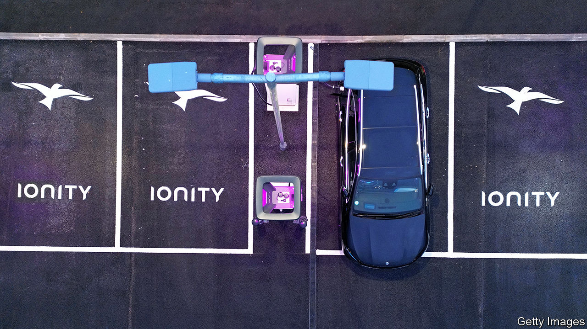
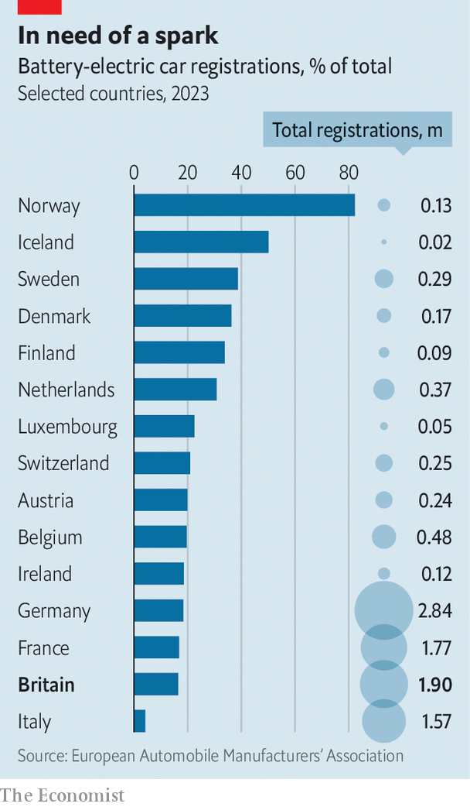

###### The charge is sputtering

# EV sales in Britain are disappointing expectations 

##### Pothole or roadblock? 

 

> Feb 1st 2024 

Sales of electric vehicles in Britain have taken off in recent years. The number of EVs has gone from fewer than 4,000 just over a decade ago to more than 975,000, roughly one in every 34 cars. Lately, however, growth has stalled. Has the market hit a pothole or a roadblock? 

In 2023 EVs’ share of the car market fell for the first time since they first emerged in showrooms, slipping to 16.5% of new sales, down from 16.6% the prior year. The Office for Budget Responsibility (OBR), the government’s fiscal watchdog, says EVs will now account for 38% of new car sales in 2027, compared with its previous forecast of 67%. Having sated demand from early adopters, cracking the mass market is proving tougher. 

 


Growth is cooling in other European countries, too. Concerns about affordability, range and charging infrastructure weigh on consumers elsewhere. Yet changes in policy have raised particular uncertainty over how quickly British drivers will switch to . In contrast to Britain, EVs’ share of car registrations was up by nearly 4% year on year in Germany in 2023 and by more than 26% in France. 

Unlike other countries, Britain has phased out most handouts for individual EV buyers, including a £5,000 ($6,330) electric-car grant that was whittled down and then axed in 2022. The government’s decision last year to delay a ban on sales of new petrol and diesel cars from 2030 to 2035 threatens to slow things further. 

The Society of Motor Manufacturers and Traders (SMMT), a trade group, argues that more incentives are needed to stimulate EV uptake. At £50,873 ($64,575), the typical EV is up to 40% more expensive than a new petrol or diesel car. The SMMT reckons that slashing VAT for three years would put 270,000 more EVs on the road. 

Competition is already doing some of the job. Fiat, an Italian car brand (whose owner’s largest shareholder, Exor, part-owns ’s parent company), has launched its own electric-car grant, worth £3,000, in a bid to convince motorists to switch from petrol or diesel. Tesla, which sold a car every ten minutes in Britain in 2022, is rolling out discounts at a furious pace. The average discount on new EVs reached 10.6% at the end of 2023, up from 4.8% at the start of that year and above the average 7.3% discount on a traditional car, according to Auto Trader, an online marketplace. An influx of cheaper  is expected to boost affordability; prices are falling in the second-hand market. 

Binding targets for zero-emission sales are the biggest reason for long-term optimism. New laws requiring 22% of carmakers’ sales in Britain to be electric came into force this year; that target will ratchet up, to reach 100% by 2035. The new rules do offer carmakers some wriggle-room, including the ability to purchase credits from other manufacturers that exceed their targets. But Fitch Solutions, a data provider, predicts that passenger EV sales will grow by around 18.4% annually over the next eight years. That is slower than its previous forecast; it is hardly reverse gear. ■


