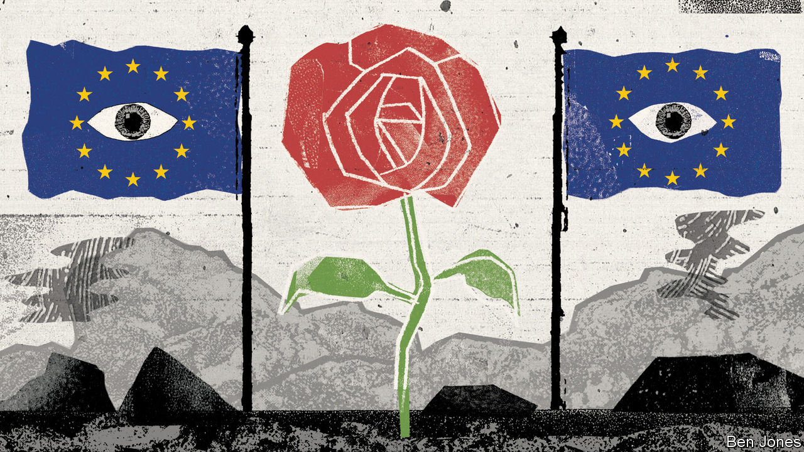

###### Ever closer?

# How does the EU view the Labour Party? 

##### The EU would welcome a Starmer-led government. That does not mean it would be generous 

 

> Feb 1st 2024 

THE IMMEDIATE reaction of European leaders to a widely expected Labour election win later this year would be a sigh of relief. After eight years of often tense relations with several Tory prime ministers, dealing with a pro-European Labour one would make a pleasant change. The EU remains by far Britain’s largest trade partner; indeed, its share of British total trade has been rising in recent years. The  has added to the case for closer cross-channel co-operation. It helps that old fears that Brexit might be copied by others in the EU have largely evaporated.

Yet Sir Keir Starmer, the Labour leader, remains cautious about Britain’s relationship with the EU. He has promised not to reverse Brexit, and has ruled out rejoining the single market or the customs union. Instead, he wants to , a task already begun under Rishi Sunak, the prime minister. A year ago Mr Sunak signed the Windsor framework to simplify border checks between Great Britain and Northern Ireland (this week the  swallowed their opposition to this and agreed to return to devolved government in Belfast). Britain has also rejoined the EU’s Horizon and Copernicus scientific-research projects. 

On the other side of the Channel, too, a warm welcome may not signal big changes. EU leaders have bigger problems to deal with. The war in Ukraine, a stuttering economy, a renewed migration crisis, the rise of far-right parties and the opening of debate over the club’s next eastward enlargement all seem more pressing than improving relations with a former member. Officials note proudly that the Brexit trade deal signed by Boris Johnson in early 2020 is tilted pretty heavily in the EU’s favour by providing for broadly free trade in goods but not in services.

The trade deal is up for review in 2025. But Fabian Zuleeg of the European Policy Centre, a think-tank in Brussels, detects no appetite for a fundamental renegotiation. Even resolving an array of niggling bilateral problems may be tricky. 

One EU ambassador says a big priority for Europeans is improved mobility. Brexit has made it harder and more expensive for musicians, schoolchildren, interns and young people to travel in both directions. Red tape and visa costs could be reduced without bringing back unrestricted free movement. The Europeans would also like Britain to rejoin the Erasmus scheme for student exchanges, though that may be opposed by the Treasury as it will cost money. Mutual recognition of professional qualifications is also complicated, because it touches on the single market.

Labour has proposed a veterinary agreement that would facilitate trade in farm products as well as further reducing border checks between Great Britain and Northern Ireland. Sir Keir has also talked of broader alignment with EU regulations in areas ranging from chemicals to carbon pricing. Yet EU officials are still nervous about British cherry-picking of bits of the single market that it likes without taking on the associated obligations. 

A veterinary deal, for example, would imply acceptance of a role for the European Court of Justice, and maybe even payments into the EU budget. It is not clear that  for this, let alone a Tory party that may lurch in a more anti-European direction after the election. Indeed, the risk that a future Conservative government might reverse any deals done by Labour will make them harder to agree.

The most promising path lies in areas where the EU sees benefits for itself. Laurence Boone, France’s outgoing Europe minister, says this is most obvious in foreign and security policy, where closer links between Britain, France and Germany are desirable. The political declaration preceding the trade deal envisaged such co-operation, but Mr Johnson rejected the idea. Wars and rising tensions with Russia and China underline the need to stick together. As Mujtaba Rahman of the Eurasia Group, a consultancy, notes, so does a possible return of Donald Trump to the White House.

None of this will satisfy those around Sir Keir who would dearly like to rejoin the EU. But that is implausible for now, especially if the Tories are opposed. Entry negotiations would take years, and the terms would be less favourable than before Britain left. Moreover, the EU is changing fast. In the foreseeable future it may expand to include several more eastern neighbours (including Ukraine), its spending and borrowing are likely to grow and almost all of today’s members will become large net contributors to the budget.

Breternal optimism

British pro-Europeans may yet find crumbs of comfort in this prospect. For many agree with Ms Boone that an EU with as many as 35 members cannot work as now. An unofficial Franco-German paper published in September envisaged a tighter core of members committed to ever-closer union alongside a looser group that might be associate members but retain access to the single market. Anna Lührmann, Germany’s Europe minister, talks of “flexegration”. A multi-tier, multi-speed Europe might appeal not just to aspirant eastern members but also to non-members like Britain, Norway and Switzerland. 

A new Labour government is not likely to lead to transformed relations with the EU. But cross-channel links that have dwindled since the Brexit vote in June 2016 would be strengthened. Some bolt-on agreements ought to be doable. And in time Britain’s European destiny might take a different form entirely. ■


