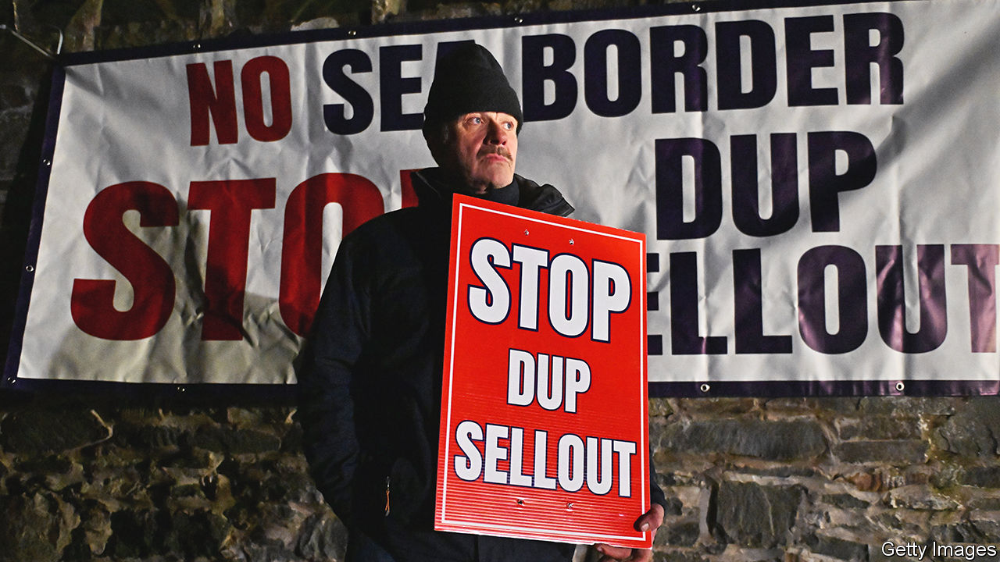

###### The power comes back on

# Northern Ireland gets its government back 

##### But the deal reveals fissures within the DUP and in Westminster 

 

> Jan 31st 2024 

It was more like something from a spy thriller than a seminal political meeting. On the night of January 29th Sir Jeffrey Donaldson, the leader of Northern Ireland’s Democratic Unionist Party (DUP), planned to persuade his party to return to the province’s devolved government. He had sent the media to another location. Even the 130 members of the party’s ruling executive weren’t told where they were going until a few hours beforehand.

He needn’t have bothered. Among those present in a room at the Larchfield Estate outside Lisburn, a city south-west of Belfast, was at least one person wearing a wire. As Sir Jeffrey spoke, his words were being broadcast live to Jamie Bryson, an activist who live-tweeted the juiciest morsels. Pandemonium ensued as the party tried to plug the leak. Members were ordered to turn off their phones; accusations were levelled at police bodyguards. 

Despite the chaos, the meeting eventually settled on a decision to restore Northern Ireland’s devolved government after a two-year absence. The power-sharing government had collapsed when the DUP, the largest unionist (pro-British) party, walked out. The DUP had been losing support among its base because Britain’s Brexit deal with the EU had established a customs and regulatory border in the Irish Sea. That ensured the Irish land border remained open and protected the EU’s single market, but at the cost of erecting barriers between Britain and Northern Ireland. 

Some of these barriers were lowered by the Windsor Framework, a  reached by the EU and Rishi Sunak in 2023. As the price of re-entering government Sir Jeffrey has secured a raft of other measures designed to reassure unionists that they remain British. The “green lane” established by the Windsor Framework for British retail goods entering Northern Ireland and staying there will be called the “UK Internal Market Lane”; there will be no routine checks on such items. A new law will commit to never putting up barriers to Northern Irish produce entering Britain. Such measures give Sir Jeffrey something to trumpet, but in neither Westminster nor Belfast do they heal the fissures of Brexit.

One element of the deal is a requirement for government ministers in London to attach a statement to every new law clarifying whether it will harden the Irish Sea border. Brexiteers fear that could give some ministers the cover they desire to slow divergence from EU standards. If that happens, tiny Northern Ireland, with less than 3% of the British population, might be seen as a brake on what to many Leavers was the whole point of the enterprise—breaking free from Brussels. Far from reinforcing the union, that could strain it. 

The faultlines within unionism in Northern Ireland have not disappeared either. By causing the collapse of the province’s government in 2022, Sir Jeffrey aligned himself with the most extreme elements of unionism. He promised them that he would return to Stormont only if he had got rid of the sea border. 

This was a pledge he could not fulfil; . That opens Sir Jeffrey to accusations of betrayal from hardliners such as Mr Bryson, a provocateur who wants to undo the Good Friday Agreement, the deal struck in 1998 to end 30 years of sectarian strife, and who has contacts with loyalist paramilitaries who retain guns and thousands of members. (He denies being a member of any such groups.) Mr Bryson wields more influence than many politicians because of his social-media following and headline-grabbing stunts. His views of the deal are shared by many within the DUP; more than 40% of Sir Jeffrey’s party officers oppose it. 

Even when the DUP was far more united, devolved government in Northern Ireland, a system in which diametrically opposing parties have to share power, has rarely been stable. This time, moreover, staunch unionists have to swallow the fact that elections (which took place in 2022, three months after the government collapsed) have changed the political landscape. The first minister, Michelle O’Neill, will be from , a nationalist party that was once the political wing of the IRA, the dominant terrorist group in the region. For the first time in the 103-year history of Northern Ireland, the province will be led by someone who doesn’t even want Northern Ireland to exist. 

Sinn Féin’s moment of triumph does not mean a united Ireland is imminent. Even after the chaos of the post-Brexit period and two years in which public services have been degraded by the absence of devolved government, support for Irish unity has only risen modestly. But each time the government collapses, it chips away at the hope that Northern Ireland would flourish once the killings of  stopped. The DUP’s decision to return to the Northern Ireland Assembly in Stormont is good news. But plenty in the province think that this is the last chance for devolution to show that it can work. ■


