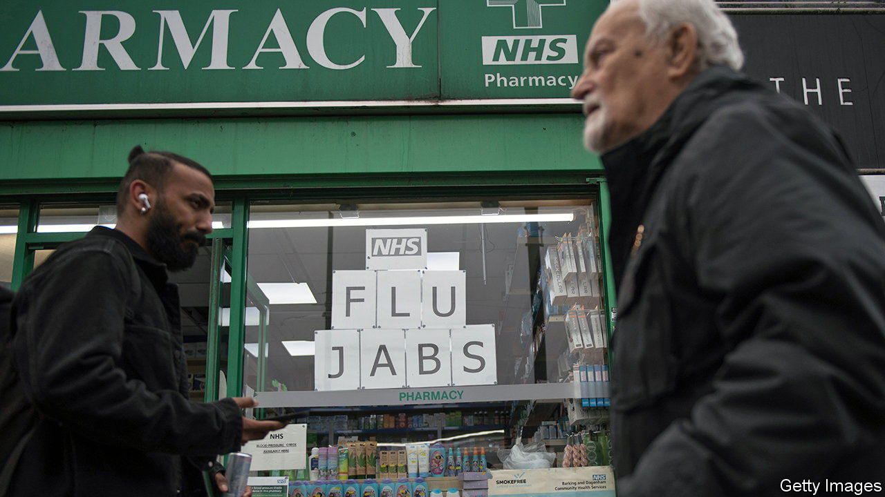

###### As prescribed

# The pharmacist will see you now 

##### A sensible reform to ease pressure on family doctors in England 

 

> Feb 1st 2024 

Harry Enfield, a comedian, once drew laughs by playing an indiscreet chemist who mortified his customers. He inquired loudly into their bowel movements, commented on a wife’s positive pregnancy test after her husband’s vasectomy and interrupted one man mid-flirtation to inquire about his herpes. The character was sanctimoniously unimportant. “Where there is despair, we bring hope; where there is pain, we bring relief,” he intoned. “Where there is darkness we bring light: especially when developing photos.” 

Pharmacists are no longer figures of fun. On January 31st England rolled out a new scheme called Pharmacy First, which gives them power to prescribe treatments for seven common ailments, including ear ache, urinary-tract infections (in women) and shingles. The National Health Service (NHS) reckons this could free up as many as 10m appointments each year in general practice, where patients can often wait weeks for a consultation with a family doctor. The scheme also signals a philosophical shift— as the first port of call for all patients.

In some ways, this has been a long time coming. Before the creation of the NHS pharmacists were “father confessors” who spent many (unpaid) hours advising their customers. More recently, they have been entrusted to deliver covid-19 vaccinations, contraception services and blood-pressure checks. It’s “a natural next step”, says Niamh McMillan, the superintendent pharmacist for Superdrug’s 190 pharmacies across Britain. (Scotland and Wales have already introduced their own versions of the scheme.) The profession is enthused by the additional responsibilities: encouraged by financial initiatives, 90% of pharmacies have signed up to the scheme.

But for Pharmacy First to work well, plenty of things have to fall into place. Pharmacies will need more time to cope with added demand: some are hiring more technicians and using robots to dispense electronic prescriptions. They will also need training. Among other things, Superdrug is teaching staff how to use an otoscope, a hammer-shaped device that can distinguish ear infections from earwax. 

Despite the injection of cash to accompany the scheme—the largest for community pharmacies in over a decade—the industry remains underfunded. It gets 90% of its income from the NHS, which has funding pressures of its own. The number of pharmacies in England has fallen by more than 1,000 since 2015. These closures have affected patients’ confidence, says William Pett of Healthwatch England, a public body representing patients. 

So too have recent drug shortages, caused by global supply-chain issues, the lingering effects of Brexit and, in some cases, increased demand for products promoted by celebrities. All have conspired to create a game of “pharmacy bingo”, says Mr Pett, in which patients must run around ticking off pharmacies until they find the drugs they need. 

Despite these problems, it is easy to imagine the role of community pharmacies expanding further. In the middle of a measles outbreak, for example, it seems absurd that pharmacies cannot yet offer measles vaccinations. The sector has the capacity to save 42m GP appointments, or around 12% of all appointments annually, reckons the Company Chemists’ Association, an industry body. 

Nick Kaye, a pharmacist in Cornwall, is testament to how much has already changed. When he first owned a shop with his father over a decade ago, it had a café upstairs, sold deodorants and sun cream, and, like Mr Enfield’s comic creation, processed photographs. Today the coffee and cameras have gone. “We’re a place of clinical care,” says Mr Kaye, who already offers walk-in consultations. If general practice is the front door to the NHS, then pharmacy is fast becoming its side entrance. ■


