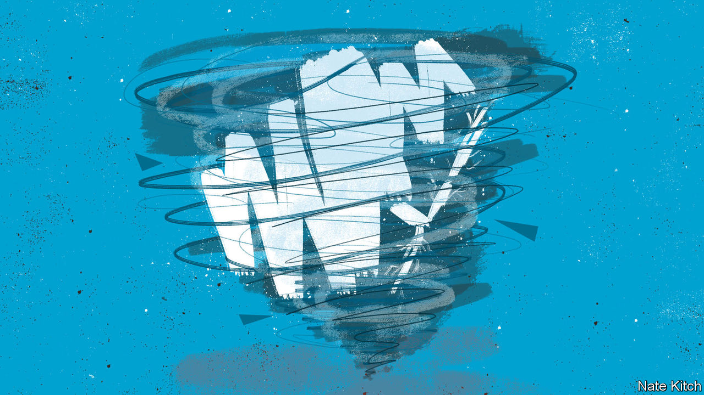

###### Bagehot

# The search for Conservative Party unity 

##### The most powerful urge in British politics 

 

> Feb 1st 2024 

IF AN ELECTORAL atom bomb reduced the Conservative Party to just two MPs, it would still be deeply divided. Sir John Hayes is the MP for South Holland and the Deepings, the safest Tory seat in Britain. He is the chairman of the Common Sense Group, a caucus which believes in a cultural struggle against wokery, mass immigration, the Human Rights Act and people Sir John calls “globalists”. The second safest Tory seat, and its geographic neighbour, is Boston and Skegness, held by Matt Warman. He is a rising star of the One Nation Group, a rival tendency of Tory centrists who believe in the defence of institutions and fiscal prudence and who are at ease with social change. 

These two very different Tories are nonetheless usually found in the same voting lobby at Westminster. Like a lunar orbit sustained by the interplay of centrifugal force and gravity, the Conservative Party is trapped between two opposing instincts. One is ideological division, the other a craving for unity. The struggle to reconcile them is the cause of most of its agonies.


At the moment the party is defined primarily by its divisions. It has broken into an alphabet soup of factions. Tory leaders change more often than they used to and the resulting cabinet reshuffles are more brutal. (Anthony Eden sacked one colleague on taking office in 1955; Rishi Sunak fired 17, notes Nicholas Allen, an academic.) On January 23rd Sir Simon Clarke, a former cabinet minister, attempted to trigger a putsch against Mr Sunak himself, warning that the party “will be massacred” at the next election if he stays. MPs disagree on, inter alia, the European Court of Human Rights, the merits of Donald Trump, the Rwanda deportation scheme, tobacco control, net zero and house building. Some of these disputes can be fudged but many cannot. 

It may seem like a miracle that the party doesn’t split. But there are good reasons it does not. Unity is strategy. The Tory party has governed Britain for 68% of the 106 years since the granting of universal male suffrage because it has united a right-leaning electorate with a wide coalition of MPs and fluid policies. David Marquand, an academic, has termed the failure of leftists to form a united front the “progressive dilemma”. For conservatives, there has been no question of a regressive dilemma: the Tory party has been the only game in town. Preventing a split on the right—first from the UK Independence Party and now from Reform UK—has been a driving force within the government for the past decade. 

Unity is also psychology. Being an MP is a lonely job. The burden of constituents, the opposition, the press and bullies on Twitter creates a siege mentality; their colleagues may be loons, but they are their loons. Lee Anderson resigned as deputy chairman of the Tories in January in order to vote against legislation to enact the government’s Rwanda scheme, only to abstain because “the Labour lot were giggling and laughing and taking the mick.” The party can inspire almost Leninist loyalty. Theresa May fought back tears as she was forced from Downing Street in 2019; months later she was campaigning on behalf of her nemesis, Boris Johnson. 

Leonard Stark, an academic, has written that all party leaders are chosen according to a hierarchy of priorities that puts unity above electability and electability above competence. Mr Johnson, who had few fixed views, promised that only he could weld together a party that had fractured over Brexit. Unity undid him in turn. He was toppled in 2022 after his colleagues resigned en masse. “The herd instinct is powerful,” lamented Mr Johnson at the time. “And when the herd moves, it moves.”

Unity is easier when you have few rules. The Labour Party is a 20th-century bureaucracy whose direction is set by committees, conferences and endless motions. The Tory party is a preliterate tribe which finds consensus informally through MPs listening to speeches, hammering the tables and saying “yeeeyeeeyeeeyeee”. In Labour factional dominance requires capturing the machine; among Tories, it means winning the argument. A rare point of institutional rigidity—a rule by which Tory MPs can challenge their leader if they submit a certain number of confidential letters—is a source of destabilisation that many would like to jettison.

For all the noise, Mr Sunak’s government can be surprisingly harmonious. He secured a difficult new deal with the EU last year with only 22 rebels, and has only lost one vote during his tenure as prime minister. But the price of unity has also been a lowest-common-denominator agenda: Mr Sunak often prefers to water down legislation than risk a rift. The Rwanda bill is a piece of factional equipoise that no one thinks will work. A decisive party would have either hardened the bill or killed it; instead Tory MPs voted it through with only 11 rebels. 

We’re all in this together

Unity can also seem irrational. Most of Sir Simon’s colleagues think that he has lost his mind in trying to install the party’s fourth prime minister in a single parliament. His supporters counter that the real madness lies in uniting around a leader who is steering their party to defeat. (Mr Sunak’s approval rating is net -46, according to Ipsos, a pollster; Sir John Major scored -30 in January 1997, ahead of his landslide defeat to Sir Tony Blair later that year). Division is better than unifying around something voters don’t want, runs the argument.

Many Tories are holding fire until after the election, and what is expected to be a battle to reshape the party. Rival factions are studying electoral projections to tally up how many allies will keep their seats. A foretaste of the jockeying will come on February 6th when Liz Truss will launch a new movement that she optimistically calls “popular conservatism”. But the winner of any future leadership contest will almost certainly pledge to unify a rump party. The Tories are itching for a clarifying schism but they are more likely to muddle through. It is a safe bet that Mr Warman and Sir John Hayes will remain uncomfortable political bedfellows. ■


