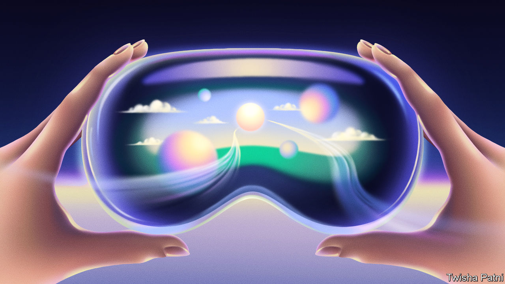
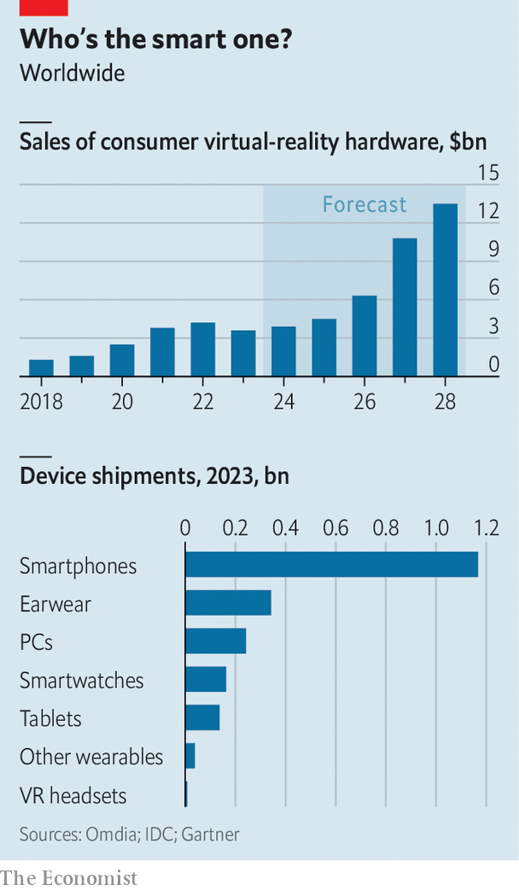

###### After the iPhone

# Apple’s Vision Pro headset ushers in a new era of personal technology 

##### Tech firms are racing to build the gadget that supplants the smartphone 

 

> Jan 31st 2024 

Apple fans have eagerly awaited February 2nd to get their hands on the tech giant’s latest gadget, a new augmented-reality headset called the Vision Pro. Some early reviewers complained that it caused headaches and had a two-hour battery life. Many potential buyers will be put off by the price tag of $3,499. Still, perhaps 200,000 have been pre-ordered, about 40% of what Apple had reportedly expected to sell this year. Tim Cook, Apple’s boss, has described trying the Vision Pro as an “aha moment”. “You only have a few of those in your lifetime,” he added. 

Aha or not, the Vision Pro is part of a trend. In September techies got excited about a new pair of smart glasses made by Meta, Facebook’s parent company, and Ray-Ban, an eyewear brand. The spectacles are controlled by voice and can play music, send texts and film everything you see. Two months later Humane, a startup founded by former Apple executives, launched the Pin, a brooch with which users interact by talking and gesticulating. In January the r1, a voice-controlled gizmo half the size of a smartphone, enthralled attendees at the Consumer Electronics Show in Las Vegas. Its maker, a startup called Rabbit, has sold nearly 100,000. 

What all these devices have in common is that they mostly do away with screens, keyboards and mice. Thanks to “generative” artificial intelligence (AI), computers are getting good at listening to, reading and watching stuff—and understanding it. That means hardware can be controlled by voice, gesture or image rather than touch. AI is thus enabling new “form factors”—tech-speak for gadgets in new shapes and sizes, just as the iPhone looked different from older handsets.

Silicon Valley’s elite are cheering on the potential shift. They believe AI could create a new market for consumer hardware, replacing the smartphone as everyone’s essential device. Sam Altman, boss of OpenAI, the startup behind ChatGPT, is reportedly in talks to start a firm with Jony Ive, former head of design at Apple, to make a gadget purpose-built for AI. Satya Nadella, chief executive of Microsoft, an AI-ambitious tech titan, recently said that “once you have a new interface…new hardware is also possible.” 

One reason for all the excitement about new gadgets is that the old ones are looking unexciting. Last year 1.2bn smartphones were sold worldwide, down by 3% from the previous year and the lowest level for a decade, according to IDC, a research firm. PCs did even worse, declining by 15% in 2023 to 242m units. Cash-strapped consumers are opting for cheaper alternatives, such as second-hand devices, or holding on to their current ones for longer. 

The hope is that they may be persuaded to fork out for all-new gadgets because they offer something that old ones do not. AI could, for instance, make using devices more seamless and more personal. Users can tell or gesture to the r1 to hail a ride, order food or play music without the need to toggle between apps. It also learns from users’ previous actions. Until now people had to adapt to software, says Vinod Khosla, a veteran venture capitalist and early backer of Rabbit. In the r1, “the AI adapts to you.” 

New gadgets are also less finicky to develop and manufacture. Lior Susan of Eclipse, a venture-capital (VC) firm, says that ten years ago building a high-tech widget required hundreds of staff. Today he can do the same thing with about ten. Every step of the manufacturing process has become easier. Initial versions can be mocked up in design software. Rather than buying an industrial machine to make parts for a prototype, they can be ordered from 3D-printing firms like Shapeways. Sensors, batteries and chips can be bought off the shelf. Contract manufacturers, such as Foxconn, no longer insist on working only for big clients like Apple. Some offer dedicated services for hardware startups.

 


The resulting crop of new AI-powered devices falls into two broad categories. The first is headsets for augmented or virtual reality (VR). So far they have been most popular among gaming enthusiasts. Sales of VR headsets hit around 10m units in 2020 following the release of Meta’s Quest 2, estimates George Jijiashvili of Omdia, a research firm. He thinks that the Vision Pro will breathe new life into the industry by making VR appealing to non-gamers (see chart). Promotional videos depict people using the Vision Pro to watch films, work or talk to friends.

The second category consists of subtler gizmos. Some 540m “wearables” worth $68bn were shipped last year, according to IDC. Many already incorporate AI in one way or another. They include earphones (which account for 63% of the units sold), smartwatches (another 30%), wristbands such as the Whoop, a fitness tracker, and smart glasses, like Meta’s Ray-Bans (which together make up most of the remainder). Humane’s Pin and AI pendants made by two startups, MyTab AI and Rewind AI, are the latest additions to this group.

All these devices are nifty. Whether they are nifty enough to dislodge the smartphone and become the next big platform is another matter. For that to happen, consumers must take to them. This requires the things, first, to look good—which some failed early efforts, such as the dorky Google Glass specs, did not. The r1 owes its sleek retro feel to Rabbit’s collaboration with Teenage Engineering, a Swedish design firm. Before its launch, the Pin appeared on a Paris catwalk at an event held by Coperni, a French fashion house. Meta’s glasses are a hit in part because Ray-Ban knows what makes shades stylish.

Second, the new gadgets have to be useful in ways the old ones are not. Many hardware-makers are adding AI to existing devices. On January 31st Samsung started selling an AI smartphone that can do neat tricks such as summarising text-message threads. Microsoft’s next generation of laptops and tablets will reportedly include specialist AI chips and a new keyboard button to summon “Copilot”, its AI chatbot. Smart speakers, such as Amazon’s Alexa and Google’s Nest, and earphones, such as Apple’s AirPods, are getting revamped with AI features. These including chatbots and, with AirPods, the ability to let through necessary sounds and turn down volume when the wearer is speaking.

To break through, the AI hardware will have to make life either much easier (for instance by booking a whole trip, flight, car and hotel included, with a single command) or much more marvellous (inspiring Mr Cook’s “aha moment”). 

Users will also expect them to perform more than a couple of functions. That means lots of apps. Meta’s latest VR headset, the Quest 3, offers 500 or so. The Vision Pro already boasts around 350 purpose-built apps, and can run the iPhone versions of most of the roughly 2m available in the App Store. Humane’s Pin, which doubles as a phone, claims to be doing away with apps, instead offering a range of “AI-powered services” from providers such as OpenAI and Google. Rabbit’s r1 piggybacks on smartphones’ existing app universe, at least for the time being. 

Third, although manufacturing things has got easier, managing supply chains remains the hardest part of running a hardware business, notes Shaun Maguire of Sequoia, another VC firm. Suppliers may take phone calls from smaller firms but some are still reluctant to give good prices to unproven newcomers with small orders. 

None of the available AI devices overcomes all three challenges. Those that look pretty, like the r1, the Pin or Meta’s Ray-Bans, seem to be peripherals more akin to AirPods than the iPhone. Independently useful ones like the Vision Pro or the Quest are dorkier than Google Glass, and much clunkier. In addition, developing apps for Apple’s headset is expensive, which is putting off developers, including some video-game studios, Netflix, Spotify and YouTube (which also happen to compete with Apple’s own video and music-streaming services). Production problems afflict just about everyone. Jesse Lyu, founder of Rabbit, says that it took his product becoming an overnight sensation for him to gain a bit more bargaining power over his suppliers. Even Apple, the master of supply chains, reportedly had to scale back initial plans to ship 1m Vision Pros this year because of the complex manufacturing involved.

If some gadget-makers clear all three hurdles, they may stumble on another: keeping up with the breathtaking pace of AI advances. Apple took seven years to develop the Vision Pro, aeons in AI time. Even the next generation of Rabbit’s device, which Mr Khosla says will be ready as soon as this summer, may be outmoded by the time it gets into users’ hands. One of today’s AI gadgets may one day dethrone the smartphone. More likely, the winning form factor has yet to take shape. ■


