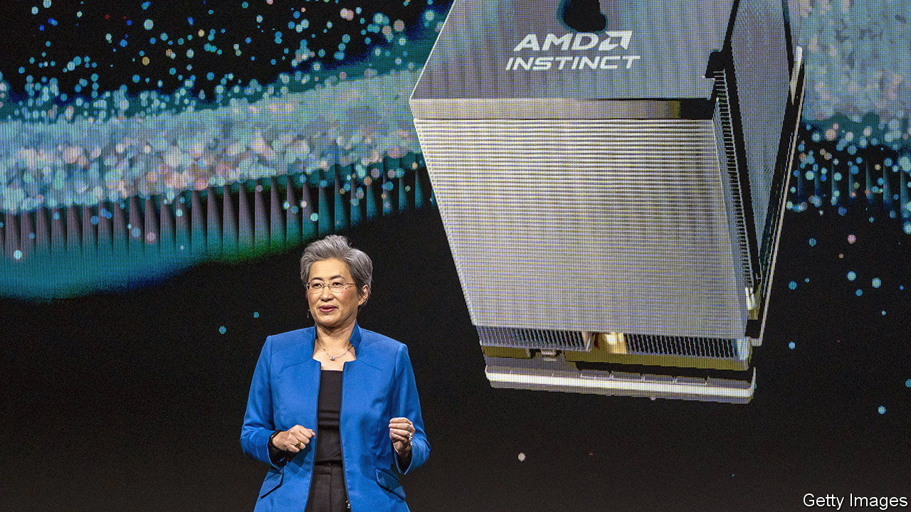
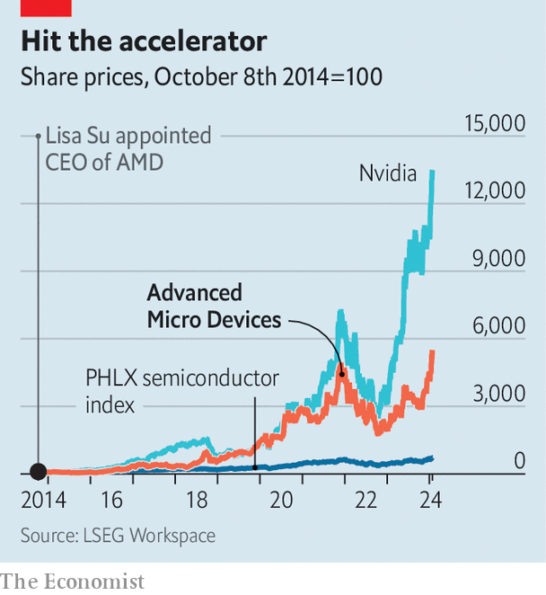
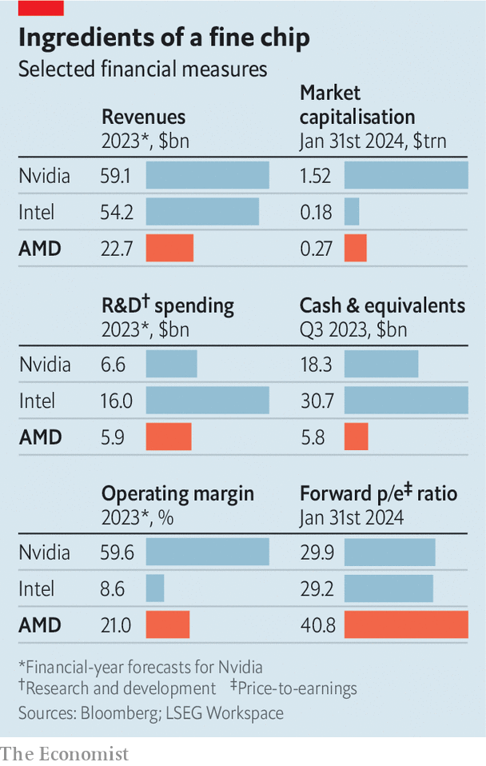

###### The AI-chip race

# Could AMD break Nvidia’s chokehold on chips? 

##### Taking on the top AI chipmaker will be hard—but maybe not impossible 

 

> Jan 31st 2024 

“IT IS THE most advanced AI accelerator in the industry,” boasted Lisa Su, boss of Advanced Micro Devices (AMD), at the launch in December of its new MI300 chip. Ms Su rattled off a series of technical specifications: 153bn transistors, 192 gigabytes of memory and 5.3 terabytes per second of memory bandwidth. That is, respectively, about 2, 2.4 and 1.6 times more than the H100, the top-of-the-line artificial-intelligence chip made by Nvidia. That rival chipmaker’s prowess in the semiconductors fuelling the AI boom has, over the past year, turned it into America’s fifth-most-valuable company, with a market capitalisation of $1.5trn. Yet most experts agreed that the numbers and Ms Su weren’t lying: the MI300 does indeed outshine the H100. Investors liked it, too—AMD’s share price jumped by 10% the next day. 

On January 30th, in its quarterly earnings call, AMD announced that it expected to sell $3.5bn-worth of MI300s this year. It also reported strong revenues of $23bn in 2023, four times what they had been in 2014, when Ms Su became chief executive. Its market value is up 100-fold on her watch, to $270bn. Relative to forecast profits in the next 12 months, its valuation is richer even than Nvidia’s. Last year it displaced Intel, which once ruled American chipmaking, as the country’s second-most-valuable semiconductor company. Now it is taking aim at the biggest.

 


Such ambition would have seemed fanciful a decade ago. Back then, recalls Mark Papermaster, AMD’s technology chief, AMD was facing an “existential crisis”. In 2008 it had spun off its chip-fabrication business to focus on designing processors, outsourcing manufacturing to contract chipmakers such as TSMC of Taiwan. The idea was to be better able to compete on blueprints with Intel, whose vast fabrication capacity AMD could not hope to match. 

It didn’t work. Several of AMD’s chips flopped. Sales of its central processing units (CPUs), mostly for personal computers, were collapsing. In 2013 it sold and leased back its campus in Austin to raise cash. A year later Ms Su inherited a net-debt pile of more than $1bn, a net annual loss of $400m and a market value of less than $3bn, down from $20bn in 2006.

She realised that the only way for AMD to get back in the game was to steer it away from the sluggish PC market and focus on more promising areas like CPUs for data-centre servers and graphics processing units (GPUs, which make video-game visuals lifelike) for gaming consoles. She and Mr Papermaster took a gamble on a new CPU architecture designed to beat Intel not just on price, but also on performance. 

When the going got tough

The idea was to use a Lego-like approach to chip building. By breaking a chip up into smaller parts, AMD could mix and match blocks to assemble different types of chip, at a lower cost. When the first such composite chips were released in 2017, they were zippier and cheaper than rival offerings from Intel, possibly in part because Intel was distracted by its own problems (notably repeated manufacturing slip-ups as it moved to ever tinier transistors). In the past ten years AMD’s market share in lucrative server CPUs has gone from nothing to 30%, breaking Intel’s monopoly.

Having faced down one giant, AMD now confronts another. The contest with Nvidia is different. For one thing, it is personal—Ms Su and Jensen Huang, Nvidia’s Taiwanese-born boss, are distant relatives. In contrast to Intel, Nvidia is, like AMD, a chip designer and thus less prone to production missteps. More importantly, the stakes are higher. Nvidia’s market value of $1.5trn is predicated on its dominance of the market for GPUs—not because of their usefulness in gaming but because they also happen to be the best type of chip to train AI models. Ms Su expects global sales of AI chips to reach $400bn by 2027, up from perhaps $40bn last year. Does she stand a chance against Nvidia?

Nvidia is a formidable rival. Both its revenues and operating margins are nearly three times AMD’s. According to Jefferies, an investment bank, the company dominates the market for AI accelerator chips, accounting for 86% of such components sold globally; before the launch of the MI300, AMD barely registered. Nvidia also offers network gear that connects clusters of chips, and software, known as CUDA, to manage AI workloads. Nvidia has dominated AI chipmaking because it has offered the best chips, the best networking kit and the best software, notes Doug O’Laughlin of Fabricated Knowledge, a research firm. 

 


AMD’s new processor shows it can compete with Nvidia on semiconductor hardware. This, Mr Papermaster says, is the result of a ten-year investment. AMD is spending nearly $6bn a year on research and development, nearly as much as its larger rival—and twice as much as a share of sales (see table). This has enabled it to adapt its Lego approach to GPUs. Combining a dozen blocks—or “chiplets”—into a single chip lets AMD put processors and memory close to each other, which boosts processing speed. In December OpenAI, maker of ChatGPT and the world’s hottest AI startup, said it would use the MI300s for some of its training. 

To outdo Nvidia on networking and software, AMD is teaming up with other firms. In December it announced a partnership with makers of networking gear, including the two largest, Broadcom and Cisco. It is also supporting an open-source initiative for chip-to-chip communication called Ultra Ethernet Consortium as an alternative to InfiniBand, a rival championed by Nvidia.

Chomping at the byte

Nvidia’s lead in software will be harder to close. It has been investing in CUDA since the mid-2000s, well before the current AI wave. AI developers and researchers love the platform, which allows them to fine-tune the performance of Nvidia processors. AMD hopes to tempt customers away from Nvidia by making its software, ROCm, open-source and providing tools to make the switch smoother, by translating CUDA programs into ROCm ones. 

Beating Nvidia at its own game will not be easy. Mr Huang’s firm is not standing still. It recently announced plans to bring out a new chip every year instead of every two years. The tech giants with the grandest AI ambitions—Alphabet, Amazon, Meta and Microsoft—are busily designing their own accelerator chips. Despite AMD’s robust sales, investors were disappointed with its forecast for MI300 shipments. Its share price dipped by 3% the day after it reported its latest results. 

Still, AMD has one big thing going for it. It is not Nvidia. AI companies are desperate for an alternative to its larger rival, whose dominant position allows it to charge steep prices and, with demand outstripping supply, ration chips to buyers. Despite efforts to design their own hardware, big tech firms will rely on chipmakers for a while, and AMD gives them options, notes Vivek Arya of Bank of America. Microsoft and Meta have already announced plans to use AMD’s GPUs in their data centres. And if Nvidia slips up, AMD will be there to pick up the Lego pieces. Just ask Intel. ■


