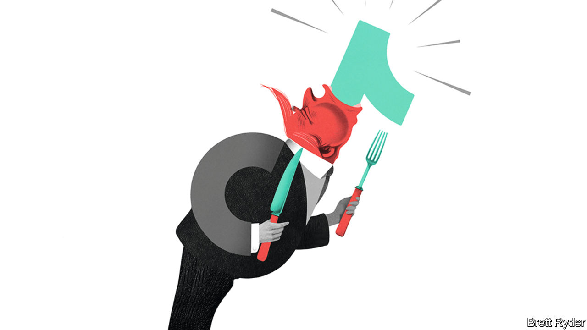

###### Schumpeter

# How much should TikTok fear a resurgent Donald Trump? 

##### The MAGA masses are now TikTokers, too 

 

> Feb 1st 2024 

Unlike war correspondents, business columnists do not risk their lives to bring stories to light. But they do occasionally make sacrifices on behalf of their readers. Schumpeter’s most recent forfeiture has involved exploring TikTok for videos about Donald Trump. In truth, the subject matter is more fun than you would think. Mr Trump is made for gangsta rap (“DAs acting silly/My mugshot’s worth a billi/Sold some merch and made a milli,” an artificial-intelligence version of his voice intones on the app). He warms the hearts of pro-racketeering Latino rappers (“Made me relate when they hit you with the RICO, now the whole ‘hood is screaming ‘Free Trump’”). The dangers are evident, though, when your columnist returns to his normal TikTok feed. Already the algorithm has polluted it with anti-woke jokes and so much Vivek Ramaswamy that he cannot swipe fast enough. 

Sympathy for Mr Trump on TikTok is interesting. After all, in 2020 he sought to ban it, pressed ByteDance, its Beijing-based parent, to sell it to an American firm, and accused China of spying on its users’ data and spreading propaganda (TikTok says it has never shared data with the Chinese government). It is such a bugbear to senior Republicans that it provoked one of the most risible moments of the primary debates—when Nikki Haley, a presidential contender, mocked Mr Ramaswamy, a rival, for using the app, then called him “scum” for daring to suggest that her daughter did, too. 

Now that Mr Trump is on the verge of defeating Ms Haley for the nomination, and is a coin toss away from the presidency, should TikTok again worry about its future? So far the former president has not attacked it during the campaign, but it may be only a matter of time. Whether TikTok can stay above the fray hinges on three things: political expediency, the courts and its efforts to distance itself from China. None of these is fully within its control.

Mr Trump savours his grudges and the one against TikTok is no doubt acute. But before deciding whether to renew his crusade against the platform, he has a political calculation to make: how much would he gain by reviving the spectre of a ban compared with how much could he lose by alienating users? In 2020 he may have felt that jeopardising their support was a small price to pay. Many TikTokers, such as the K-Pop fans who claimed tickets to his rally in order not to show up, were a thorn in his side. But TikTok is different now. On January 31st Shou Zi Chew, its chief executive, told a congressional hearing that 170m Americans use it monthly. That is up from about 100m when Mr Trump left office. TikTokers are no longer just lip-synching teens. Their average age in America is over 30. Given that they account for more than half the population, it stands to reason many vote Republican. Though Mr Trump does not use the site, he is there by proxy. The hashtag #donaldtrump2024 has 445m views on TikTok, compared with 22m for #joebiden2024. That does not reflect support. TikTokers may hashtag Mr Trump even if they hate him. But it does suggest that his presence is more kinetic than his rival’s. He may relish that.

Legal obstacles are another reason taking on TikTok should give him pause for thought. Almost every attempt to ban the app has foundered in the courts. Two federal courts ruled in 2020 that Mr Trump’s use of the International Emergency Economic Powers Act to in effect ban TikTok in America exceeded his authority. Late last year a judge blocked Montana from slapping the first statewide ban on the app, saying it violated the free-speech rights of its users. A separate punitive measure started by Mr Trump, using the Committee on Foreign Investment in the United States (CFIUS) to enforce a sale of TikTok on national-security grounds, has hung over the platform during the Biden administration, too. But Mr Biden has his own supporters on TikTok to think about. It is doubtful he would risk antagonising them in an election year by using CFIUS to decapitate their favourite pastime. 

TikTok’s main line of defence is its own effort to protect users against meddling from China. Under its so-called Project Texas, it has set up an entity in America that it says is sealed off from ByteDance, is staffed by Americans, and stores user data and sensitive technology, such as algorithms and content-moderation systems, in a cloud run by Oracle, a Texan software company. It is voluntary, however, and may not be foolproof; on January 30th the  reported that employees say they sometimes share data with ByteDance. (Mr Chew said “many things about that article” were “inaccurate”.) Moreover, the most significant safeguard—reaching a deal with the government to create an independent board to oversee data- and national-security protections, with members vetted and approved by CFIUS—remains elusive. A deal is unlikely to be reached this year. In election season the Biden administration would not dare run the risk of looking soft on China.

China is still TikTok’s Achilles heel. Lawmakers grilling Mr Chew (alongside four other tech CEOs) on his platform’s response to online child exploitation could not resist airing concerns about TikTok’s threat to national security as well. The worry is bipartisan. Under the Biden administration, use of TikTok has been banned on federal-government devices. Congress is mulling attempts to strengthen the president’s authority to ban it. If anti-China rhetoric rises during the presidential campaign, TikTok is almost bound to be caught in the crossfire. 

If you can’t ban ’em, join ’em

Rhetoric is one thing. Securing a ban is another. For all of the anti-TikTok tirades, the app continues to thrive—as a platform, as an advertising medium and, incipiently, as a place to shop. Moreover, prominent mouthpieces for Mr Trump, such as Tucker Carlson, a broadcaster, are keen TikTokers. Ben Shapiro, a pro-Trump pundit, used it this week to promote a hit anti-woke rap song in which he co-stars (“If you want my pronouns I’m the man/I’m the man that don’t respect you”). Maybe Mr Trump, potential gangsta-rapper-in-chief, should bury the hatchet and join them. ■


