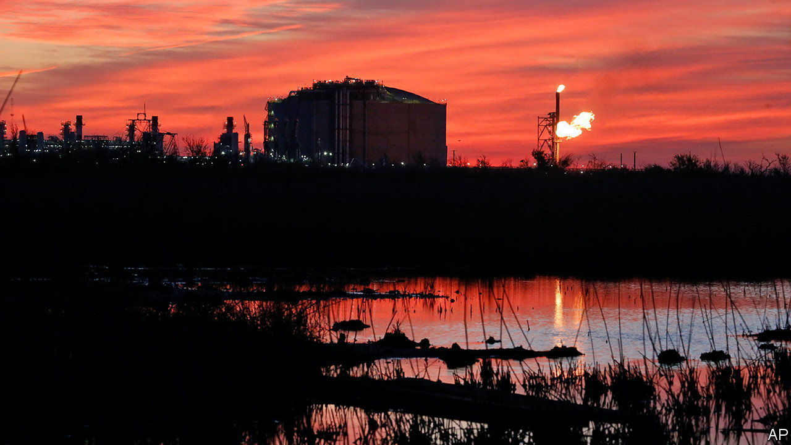

###### Gas gaffe

# Joe Biden’s limits on LNG exports won’t help the climate 

##### Will they help his re-election chances? 

 

> Feb 1st 2024 

“FREEDOM GAS” saved Europe from an energy crisis. The old continent’s imports of American liquefied natural gas (LNG), first equated with liberty by Donald Trump’s administration in 2019, ballooned from 16m tonnes in 2021, the year before Russia invaded Ukraine and all but stopped piping gas to Europe, to 46m tonnes last year. The decisions to redirect LNG cargoes destined for Asia and elsewhere to Europe were made by private companies. But they enjoyed strong official support from Mr Trump’s successor, Joe Biden. So did LNG exports more broadly, turning America into the world’s biggest exporter, ahead of Qatar and Australia.

On January 26th Mr Biden threw a spanner in the gasworks. He announced a “temporary pause” on pending LNG-export projects such as gas terminals, so that officials can scrutinise their economic, security and environmental impact. The decision is not an export ban and does not halt initiatives that have already been approved by the Department of Energy. But it does freeze a few big proposed but unapproved projects that would benefit countries which do not have free-trade agreements with America (a large group which includes big markets in Europe and Asia). 

The move delighted those climate campaigners who claim that LNG is not about freedom but about locking economies into continued dependence on fossil fuels. It disappointed the more level-headed sorts who see natural gas as a cleaner “transition fuel” that would help ease the shift to greener energy, especially in light of Mr Biden’s efforts to crack down on methane, a powerful greenhouse gas that can leak during the production and transport of the fuel. To America’s allies, it was another example of how the superpower is becoming an ever more unreliable partner.

For Mr Biden, though, it was all about politics. To stop the war in Ukraine from disrupting energy markets, his administration has overseen a big expansion in domestic fossil-fuel output. As well as being the world’s top LNG exporter, America continues to be the biggest oil producer. That angers the climate-anxious left wing of Mr Biden’s Democratic Party. In announcing the pause, Mr Biden adopted its language. His decision, he said, “sees the climate crisis for what it is: the existential threat of our time”. The head of a big environmental group calls it “a big win for progressives in an election year”. Bill McKibben, an influential activist behind a campaign to end LNG exports, declared that “We all just won…I have a beer in my hand”. 

Mr McKibben may want to keep that beer on ice. As Joseph Majkut of the Centre for Strategic and International Studies, a think-tank, wryly points out, the impact of the pause on global markets—and thus on global emissions, which is what matters to the climate—will be minimal. Forgone American exports will be offset by fresh supplies from Qatar, Australia and elsewhere. “I think there is an opportunity,” declared Jonathan Wilkinson, Canada’s energy minister, on January 30th. 

Moreover, American hydrocarbons will wash over world markets, pause or no pause. Should the carbon-cuddling Mr Trump return to the White House, which polls suggest is as likely as not, America will drill, baby, drill. Even if Mr Biden staves off the Trumpian challenge, America will keep producing lots of LNG. The approved projects alone would propel American exports to a level 50% above those of Qatar, a gas superpower, by 2030. 

And if the extra scrutiny of projects pledged by Mr Biden, combined with his methane crackdown, leads to further reductions in the carbon-intensity of American LNG, that would make the stuff more competitive in places like Europe and Japan, which want their fuel produced in the cleanest way possible, argues Amy Myers Jaffe of New York University. The movement that sought to topple America’s LNG industry would then, in other words, shore it up instead, while damaging American alliances, which some of the same left-wingers would prefer to preserve. Mr McKibben had better enjoy a bitter. ■


