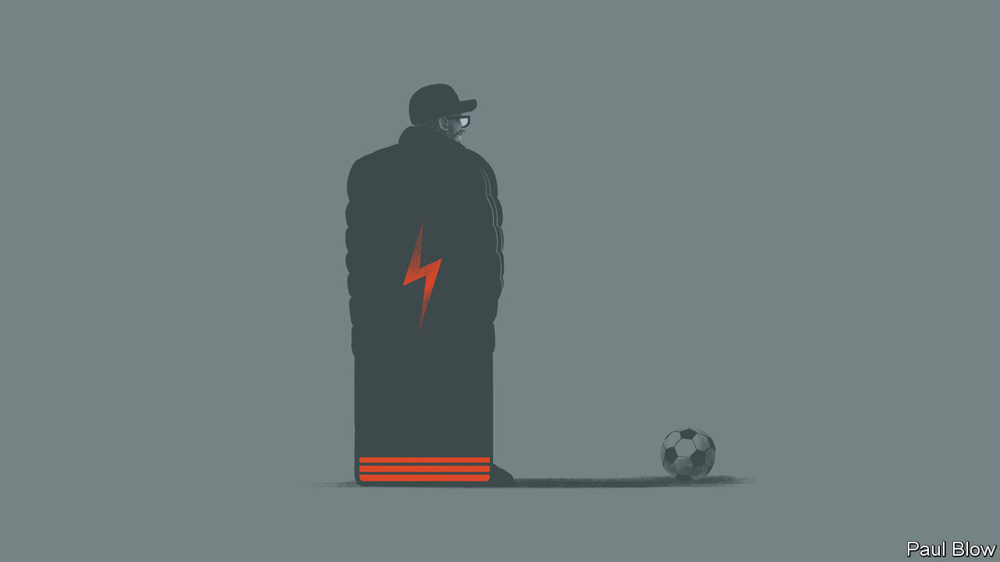

###### Bartleby

# Jürgen Klopp and the importance of energy 

##### The resignation of a football manager is a reminder of a CEO superpower 

 

> Jan 29th 2024 

Jürgen Klopp is a football manager. That means there is a limit to how much he can teach corporate bosses about how to do their jobs. Managers in firms tend not to be parent substitutes to their charges, envelop people in bear hugs after a successful meeting or use the  technique against rivals. But Mr Klopp has drawn back the veil on a crucial ingredient of success in almost every walk of life: energy. 

To general surprise Mr Klopp announced on January 26th that he would be leaving his job as manager of Liverpool Football Club later this year. His team is leading the English Premier League, the most-watched competition in the world’s most popular sport. His job is secure—his contract does not run out until 2026—and he claims still to love it. But after eight years in the role, and more in management, he is running out of energy. His resources are finite, he said. “I can’t do it on three wheels, I don’t want to be a passenger.” 

Mr Klopp is not the first high-profile person to make this kind of decision. Jacinda Ardern resigned as prime minister of New Zealand in January 2023, saying that she no longer had enough in the tank to do the job. Jeff Kindler cited the extreme demands of his role when he stopped being the boss of Pfizer, a drugmaker, in 2010, saying he was looking forward to recharging his batteries. But admissions like this are nonetheless rare from someone leading an organisation. 

For energy is one of those factors that reliably differentiates bosses from those below them. Ability, ambition and luck all play a big part in climbing the greasy pole. But energy plays an outsize role. High-achievers have done their email and a full workout before the sun rises. They don’t cancel breakfasts because they are feeling a bit tired; they certainly don’t admit to doing so. They are less likely to nod off in the middle of the afternoon. They get off the red-eye and work a normal day. 

And that is just on the way up. Talk to people who have made the leap to CEO and they will frequently comment on how intense the job is, and how hard it is to switch off. Most organisations are pyramids. As decisions get tougher and more important, they land on an ever smaller number of individuals. And as these figures become more senior, the number of people who want to see them goes up. 

The boss has to show their face to employees regularly, and it cannot be the face of someone who looks like they haven’t slept for two weeks. They have to glad-hand the board, meet investors, attend endless networking events and make time for actual work. It is exhausting to contemplate, let alone do.

The sheer physical demands of big jobs mean that certain types of people have an advantage over others. Not having too many other calls on your time helps, which tends to be bad news for women, who shoulder more chores and caregiving duties at home than men. 

Extroversion offers an edge in terms of oomph. A survey of CEO time-use from 2017, conducted by Oriana Bandiera of the London School of Economics and her co-authors, found that bosses spend 70% of their time interacting with colleagues, clients and the like. If you are the kind of person who derives energy from spending time with other people, this is like being a phone on charge all the time. If you are introverted and find other people draining, your battery will be close to 1% and it is only a matter of time before you shut down completely. 

Some lucky people naturally have more zip. These are the mitochondrial CEOs who can get by on three hours’ sleep and do not know what it is like to grope for the snooze button. But if you haven’t won the biological lottery, you can still work out what reinvigorates and what enervates. That might mean exercise at dawn, power naps in the afternoon or just protecting your calendar; when he was running Amazon, Jeff Bezos would aim for eight hours’ shuteye a night and try not to schedule meetings before 10am. It means prioritising rest rather than getting by on less of it. In their book “The Mind of a Leader”, Rasmus Hougaard and Jacqueline Carter found that senior executives were likely to sleep more than non-executives. 

In admitting that his energy stores are now becoming depleted, Mr Klopp has offered an unusual reminder of how punishing leadership roles can be. His decision to hang up his Liverpool tracksuit brings to mind the aphorism of another great football manager, Sir Alex Ferguson. Hard work is a talent, Sir Alex liked to say. But it is also just hard. ■


