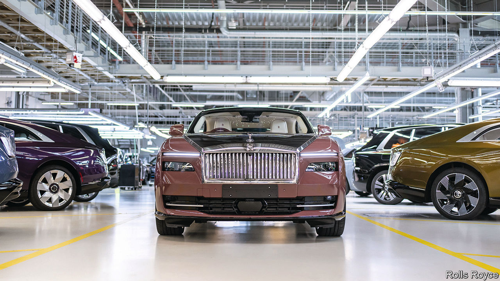

###### High rollers

# Rolls-Royce goes electric—in style 

##### Battery power suits the priciest vehicles 

 

> Feb 1st 2024 

Rolls-Royce is, in some respects, like any other carmaker. A recently revamped showroom in Sunningdale, close to London and closer still to a renowned golf club where its vehicles would look right at home, does not seem out of the ordinary. Some might think that a bright-yellow Cullinan on display is a tad brash (a spokesperson insists it is “expressive”). But it is an SUV and that makes it the company’s bestselling model, as SUVs tend to be. And, like other car companies, Rolls is embracing battery power, promising to go all-electric by 2030. Deliveries of the Spectre, its first electric vehicle (ev), began last autumn and are expected to make up 20% of sales this year. As part of bmw, it can tap its German parent for ev tech such as battery cells and motors. 

Here, though, similarities with the rest of the industry end. For one thing, Rollers are ideally suited to electrification. Batteries do away with the need to muffle engine noise—its adverts once promised that the only disturbance in the cabin is the ticking clock. While other firms fret about the affordability of evs, the Spectre’s £330,000 ($420,000) list price will not make buyers’ eye water. That is more than a petrol-powered Cullinan or Ghost, a smaller saloon, but a bargain compared with the Phantom limo, which will set you back £420,000. And it is merely the starting price onto which you affix pricey add-ons. The average Rolls in fact sells for around £430,000. The firm sees itself as a luxury-goods firm rather than a carmaker. No kidding.

On closer inspection, the showroom is distinct, too. It harbours an , a wood-panelled haven where customers can stroke rare leathers, assemble models to assess two-tone paint schemes or admire a roof lining of 1,340 led lights mimicking the night sky. 

If this were not bespoke enough, they can visit the company’s base in Goodwood in Sussex or a handful of “private offices” around the world to liaise with designers and commission more elaborate touches. Last year a Middle Eastern client ordered a car bedecked with mother of pearl and a roof lining of the stars on the day he was born. The feeling of membership of an exclusive club is enhanced by Whispers, an app that connects to your car but also acts as a social network for owners, where plutocrats can chat with fellow plutocrats.

Rolls-Royce is tiny, guaranteeing the exclusivity that attracts the richest motorists. It delivered just 6,032 cars in 2023 but has a monopoly over the priciest vehicles, ensuring bulging order books. Few carmakers command its net margins, reckoned to be over 20% (bmw does not disclose such uncouth details).

If there is a bump in the road it is one that Rolls will probably glide over. It sold only 11 more cars last year than in 2022. Sales in China, its second-largest market after America, fell as a struggling economy took its toll. But the marque has always traded on rarity rather than volume. It is expanding a scheme to make more bespoke models. Ever more buyers want exclusive—and expensive—features, such as scent-releasing headrests. And, happily for Rolls-Royce, they are prepared to pay through the nose to get them. ■


