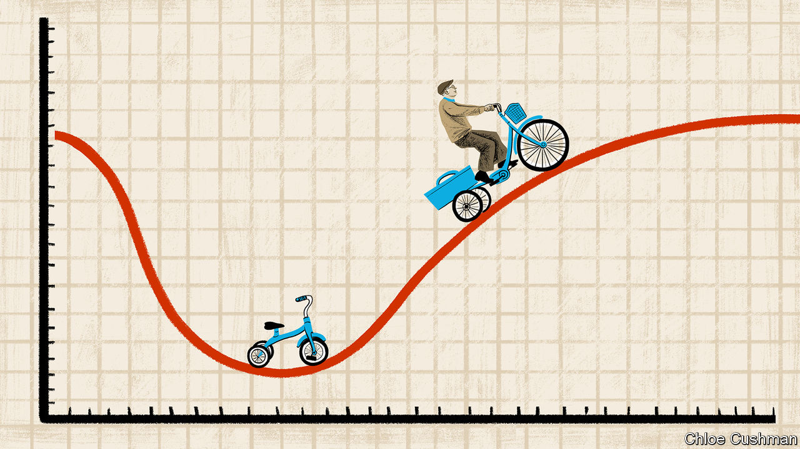

###### Chaguan

# Hard times for China’s micro-industrialists 

##### A rural hub for children’s bicycle-making adjusts to a world with fewer kids 

 

> Feb 1st 2024 

THERE ARE lots of upsides to making bikes for kids, explains Mr Li, a young entrepreneur from Pingxiang, a scruffy county in northern China that has become a centre for the children’s bicycle industry. For one thing, they are easy to build, he says, nodding at a toddler-sized machine parked near his desk, held upright by tiny stabilisers. Teenage mountain bikes are a bit fiddly, but smaller ones “need no special machinery at all”. Also, he grins, children grow. Sell a three-year-old their first ride and two years later their parents have to buy a bigger one, and so it goes on for years to come. The downside? China is running out of children. 

Pingxiang, in the province of Hebei some 400km south of Beijing, is a revealing place to see the country’s demographic future playing out today. Like many industrial clusters in China, it grew over decades as businesspeople forged networks, helped by local officials offering tax breaks and other subsidies. Initially, small firms assembled frames, pedals and other parts bought from established manufacturers in coastal cities. Over time complete supply chains were created in Pingxiang. Today, the county is a sprawl of large industrial plants linked to smaller suppliers, many of them tucked away in rural sheds and barns. There are traffic jams as lorries and three-wheelers piled high with bicycle cartons inch down narrow village lanes.

County officials report that 10m bicycles a year are built there, by thousands of firms. Official media credit Pingxiang with supplying 40% of the children’s bicycles sold worldwide. It also produces half the wheeled toys sold inside China, including bicycles, tricycles, scooters and ride-along toy cars. This targeted approach to globalisation made Pingxiang prosperous, if not lovely. The county is a drab, dusty spot, though officials have painted cycling-themed murals on walls and erected a giant sculpture of a bicycle wheel in a public square. Then came China’s fertility crash.

In 2023 the number of Chinese newborns hit a record low of just over 9m, after falling for seven years in a row. That compares with nearly 19m babies born in 2016. Mr Li quit his job as a quality controller in a big factory a few years ago, and began selling hand-assembled bikes in street markets. Today he rents a small factory with a former colleague. He employs 15 people who can make hundreds of bicycles a day, when orders are good. Orders are not good right now and his staff are on short hours. Huddled in a freezing office in one corner of their steel-walled factory, he and his business partner look anxious. This is understandable, given that their main customer base—namely, Chinese toddlers—has shrunk by half over the past decade. The change “started slowly, a few years ago”, he recalls. Now the impact on sales is unmistakable.

Mr Li’s plight reveals a lot about the large forces that are battering China’s private sector, and about the solutions being proposed by officials in both the local and central governments. Coverage of China’s economy often focuses on a handful of national champions making world-class products, from smartphones to electric vehicles. But small firms with fewer than 300 employees accounted for 79% of China’s job creation and 68% of exports, the OECD, a club of mostly rich countries, reported in 2022. Though the Communist Party puts great stock in large state-owned enterprises and groundbreaking technology, China needs its backyard entrepreneurs, too. The supreme leader, Xi Jinping, calls China’s mastery of the complete array of industrial sectors a source of national strength. Last year he urged officials to upgrade, not eliminate, industries deemed “low-end”. 

Sluggish domestic demand, notably since the end of the covid-19 pandemic, has led officials to urge manufacturers of all types to seek new markets abroad. Still, exports are not a cure-all. A bicycle-industry veteran in Beijing notes that China’s manufacturers saw roaring domestic and foreign sales during the pandemic, as people abandoned public transport for their own two wheels. The industry now faces a hangover, as inventories are cleared and many covid-era riders lose interest. In ageing societies, e-bikes for adults are selling well. But even in markets that still have children, many want to play video games, not play outdoors. Chinese consumers lack the confidence to spend but demand is weak in many foreign markets too, says the veteran. “In some of our enterprises, production is down by a third.”

A slowing China bets on exports

Back in Pingxiang, Mr Li is struggling to survive. During pandemic lockdowns, many Chinese consumers had bills to pay but no income. They have not yet shaken the fear that they felt then, he says. Compared with last year, his firm’s sales are down by more than half. Local officials urge businesses like his to look abroad, with a focus on countries signed up to China’s Belt and Road Initiative. In 2020 less than a tenth of the firm’s sales went abroad. Now exports account for 40-50% of turnover, with customers in Russia, Malaysia and Indonesia. He is grateful to county officials who subsidised his stand at a trade fair in Shanghai, where he met foreign buyers. But exports are hard work. The Russians are from that country’s far east near the Chinese border, he thinks. They ask for more time to pay when the rouble is weak, though helpfully they settle their bills in Chinese yuan. Europe and America are richer markets, but the firm cannot meet their product standards.

After lunch, Chaguan is taken to a nearby village to see Plan B. In a farmyard workshop guarded by honking geese, Mr Li’s business partner has a team assembling pedal tricycles for old people. These are built to order in batches of 50, which middlemen sell to domestic customers online. Compared with children, who need new bikes as they grow, the disadvantage is that pensioners “stop riding” when they get older, says the partner earnestly. But at least China will have more and more of them. A larger tricycle-assembly line is planned for next year. These are grim times for China’s micro-industrialists. Their resilience is a wonder to behold. ■


