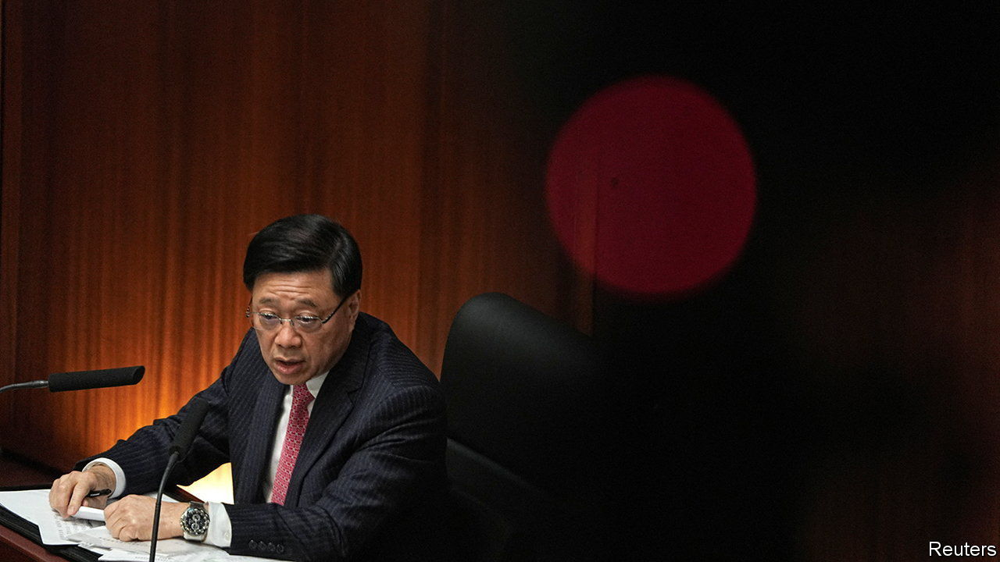

###### One is not enough

# Hong Kong gets a second draconian security law 

##### John Lee thinks foreign powers are still trying to overthrow his government 

 

> Jan 31st 2024 

HONG KONG has a constitutional duty to implement its own national-security law, as well as a practical need to do so. So said John Lee, the city’s chief executive, on January 30th, as he unveiled new legislation aimed at thwarting subversive types.

Mr Lee was half right. Hong Kong is indeed required to pass national-security legislation under Article 23 of the Basic Law, the mini-constitution enacted after Britain handed back the city to China in 1997. Its practical need is debatable. Hong Kongers, at least, seem to prefer living without it. When the government last tried to push through such a measure, in 2003, it sparked enormous protests and the city’s leaders .

Since then, Article 23 has loomed over Hong Kong. Everyone knew it had to be dealt with; the question was when and how. The central government in Beijing moved first. In 2019 it was spooked by big pro-democracy protests in Hong Kong. A year later, after the pandemic cleared the streets, it foisted its own  on the territory. The success of that legislation in suppressing even mild criticism of the authorities allowed Hong Kong’s government to at last put forward its own version of the law. No big protests are likely.

After a four-week public consultation, the new measure is expected to be swiftly passed by the city’s legislature, which is packed with Communist Party supporters. The statute will cover acts such as treason, insurrection and sabotage. The government says it will complement the one imposed by the central government. Some of the acts the new law will proscribe are distinct, such as espionage. Nevertheless, given that the existing law is so broad and ill-defined, it is difficult to conceive of an activity that would fall foul of the new law and not already be covered by the old one, says a barrister in the city.

The idea of Western powers meddling in Hong Kong seems to be part of what is motivating Mr Lee, a tough former policeman and security chief. The new legislation would outlaw “external interference” in Hong Kong’s affairs. Mr Lee has come round to the view, popular in Beijing, that forces from abroad were behind the protests in 2019. “Foreign agents and advocates of Hong Kong independence are still lurking in our society,” he warned on January 30th. His words have sent a chill through foreign NGOs working in the city. Mr Lee “has a track record of throwing wild and completely false allegations at people who simply advocate for democracy and human rights”, says Ben Rogers of Hong Kong Watch, a monitoring group. He expects a crackdown on foreign organisations.

Few believe Mr Lee when he says that freedoms and rights will be “respected and safeguarded” under the new measure. The existing national-security law has been used to lock up ,  and effectively outlaw vigils for the victims of the . Mr Lee was keen to explain how his proposed legislation is not so different from laws which have been enacted in Western countries. That may be true, says the barrister, but “it is one thing to legislate as part of a democracy, another when you are effectively a one-party state.” ■


