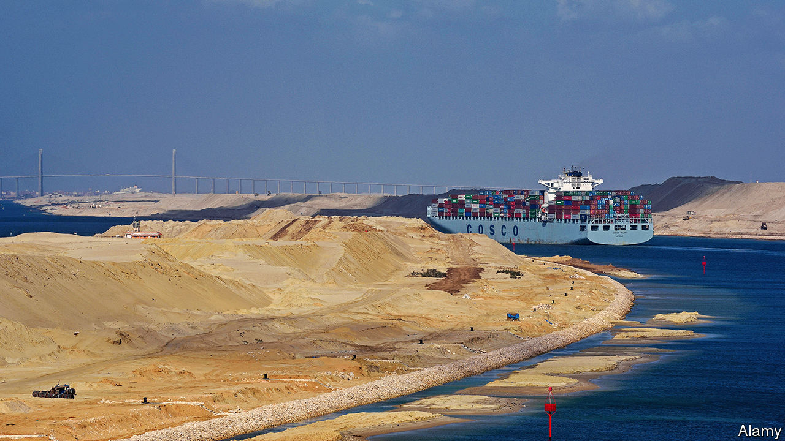
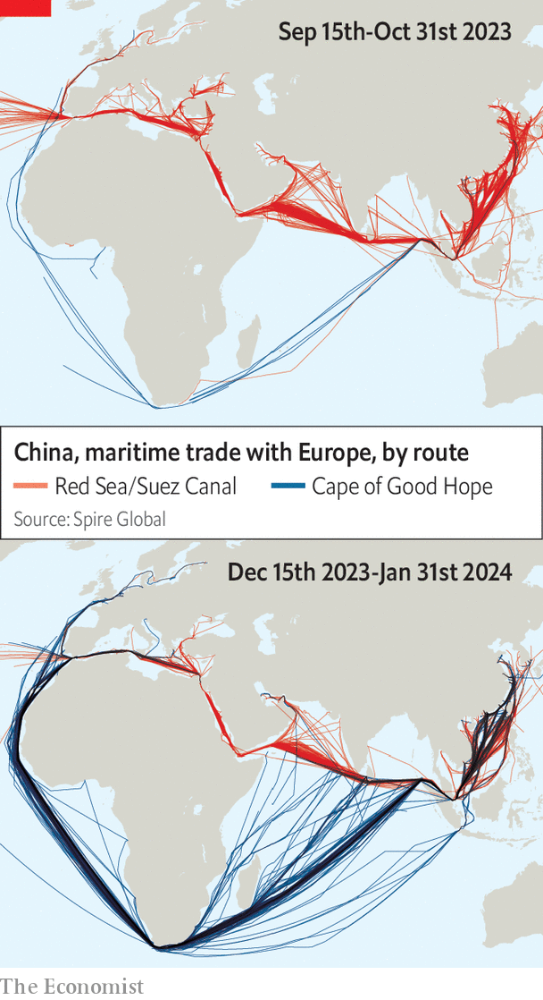
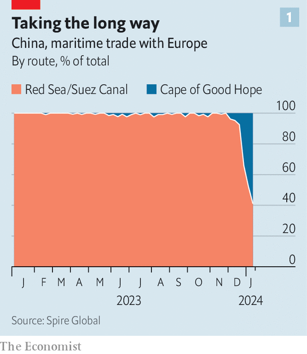
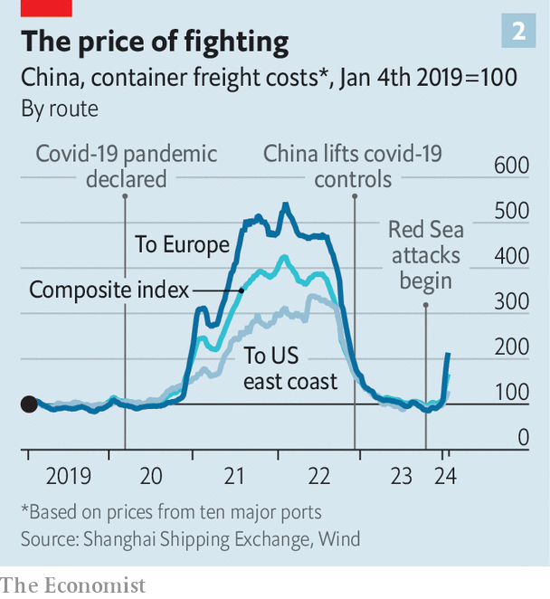
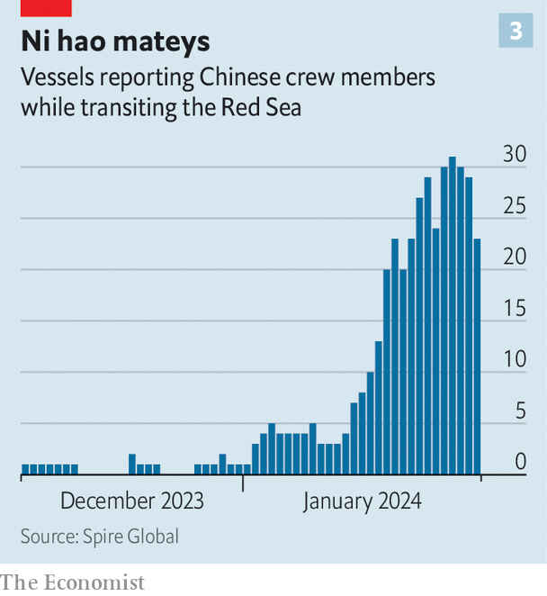

###### Operation Sit Tight

# Is China a winner from the Red Sea attacks? 

##### China seeks to reap political benefits from the new Suez crisis 

 

> Feb 1st 2024 

Six years ago a film titled “Operation Red Sea” became a huge hit in China. It was touted as the first in Chinese cinemas to focus on the exploits of the modern Chinese navy, which in recent years has overtaken America’s to become the world’s largest. The plot revolves around a naval special-forces operation to rescue a Chinese citizen taken hostage by terrorists in a Yemen-like Red Sea country. “This mission is a message to all terrorists that you will never harm a Chinese citizen,” intones the commanding officer. The Communist Party organised showings to whip up patriotic fervour. Officials said the film showed a China that was “taking on its responsibilities as a great power”. 

America is wary of China’s growing global reach. But since mid-November, when Houthi rebels in Yemen began attacking shipping in the Red Sea with missiles and drones, American officials have been prodding China to show some of that great-power spirit by helping to resolve a real-life crisis in the region. During 12 hours of meetings on January 26th and 27th in Bangkok, America’s national security adviser, Jake Sullivan, tried to persuade China’s foreign-affairs chief, Wang Yi, that China’s influence could be used to stop the threat to a major artery of global trade. China, however, views its responsibilities differently. It does not want to flex muscle in the Middle East. China sees the region’s security as a quagmire of America’s making. It is exploiting an opportunity to talk up solidarity with the Arab world.

 


Security in the area is certainly important to China. In 2021, when a container ship blocked the Suez Canal for six days near its entrance to the Red Sea, China’s Ministry of Commerce estimated that 60% of the country’s exports of goods to Europe were using that route (last year about 17% of China’s goods exports worldwide were to the European Union and Britain).

The Houthis claim their dozens of attacks have been aimed at vessels linked to countries that support Israel in the Gaza conflict (China does not). But there are risks for all. On December 3rd a container ship chartered by OOCL, a Hong Kong-based firm owned by COSCO, a state-controlled Chinese shipping giant, was hit by a drone-fired rocket. There has been speculation that the Houthis had outdated information about the vessel, which previously had been chartered by an Israeli firm. On January 19th the Houthis said Chinese and Russian ships would enjoy safe passage through the Red Sea. But much of China’s maritime trade involves ships registered in other countries. Many of these are now playing safe by going around the Cape of Good Hope (see map). 

 


Data provided to  by Spire Global, an analytics firm, shows that before December, 99% of container ships sailing between Europe and China went through the Suez Canal. By the second week of January, fewer than half were doing so (see chart 1). The Cape route can add about two weeks to the journey—avoiding the high premiums now demanded by insurers for Red Sea transits, but adding to transportation costs. The China Containerised Freight Index, a measure of container prices at major Chinese ports, has more than doubled since late 2023 for shipping to Europe (see chart 2). 

Your problem

The Chinese government, however, prefers to stay on the sidelines. The country’s only overseas military base is close by, in Djibouti. Yet the Chinese navy has been keeping a low profile. It has avoided involvement in an American-led military coalition, known as Operation Prosperity Guardian, which has been formed in response to the Houthi attacks. China’s state media do say a Chinese shipping line, Sea Legend, is offering to carry freight through the area with the help of Chinese navy escorts. Its website displays a schedule for such escorts in the Gulf of Aden, which adjoins the Red Sea. China has much experience of such missions: since 2009 its warships have been helping to protect commercial shipping in the Gulf of Aden from attacks by Somali pirates. 

 


America believes that Iran is encouraging the Houthis and that China, which has close ties with the government in Tehran, could help persuade the country to stop the Red Sea attacks. According to a senior American official, Mr Sullivan stressed this during his meeting with Mr Wang in Bangkok. Reuters says that during several recent encounters in Beijing and Tehran, Chinese officials have indeed asked their Iranian counterparts to rein in the Houthis. The Chinese message has been that: “If our interests are harmed in any way, it will impact our business with Tehran,” the news agency quoted an Iranian official as saying. The American official said China had confirmed it was talking to Iran about the attacks. “But we’re certainly going to wait to see results before we comment further,” he said, seeming unsure of “whether we think they’re actually raising it”. 

China likes to present itself as a benign big power that can help spread peace in the Middle East and elsewhere. In 2022 China’s leader, Xi Jinping, unveiled a “Global Security Initiative” (GSI) that was clearly aimed at rallying support for China, especially among countries resentful of American hegemony. It called for resistance to “cold war” thinking and opposition to “the pursuit of one’s own security at the cost of others’ security”. These are standard Chinese descriptions of American behaviour. The idea was that conflicts would ebb if countries focused on building their economies (hint: we can help with that if you subscribe to our worldview). 

There was nothing new in this, but the GSI was much trumpeted in Beijing. In March last year, China claimed a victory for it in the Middle East, brokering a deal that saw Saudi Arabia and Iran restore diplomatic relations after a seven-year rupture. In reality it was low-hanging fruit. “They went to China, I think, to get that great-power stamp of approval at the very end of the process,” says Jonathan Fulton of the Atlantic Council, an American think-tank. In the Red Sea, China cannot be expected to work GSI magic. American hopes that China might help end the crisis face several obstacles. One is China’s willingness to use what the American official called its “substantial leverage” in Iran, which exports about 90% of its oil to China. China welcomes this cheap supply of energy—it accounts for about 10% of its crude oil imports. It relishes friendship with a country that shares its misgivings about American power. 

Another difficulty is that Iran supplies the Houthis with weapons and intelligence, but its ability to control them may be limited. “They are strengthened by Iran, which gives Iran a little bit of sway over their actions,” says Dina Esfandiary of Crisis Group, a Brussels-based think-tank. “But if what they want to do goes against what Iran wants to do, they usually don’t hesitate to go ahead and do it.” Meanwhile, China is expending little energy on trying to secure peace in Gaza—it lacks the clout to achieve much there. Its state media have been pumping out coverage accusing America of fanning the flames. Mr Wang has pointedly remarked that the UN Security Council has not given approval for American and British strikes in Yemen. 

China would have much to fear from a wider conflict in the region. Its companies have invested more than $20bn in countries around the Red Sea, mainly in Egypt and Saudi Arabia, according to the American Enterprise Institute, a think-tank in Washington. More than 70% of the oil that China consumes is imported; about half of it comes from the Middle East. 

 


But at present China appears to believe that the threat from the Houthis is bearable. COSCO has said it would re-route its ships around the Cape of Good Hope and stop delivering to Israel. But some of its vessels have continued to ply the Red Sea. Ships try to protect themselves from Houthi attacks by making clear a link with China in their automated identification systems—transponders that are fitted on ships above a certain tonnage on international voyages. By late January, more than 30 vessels per day in the Red Sea were advertising such a connection, Spire Global’s analysts found (see chart 3). 

In China movie fans have been more focused on when a much-anticipated sequel to “Operation Red Sea” might be released (this year, many reckon). Expect it to feature an alternative universe, with China in the thick of Middle Eastern action. ■


