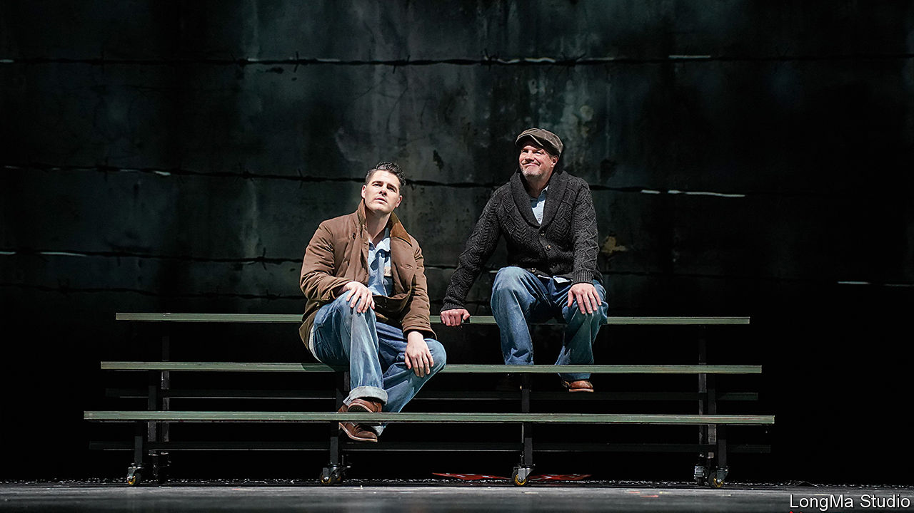

###### Salvation lies within

# Watching “The Shawshank Redemption” on stage in China 

##### Why wasn’t this banned? 

 

> Feb 1st 2024 

IS HOPE A dangerous thing in China? Theatregoers in Beijing have been mulling that question, with two new stage adaptations exploring themes of injustice, freedom and renewal. “The Shawshank Redemption” (pictured) is set in mid-20th-century America, while “Les Misérables” takes place in 19th-century France. Both feature characters who are unjustly imprisoned and suffer under cruel jailers and corrupt systems.

The plays, performed in Mandarin, might seem a bit too on the nose for Chinese censors. After all, the Communist Party has been known to play the role of cruel jailer in real life. The party also disputes the notion that freedom and human rights are universal values. 

“The Shawshank Redemption”, based on a novella by Stephen King, was made into an award-winning film in 1994. Though it was not shown in Chinese cinemas, it became hugely popular with locals who bought bootleg VHS or DVD copies. It also caught the attention of censors. In 2012 a blind human-rights lawyer called Chen Guangcheng pulled off a daring night-time escape from house arrest in the village of Dongshigu. (He ended up in America.) This gave rise to chatter about the “Dongshigu Redemption”—and led the government to block online searches for “Shawshank”.

In 2019 “Les Misérables”, which is based on a novel by Victor Hugo, got similar treatment. This came after pro-democracy demonstrators in Hong Kong adopted as their anthem a tune from the musical version of the story. The song, “Do You Hear the People Sing?”, was subsequently censored.

Yet people involved in the Chinese stage productions of “Shawshank” and “Les Misérables” report no problems gaining approval. This is not all that surprising. Censors worry less about plays than films or online content, which can be shared widely. Another factor is the foreign settings of the works, which make their messages easier to dismiss by Chinese officials. The production of “Shawshank” even has a foreign cast (all of whom speak Mandarin).

But Chinese theatregoers are not being obtuse. “Of course you start to think China is a bit like the prison,” says an audience member at the Beijing premiere of “Shawshank”. One of its stars is Mark Rowswell, a Canadian who has enjoyed fame in China under the stage name Da Shan. He admits that the play veers into sensitive territory. “Sure, it’s about a corrupt system that makes you think you’re trapped and you’ll never get out,” he says. “But really, it’s mostly about hope. What’s wrong with that?” ■


