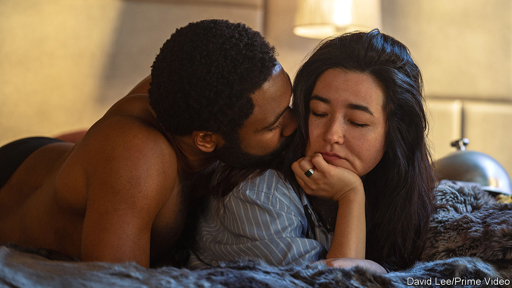

###### Back Story

# A new “Mr and Mrs Smith” is about more than action, money and sex 

##### In the TV version, the assassins’ mission is to make you think about marriage 

 

> Feb 1st 2024 

IF YOU remember “Mr &amp; Mrs Smith”, a romantic-comedy spy caper of 2005, it may not be for its shrewd analysis of matrimony. The film starred Brad Pitt and Angelina Jolie as husband-and-wife assassins; their on-set attraction helped assassinate Mr Pitt’s  to Jennifer Aniston and inaugurate the cult of “Brangelina”. Yet beneath the stunts and perfect hair bubbled deeper emotional questions. A new TV version of the story amplifies and adds to them—casting light on changing times and contrasting artistic ambitions.

In the film, the Smiths did not know they shared a vocation until their employers, rival contract-killing agencies, dispatched them to rub each other out. Matrimony, the film winkingly suggested, is an exercise in espionage and subterfuge, coiffed exteriors hiding secrets from both spouses and the world. For some it can feel a bit like mortal combat. “There is this huge space between us,” Mrs Smith told a , “and it just keeps filling up with everything that we don’t say to each other. What is that called?” “Marriage,” came the reply.

The new series, out on Amazon Prime Video on February 2nd, was co-created by Donald Glover, the small-screen auteur behind the . Mr Glover plays John Smith; this time he and Jane Smith (Maya Erskine) are strangers recruited by the same mysterious firm, which assigns their cover names and concocts their fake marriage. Would they have hit it off, they are asked, if the company hadn’t matched them? In essence, this is a question many couples ponder, since all are brought together by propitious circumstance and chance.

The movie’s Smiths were superhuman: not just absurdly gorgeous but pain-free, conscience-free and able to roll around amorously on glass-strewn surfaces without cutting themselves. The TV Smiths (pictured) are regular millennials, but with a high tolerance for violence. Novices as both agents and spouses, they cope with buggings and bombs, but also jealousies and petty rows, bickering over table manners and a missing phone-charger. “Do you think the cheese plate was too much?” asks Mrs Smith in a lull between dinner and a gory mission.

Sex is a different story, too. Mr Pitt’s and Ms Jolie’s characters got down to it shortly after meeting; in the updated version sex is a subject of cagey negotiation. Only after accidentally killing someone do these Smiths find comfort in each other’s arms.

The movie had a touch of girl-power feminism, as when Mrs Smith complained about being given the smaller gun. Now the politics are starker, especially the racial kind (Ms Erskine is half-Japanese; Mr Glover is black). This Mr Smith worries that he will be conspicuous at a swish art auction, so disguises himself as a waiter. Verbal microaggressions trouble the pair as much as murder seems to.

Another detail of the film is foregrounded on TV. The big-screen Smiths lived in the sort of palatial home, with a two-car garage and Greenland-sized kitchen island, which passes for normal in American dramas. In the revamp the house that comes with the job—a huge Manhattan brownstone rather than a suburban mansion—boasts a roof garden and a pool. But no longer is it an unremarked perquisite of the killing business. Through the house, the show becomes a study, not only of marriage, but of the aspirations, grind and compromises of the 21st-century rat-race.

If this makes “Mr &amp; Mrs Smith”, the reboot, sound overstuffed or didactic, it isn’t. On the contrary, the show squeezes in a generous quota of car chases and explosions, racking up a body count to compete with the movie’s. It also, elastically, finds time for the languid chats about nothing much, naturalistic and absurd at once, which are among Mr Glover’s trademarks. Amid the shoot-outs, people say things like “You’re being weird.” On the shore of Lake Como, in the middle of a kidnapping, the Smiths fall out over whether to .

It is, in other words, a bold experiment in form, not only in transposing a film to Tv. Like  and , “Mr &amp; Mrs Smith” mixes domesticity with violent careers, stirring in elements of Hitchcock and dating shows. It is a thriller, a parable and a joke.

Should you watch it? The lurching tone is a challenge, but persevere. At the close of the sugar-rush film, the gleaming Smiths have vanquished their foes and honesty has rejuvenated their relationship. On tv, the story is far more nuanced and equivocal, much like the real-life drama of marriage.■


