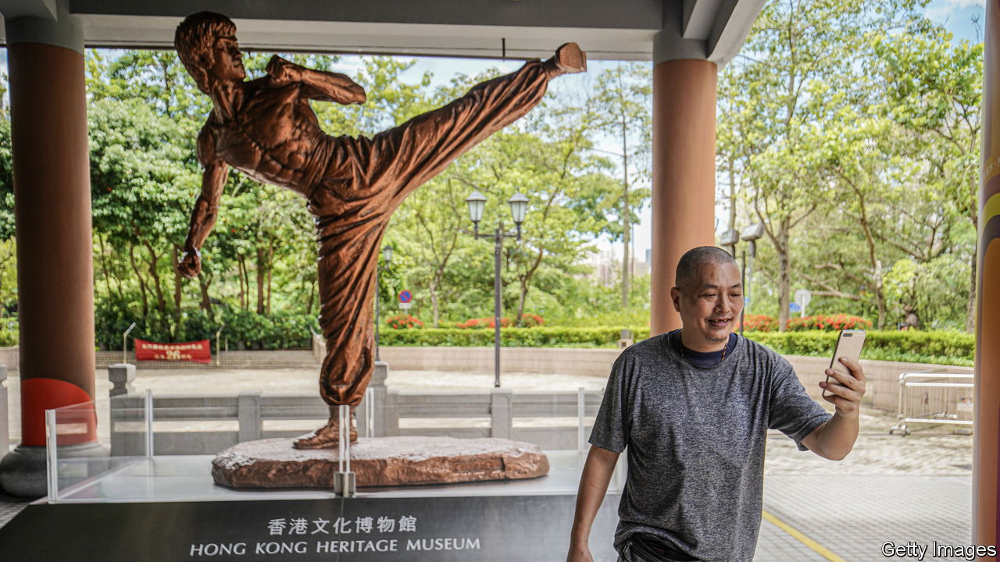
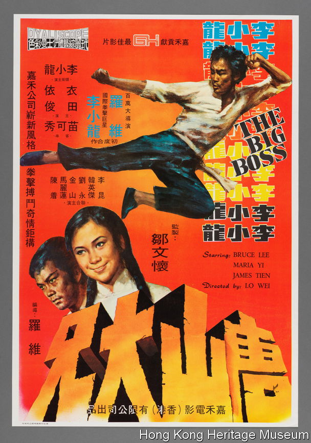

###### So long, Hong Kong

# A row over the Hong Kong Heritage Museum is a window on China 

##### Museums are yet another front for Communist Party control 

 

> Feb 1st 2024 

The Hong Kong Heritage Museum is beguiling and eclectic. Visitors wander through a colonial-era reading room and a full-sized replica of an opera house made of bamboo. An exhibition on Bruce Lee features quotes of the actor urging people to “be formless, shapeless, like water”—a  pro-democracy protesters in 2019. It may be a hotch-potch collection, but it represents “our collective memory”, says Kacey Wong, a Hong Kong-born artist who has exhibited there: “So it’s very important.” 

The museum affirms and protects the city’s distinct culture. Around 451,000 people visited last year. But it may not exist for long. Hong Kong’s  wants to build the city’s first major museum dedicated to China’s “grand development and achievements”. It recently outlined a plan to commandeer a site in the bustling tourist district occupied by the Science Museum and move the Science Museum into the Heritage Museum—disbanding the Heritage Museum’s collection. After pushback local media now report the government will overhaul the Heritage Museum to focus only on pop culture. 

 


Last year John Lee, Hong Kong’s chief executive, promised two new museums to “cultivate a stronger sense of national esteem and patriotism”. Institutions that challenged the party line, such as a tiny museum dedicated to the  protests of 1989, have closed. A Chinese Culture Promotion Office is in the works; it plans to ensure “Chinese culture and history” is prioritised. All this ties into China’s plans to be a “museum power” by 2035: it says it opened 382 new ones in 2022.. 

Hong Kongers are depressed about the likely fate of the Heritage Museum. “Turning it into a museum of popular culture is like people listening to bagpipe music but not talking about Scotland,” says Mr Wong. He organised a petition calling on the government to keep the Heritage Museum as is and expected around 60 signatures. Some 700 Hong Kongers signed it; many are associated with the pro-democracy movement and so have left the city. He does not expect the government to take any notice of their anger. Hong Kongers living abroad will preserve , he says. But “if you’re staying in Hong Kong then you have to endure.” ■


