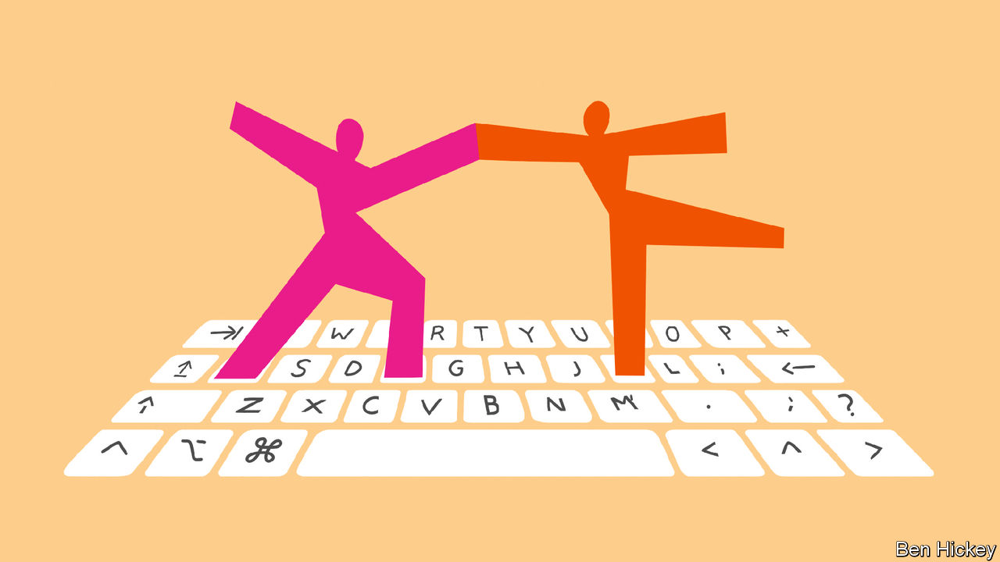

###### Write on

# Authors are collaborating with AI—and each other 

##### A new novel by Margaret Atwood and others points to an exciting trend 

 

> Feb 1st 2024 

Edited by Margaret Atwood and Douglas Preston. 

Imagine living in a rundown apartment building on the Lower East Side in Manhattan. When covid-19 hits in 2020, you do not have the money to escape to a second home in the Hamptons or the Hudson Valley. Instead, in the evening you make your way up to the rooftop of your building, where, to your surprise, other tenants have come, too. You do not know most of them, but after some awkwardness, everyone starts meeting nightly, drinks in hand, to share stories about family, music, , love and, equally—inevitably—death.

This is the premise of “Fourteen Days”, a “collaborative novel” edited by  (of “The Handmaid’s Tale” fame) and Douglas Preston (author of “The Lost City of the Monkey God”). In addition to Ms Atwood and Mr Preston, 34 notable authors of varied genres and backgrounds contributed to the book, including , a playwright, and the novelists , Dave Eggers and John Grisham. Reading “Fourteen Days” is like sitting by a campfire, with characters taking turns telling tales about their lives. (This conceit is helpful, given the number of collaborators. The book’s plot is simple, so each character’s story can stand on its own.) 

“Fourteen Days” is one of a growing number of new works, both fictional and factual, which are written collaboratively in some way. , a writer and futurist from California, is working on a book entitled “Maintenance: Of Everything”, which allows early readers to comment on draft chapters. In January Audrey Tang, Taiwan’s minister of digital affairs, and Glen Weyl, a noted economist and co-founder of the RadicalxChange Foundation, a group of activists, signed a contract to write a book, entitled “Plurality”, on digital democracy together with dozens of contributors. AI services, , have started to become co-authors, too. A more collective approach to authorship is on the rise.

There is a rich history of collaboration in writing. Just think of the Bible or the “Kalevala”, a Finnish epic, which were both written by many hands. Homer, if he was in fact a single person, probably synthesised bits of oral poetry for his “Iliad” and “Odyssey”. In the Renaissance plays had many authors, who often added new characters as they saw fit. Only after the invention of the printing press in the mid-15th century did books became a business. Single-author books proved easier to market, and the “myth of the solitary author” established itself, says Scott Rettberg, who leads the Centre for Digital Narrative at the University of Bergen in Norway. 

In the 20th century collective authorship made something of a comeback. In the 1960s the idea re-emerged for all sorts of reasons, including as a counteroffensive against cultural conventions. In 1969 two dozen journalists wrote “Naked Came the Stranger”, a deliberately terrible book poking fun at American literary standards. (It became a surprise bestseller.) In the 1990s new technological possibilities prompted writers to work together—or, more accurately, to link to each other. A noted example is “Hypertext Hotel”, a collaborative writing space built online in 1991 by Robert Coover, an American experimental novelist, which uses a spatial metaphor to weave stories together. 

Chances are, your bookshelf contains an example of a literary collaboration, say by , who wrote some of the “Jack Reacher” series with his brother, Andrew, or James Patterson, whose bibliography of co-authors reads like a name-dropper’s address book. “Fourteen Days” nods to this history of collaborative writing. In their foreword Ms Atwood and Mr Preston cite the influence of “The Decameron” (1353) by Giovanni Boccaccio, a collection of stories about a small group of people who shelter in a villa near Florence to escape the bubonic plague. 

Even if these projects do not blaze new trails, it is clear that something is different. The tools to write together have improved in recent years. Mr Brand publishes his draft chapters on Books in Progress, a website with a user-friendly commenting tool. He celebrates Google Docs: its features make co-authoring extremely easy. ( writers and editors are avid users.) 

What Mr Weyl and Ms Tang are attempting is more novel. They intend to employ tools of the kind typically used to develop open-source software to co-ordinate their contributors and even “help them find a single authorial voice”, says Mr Weyl. 

Their point of departure is Microsoft’s GitHub, a website that helps coders collaborate on open-source projects. But they have also added features, such as voting, to make it easier for contributors to agree on wording. Participants can earn a digital currency by doing tasks, too. This rewards their participation (and offers a share of the profits if the book makes money). This set-up is meant to create the right incentives, bribing people to do boring tasks like fixing typos and line editing.

Readers have become accustomed to collectively created works, Mr Brand argues: “We’re already living in a more interactive collaborative mode.” Social media has conditioned people to multi-author texts. Many have even contributed to collective works, such as , an online encyclopedia. But there are also all sorts of manuals, textbooks and writers’ groups for fan fiction, where people add and comment on new twists to existing works. 

Generative AI will add more to the mix. It is not just that the algorithms powering services like ChatGPT are themselves collective works of sorts (trained on huge amounts of text scraped from the internet). Such models are also conversational machines, which can suggest phrases, give feedback and answer questions. 

“Cyborg authorship” is what Mr Rettberg of the University of Bergen calls this. He already has more than one tech-supported writing project under his belt (and recently co-curated an exhibition of books written with the help of AI at the University of California, Berkeley, called “More Than Meets AI”). He published a book jointly with colleagues, in which ChatGPT is invoked to generate reviews of famous works in the style of well-known authors—think  writing about William Burroughs’s “Naked Lunch”. 

Writing with collaborators, be they human or artificial, will only become more common. But individual authors will still dominate creatively. That is because collectively written books rarely make for great literature. The many contributions to “Fourteen Days” are cleverly woven together. But the book does not quite gel (even if it does have a surprising ending).

Then there is authorial ego. Getting all 36 authors of “Fourteen Days” to agree on the text was a challenge, with some writers taking issue with how their story ended up being framed and referred to by other contributors later.

And AI is not yet fully accepted in literary circles. Recently Kudan Rie, the winner of Japan’s top prize for literature, admitted she used ChatGPT to write around 5% of her science-fiction novel “Tokyo Sympathy Tower”. Such candidness is rare. Most would never admit to using AI. A new sort of “ghost writing” may be having a moment, but many writers will never want to name ChatGPT as their co-author. ■


