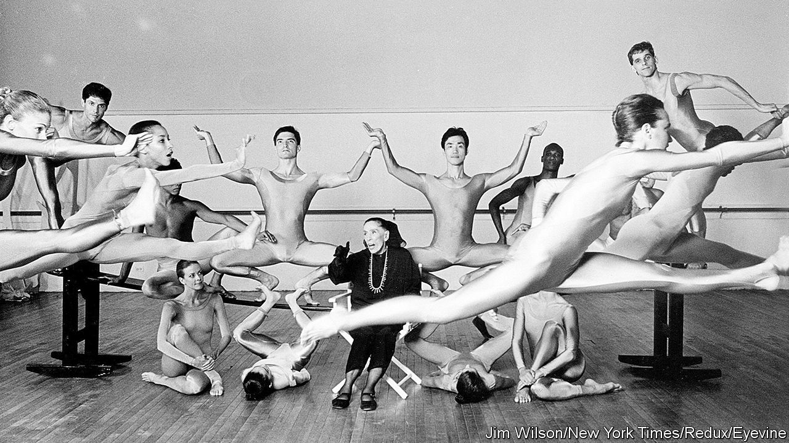
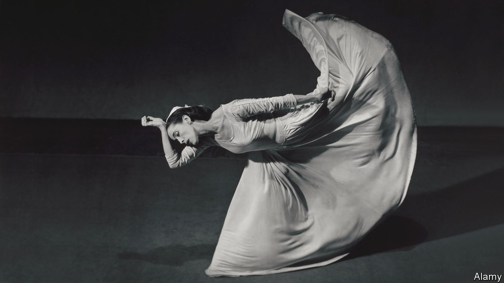

###### Dance like nobody’s watching

# Martha Graham’s life tracked the jumps and dips of modern dance 

##### A new biography looks at the woman who helped popularise modern dance in America 

 

> Feb 1st 2024 

 By Deborah Jowitt.

In 1929 an American critic, Henry McBride, observed that “the centre of the world has shifted” from Paris to New York. America did not just have cultural capital—it was becoming the West’s cultural capital. Dance was flourishing because of two inventive and charismatic choreographers. , the father of American ballet, liberated classical dance from European strictures, replacing costume dramas with graceful abstractions. 

Less well remembered today but just as influential was Martha Graham, who pioneered modern dance. The Martha Graham Dance Company, which she founded in 1926, was the first dance troupe in America. As Deborah Jowitt, a critic and former dancer, shows in a new biography, Graham helped “dignify” dance and elevate it from entertainment to art. 

Graham never had classical training. As a young woman, she saw a performance by Ruth St Denis, an early pioneer of modern dance, and later attended Denishawn, St Denis’s school. There Graham was immersed in “oriental” dances, which were fashionable at the time and often performed in costume at vaudevilles. But Graham soon moved beyond this cartoonish style, which she dismissed as “the weakling exoticism of a transplanted culture”. 

Drawing not just on Native American, black and folk traditions but also on philosophy and literature, Graham developed a style that was athletic and expressive. Still taught in Graham-style classes, its signature movement involves a deep breath in as the dancer leans forward in “contraction”, followed by a “release”. Graham thought dance began in the muscular core; she sometimes enjoined women to “dance from the vagina”. There were no positions, as in ballet, but rather a “lexicon of movements”, Ms Jowitt describes.

In her 181 works, Graham explored not just the fine arts (making dances about , the  sisters and Greek myth) but also contemporary social and political questions, such as the , the influence of technology on society and, above all, sex and gender. If Balanchine’s ballet idealised the female body and made women into angels, Graham’s modern dance doubled down on their fleshiness. 

Though Graham’s company was never financially successful, her dances made a mark. She was famous enough to be caricatured in newspapers and magazines and in 1937 became the first dancer to appear at the White House (invited by Franklin Roosevelt and his wife, ). The State Department sent the Martha Graham Company on world tours seven times between 1955 and 1987. Her energetic dances represented American freedom on stage, delighting audiences from Paris to Tokyo.

Today dance is more peripheral and “not nearly as culturally important in America as it was in the last century”, says Brian Seibert, who writes about dance for the  In 2017, the latest year data is available, around 1.9m Americans attended a dance performance, down by more than half since 2012, according to analysis of government surveys by Daniel Fonner, an adjunct lecturer at Southern Methodist University in Dallas.

Dance remains expensive to attend, and stubbornly physical. Beyond TikTok, dance does not translate well to filmed media, which limits its distribution and appeal. Fundraising has become more difficult as audience attendance and interest have flagged. Graham’s company has struggled to find its way since its founder died in 1991; so have other dance troupes that proliferated in Graham’s dynamic shadow. 

 


What are modern dance’s next steps? To attract new viewers, dance companies are tackling subject matter with clearer connections to people’s lives and popular taste. The San Francisco Ballet recently commissioned  about artificial intelligence, called “Mere Mortals”, based on the myth of Pandora unleashing ills. More dance companies are staging performances about race and sexual identity, too. Contemporary venues sometimes feature hip-hop-inspired groups one night and traditional companies the next. 

Just as ballet did not die with Balanchine, modern dance did not die with Graham. But it needs to work even harder to stay modern. ■


