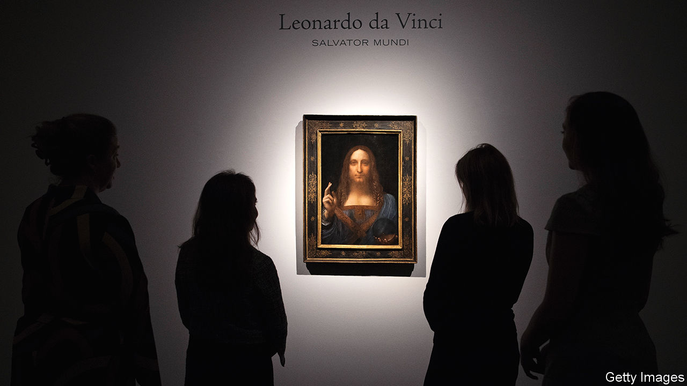

###### Secrecy and sketchiness in art

# The Sotheby’s trial revealed the art market’s unsavoury practices 

##### But the outcome suggests not much will change 

 

> Jan 31st 2024 

The horror of it dawned on Dmitry Rybolovlev in paradise, of all places. Over lunch in St Barts in 2014, conversation turned to a painting by Amedeo Modigliani, an Italian artist, that the Russian billionaire had bought several years before in a private sale. At the table happened to be an art adviser for the previous owner, who revealed Mr Rybolovlev paid around $25m more than what the seller had made. 

It turned out that a Swiss middleman named Yves Bouvier, whom Mr Rybolovlev thought was acting as his adviser, pocketed the difference, plus an agreed-upon commission. The staggering markup fit a pattern. Over 38 sales Mr Bouvier allegedly made more than $1bn. On many occasions Mr Rybolovlev says he was told falsely that Mr Bouvier was haggling with the sellers to get better prices, only to inflate them. 

Cue a  in Hong Kong, Monaco, Singapore, Switzerland and now America. On January 30th the art-filled drama concluded in a courtroom in Manhattan, with a disappointing result for Mr Rybolovlev. The trial concerned whether Sotheby’s, an auction house, aided and abetted Mr Bouvier’s alleged fraud. A jury found it did not. (Mr Bouvier was not a defendant; he and Mr Rybolovlev settled their dispute confidentially in Switzerland last December.) 

Mr Bouvier denied wrongdoing and said that he acted not as an adviser but as a dealer, who is entitled to markups. He bought trophy paintings in private sales at Sotheby’s, then flipped them to Mr Rybolovlev. The trial centred on pricey works by , Gustav Klimt,  and Modigliani. Mr Rybolovlev alleged that Sotheby’s helped Mr Bouvier justify markups by providing inflated appraisals in a bid to keep Mr Bouvier’s business, which Sotheby’s denied.

The case was challenging to win. Proving fraud requires showing intent; the evidence presented at trial was circumstantial. The saga’s main player, Mr Bouvier, never testified. That the alleged swindle took place on a yacht and in a penthouse apartment along Manhattan’s “billionaire’s row” near Central Park probably did not elicit much sympathy from the jury. 

Another wrinkle in Mr Rybolovlev’s case was the fact that he actually made out extremely well in at least one instance. In 2013 he bought “Salvator Mundi”, a painting by da Vinci (pictured), from Mr Bouvier for $128m. Mr Bouvier charged a 54% markup and congratulated him on a “great deal for this unique masterpiece”. That was shifty. But four years later Mr Rybolovlev sold “Salvator Mundi”  for any artwork and more than triple what he paid.

After the verdict Mr Rybolovlev’s lawyers said that the case shone a “light on the lack of transparency that plagues the art market”, but “secrecy made it difficult” to win. Private sales, both through auction houses and art dealers, are notoriously opaque. Much like the  on Wall Street, which was revealed after the global financial crisis of 2007-09 to take advantage of “dumb-money” pension funds, middlemen can manipulate prices for art. This trial highlighted the shamelessness of profit-hungry players. 

But there is more that Mr Rybolovlev should have done to protect his interests. For example, he never delineated in writing the nature of his relationship with Mr Bouvier: was he a dealer or an agent with a fiduciary duty? Lawyers for Sotheby’s hammered Mr Rybolovlev on why, as a shrewd businessman, he failed to draw up contracts or request invoices straight from the auction house. At the outset this could have cleared up the disagreement or at least mitigated the fallout, says Judd Grossman, an art lawyer. 

To Mr Grossman this lesson recalls another art-world dispute decided in New York in 2010. That case also involved an agreement never put into writing between a miffed collector and David Zwirner, a blue-chip dealer. “Some in the art world desire a market that is neither open nor honest,” wrote the judge in his ruling. Collectors, he added, in this “seemingly refined bazaar should heed the admonition ‘’”. ■


