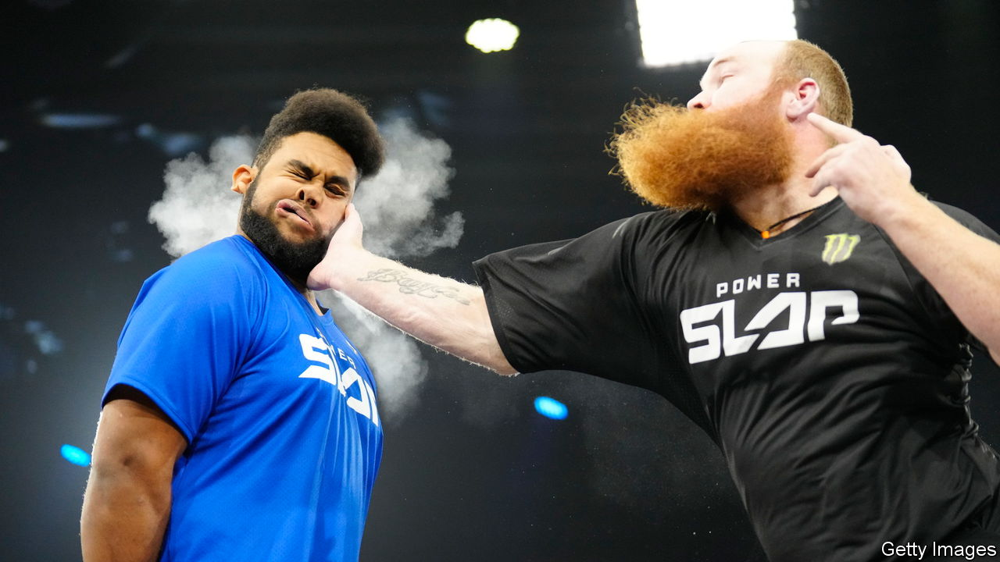

###### Bad sport

# The violence of “Power Slap” is part of its allure 

##### A fringe combat sport is pushing into the mainstream 

 

> Feb 1st 2024 

In January 2023 Dana White, president of the Ultimate Fighting Championship (UFC), a mixed martial-arts firm, launched a new sporting endeavour: Power Slap, America’s first official slap-fighting league. Slap fighting is simple. Two competitors, usually beefy men, slap each other. Hard. The bout typically ends when only one of them is conscious. As recently as a year ago the sport was obscure, watched largely on social media in eastern Europe. Now slap-fighting franchises are starting to hit the mainstream. 

The league’s first televised slap fight last year between two welterweights, Chris Thomas and Chris Kennedy, gave a sense of what was to come. Mr Thomas’s initial strike was mighty, rippling Mr Kennedy’s face and sending him to the mat, where he started displaying the fencing response. This is when a person’s arms are extended after a blow. It can be a sign of brain injury. Officials rushed to him and explained, when Mr Kennedy came to, that he had just been knocked out. “Knocked out doing what? Was I fighting?” he asked.

Watching people slap each other may sound mindless. And that is exactly what television viewers thought. Mr White first launched his venture as a reality-TV show, “Power Slap: Road to the Title”, but it failed to catch on and was dropped by TBS, a broadcaster, in March 2023, partly because of low ratings (and partly because of controversy after Mr White was filmed slapping his wife). 

However, television trash can turn into social-media treasure. “Power Slap” garnered a devoted online audience and now claims 4.2m followers on TikTok, with some videos achieving more than 1m views. The hype on social media spurred Mr White to double down with a second season, this time broadcast on Rumble, a video-sharing platform. The season finale will air on February 9th. 

The growing popularity of “Power Slap” is a slap in the face for those who worry about brain injury in combat sport. Contests involve unrestrained attacks with no defence: contestants are not allowed to duck, dodge or wince when hit. Most bouts conclude with a knockout (involving a fighter being unable to get up) or a technical knockout (with a referee deeming the fighter unfit to continue). In 26 of the 55 league matches to date a competitor was rendered unconscious. 

Critics worry about brain damage and chronic traumatic encephalopathy (CTE), a neurodegenerative disease that occurs after , often resulting in speech impediments and dementia. In recent years the reputations of American football,  (MMA) and rugby have been bruised because of the risks posed to athletes’ neurological health, including more documented cases of CTE. (Health concerns, however, have not stopped fans from watching matches.) 

Some critics are going so far as to try to ban children from contact sport. A committee of the California legislature recently passed a bill to make it illegal for those under the age of 12 to play tackle football. (Gavin Newsom, the governor, vetoed it, knowing political opponents would tackle him for regulatory overreach.) But even more than American football, slap fighting raises ethical questions about watching a sport that Dr Bennet Omalu, an expert on CTE, has called “inconsistent with the intelligence of humans”. 

The UFC experienced similar scrutiny in the 1990s. , a senator who later ran for president, branded MMA “human cockfighting” and attempted to ban it. The league introduced safety regulations, with the Unified Rules of Mixed Martial Arts markedly increasing safety for athletes and opening the sport to larger venues that previously refused to host MMA fighting. 

What regulations to promote safety in slap fighting might look like is not entirely clear: the lack of protective kit and rules helps explain the sport’s appeal for viewers. Most power-slappers are unbothered by complaints that their “sport” shows how desensitised viewers have become to violence. They just want a moment of social-media fame, brains be damned.■


