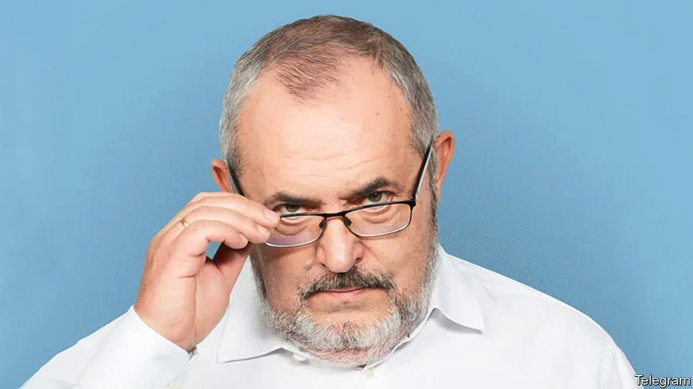

###### A tame candidate turns a little wild

# Meet Boris Nadezhdin, Vladimir Putin’s brave challenger 

##### Backing him is a form of protest 

 

> Feb 1st 2024 

“Idon’t have the charisma of Alexei Navalny or Boris Nemtsov. You can’t make Che Guevara out of me, no matter how hard you try. I have no illusions and don’t pretend to be a hero, God forbid. But it just so happened…” So speaks Boris Nadezhdin, a portly 60-year-old in glasses, a former physicist who spent the past 30 years inside Russian politics, mostly as someone’s deputy or aide, attracting little attention from the wider public. 

It is probably these dull Everyman qualities and a long and steady record of losing elections that persuaded the Kremlin to let him play a minor part in the farcical presidential poll on March 15th-17th. Vladimir Putin is certain to be elected to a fresh term. But the authorities have allowed Mr Nadezhdin to collect enough signatures to be included on the ballot. 


But it just so happened that over the past few weeks hundreds of thousands of Russians citizens have queued to sign for Mr Nadezhdin. The reason is a line in his manifesto that says Mr Putin’s “special military operation” (in Ukraine) is “a fatal mistake”. With his owlish appearance, Mr Nadezhdin epitomises the peaceful and ordinary life that has been uprooted by the military operation that Russians are not allowed to call a war. 

Standing in line to provide a signature for a man whose last name means “hope” in Russian, without any immediate risk of being arrested, looks like an attractive option for many disgruntled Russians. After all, they can go to prison for displaying a pacifist slogan or for backing Ukraine. Their smallest protests are brutally dispersed. They have no free media, no fair courts and no space for debate. 

Within days Mr Nadezhdin had collected over 200,000 signatures, twice the 100,000 he needed to qualify. To be sure, Mr Putin’s “special electoral operation”, as it is mockingly known, is as far from a free and fair election as Russia is from democracy, and Mr Nadezhdin is as far from winning it as he is from being Che Guevara. But the images of people queuing up for hours in the winter cold to support his candidacy add up to a political event in themselves. “I saw that there are people around me who think the same way as I do,” one person wrote to Mr Nadezhdin. 

Mr Putin’s dictatorship relies on ostracising and isolating those who oppose his regime, depriving them of any participation or even the ability to communicate and organise. “My goal was to show to the whole world and to people themselves that they are not alone. I’ve achieved this goal 100%,” Mr Nadezhdin told Meduza, Russia’s largest independent online media outfit, operating in exile. 

The queues have brought together people with diverse political views but a common anti-war sentiment, giving them a chance to air their numbers. Musicians, bloggers and influencers with multi-million-strong audiences recorded short videos of the lengthy queues. Yulia Navalnaya, the wife of Alexei Navalny, Russia’s leading opposition politician (who is locked away in a harsh penal colony in the Arctic), has signed up for Mr Nadezhdin. Political prisoners have saluted his courageous candidacy from behind bars. 

The Kremlin’s managers might have thought of Mr Nadezhdin as a controlled experiment, a way for Russians to let off a bit of steam, or perhaps they hoped that letting a licensed liberal get just a handful of votes would actually underscore Mr Putin’s popularity. But the experiment seems to have escaped its control. Whether it will now actually let Mr Nadezhdin stand, or will invent a reason why he cannot, is the story’s next episode. ■


