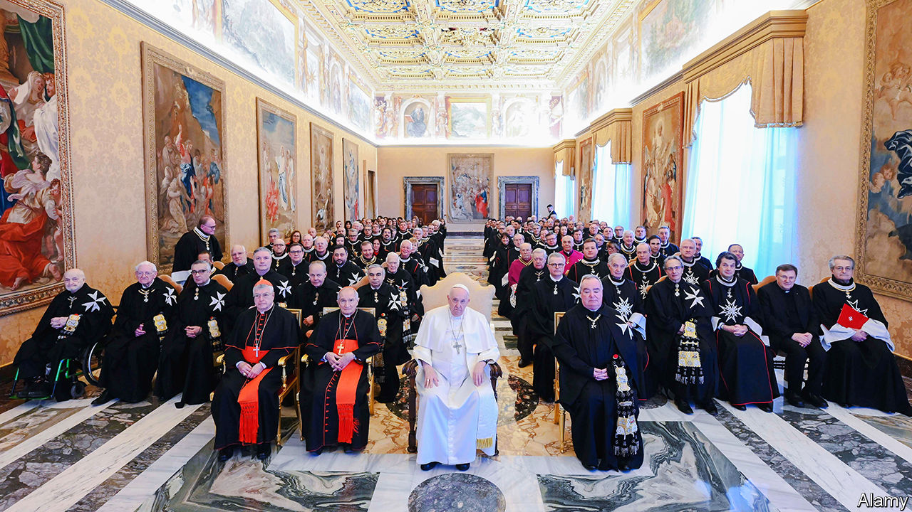

###### Still sovereign

# Meet the Knights of Malta 

##### An ancient global order gathers in the Eternal City 

 

> Feb 1st 2024 

It was enough to captivate any conspiracy theorist: in the grounds of an 18th-century Roman villa more than 100 well-connected men and women from around the world—many of them aristocrats—came together to discuss their common mission. The meeting, from January 25th-27th, brought together the ambassadors of perhaps the oddest entity in international law, the Sovereign Military Order of Malta.

Once the Crusaders’ medical corps, the order later ruled Malta for more than 250 years. Driven out by Napoleon in 1798, its knights (and later dames) retained that intangible yet priceless asset, sovereignty. That lets the order not only maintain diplomatic relations with other states, but also issue stamps, coins, passports and car number-plates. Its Grand Master is entitled to be addressed as “Your Highness” and what little territory he rules—a villa on the Aventine Hill in Rome and a mansion near the Spanish Steps—is not part of Italy. The Italian soldiers and police guarding the ambassadors’ pow-wow stayed outside the villa’s gate.

Today the order is essentially a Catholic humanitarian NGO—and a very big one, with 13,500 knights and dames, almost 100,000 volunteers and more than 50,000 professional staff who care for the victims of natural disasters, wars, epidemics and poverty. In a room decorated with the coats of arms of scores of past dignitaries of the order, Riccardo Paternò di Montecupo, its Grand Chancellor (similar to a prime minister), says its members do not proselytise. But, he adds, “If our work touches the heart of someone, well, we are very happy.”

The order also runs permanent structures, notably the Holy Family Maternity Hospital in Bethlehem. It has no diplomatic relations with Israel. But, perhaps ironically in the land of the Crusades, it maintains an ambassador to Palestine: an American, Michele Burke Bowe. Like many other humanitarian outfits, it has been unable to gain access to the Gaza Strip. “But as soon as the occasion presents itself, we’ll be in Gaza,” says Ms Burke Bowe. ■


