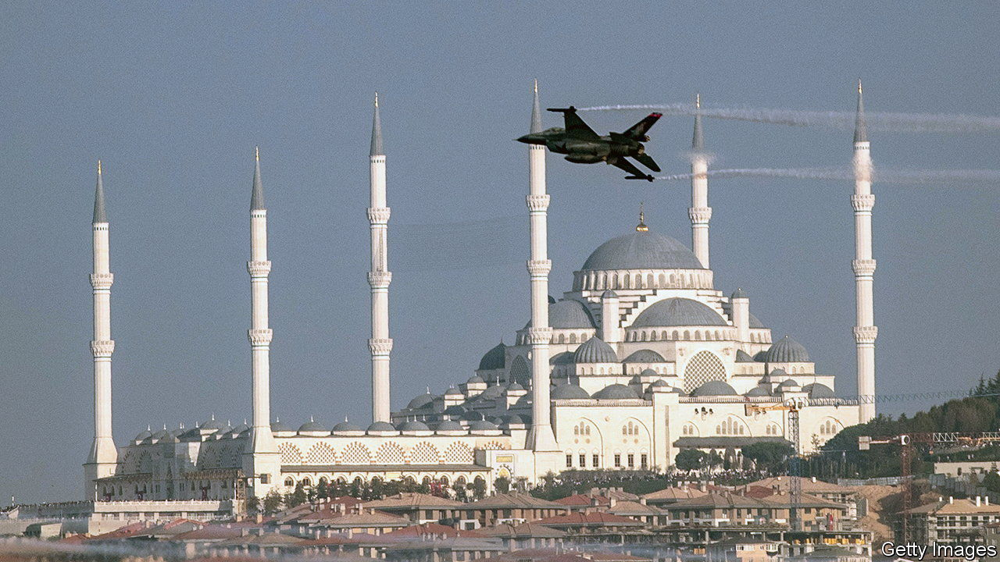

###### F-16s, by any means

# Sweden clears a Turkish hurdle to NATO accession 

##### Hungary is still blocking it, though 

 

> Feb 1st 2024 

FOR months, senior officials in Ankara had assured their Swedish counterparts that Turkey’s ratification of the Nordic country’s NATO membership bid was just around the corner. The long wait came to an end on January 25th, when Turkey’s president, Recep Tayyip Erdogan, signed off on Sweden’s accession protocols, shortly after his country’s parliament backed the agreement. The ink of Mr Erdogan’s signature had barely dried when America agreed to provide Turkey with 40 new F-16 fighter jets and to modernise another 79, a deal worth some $23bn. America simultaneously approved the sale of up to 40 F-35 stealth fighters to Greece.

The timing was no coincidence. For well over a year Mr Erdogan had used his veto power over NATO’s enlargement to seek concessions from his Western allies. The F-16 sale is the most important of these. Mr Erdogan has not made any new friends in NATO. But he has notched up a number of victories. He got both Sweden and Finland to scrap their arms embargoes against Turkey, imposed in 2019 after Turkey launched an offensive against Kurdish insurgents in Syria. On January 29th Canada, another NATO member, said it would resume exports of drone parts to Turkey, which it had suspended in 2020.

Mr Erdogan waved through Finland’s membership last March, but kept Sweden jumping through hoops. In response to Turkish pressure to crack down against the Kurdistan Workers’ Party (PKK), an outlawed Kurdish group, the Nordic country passed a new terrorism law in 2023, a move that needed constitutional changes. 

Sweden’s accession also became entangled in a row featuring America, Turkey and Greece, another member of the alliance. Ever since it was booted from America’s F-35 programme as a result of its purchase of an air-defence system from Russia, Turkey has sought to buy new F-16s and upgrade the ones it bought years ago. Mr Erdogan wanted the Americans to unblock the sale, which had been held up by Congress for years. 

But America played hardball as well. Its officials made clear they would continue to block the F-16 sale unless Mr Erdogan gave Sweden the green light. They also suggested America would push ahead with the sale of the F-35s to Greece without waiting for Turkey, a move that risked upsetting the balance of power between the two neighbours. That threat helped clear the way for the vote. Sweden is now only a single Hungary-shaped hurdle away from membership in the alliance.

The F-16 sale will not transform America’s relations with Turkey, thanks to continued irritation in Washington over Turkey’s human-rights record, Mr Erdogan’s support for Hamas and his reluctance to stand up to Russia. But the new planes will help anchor Turkey in NATO and strengthen its dependence on America’s arms makers for spare parts and maintenance, at least for a while. Turkey is working on its own indigenous aircraft, known as the Kaan. But it is not likely to enter into service for another decade or so. The F-16s are expected to keep flying well into the late 2040s. Anyone prognosticating too anxiously over Turkey’s imminent departure from NATO might take note. ■


