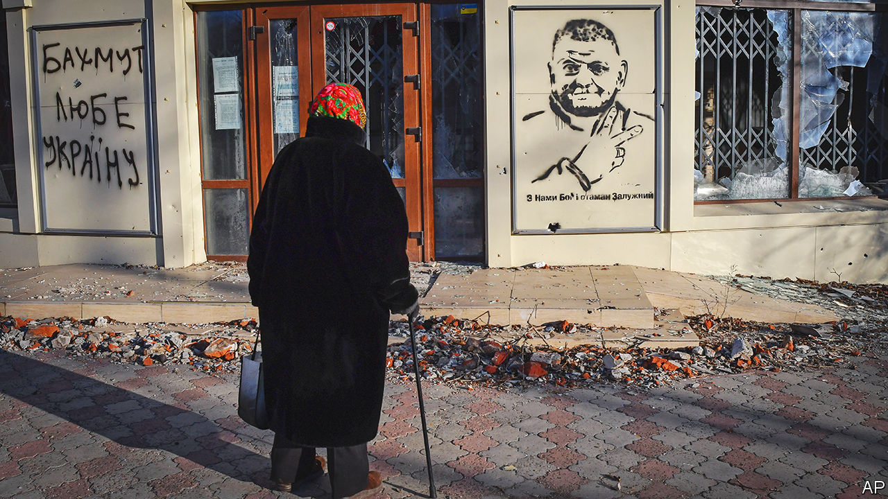
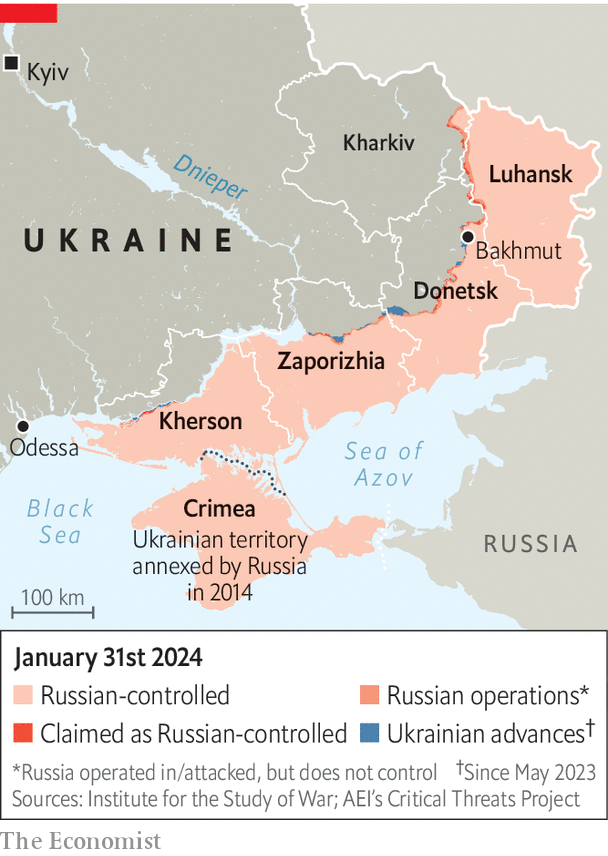

###### Trouble at the top

# The feud between Ukraine’s president and army chief boils over 

##### Is Valery Zaluzhny about to be fired? 

 

> Jan 30th 2024 

Instability AT THE top of Ukraine’s wartime government was laid bare this week. On January 29th rumours swept Kyiv that the president, Volodymyr Zelensky, was about to fire his popular armed-forces commander, General Valery Zaluzhny, following weeks of reported tension. So far, Mr Zelensky has not announced the general’s removal. That does not mean his job is safe; it may simply be that his replacement has not yet been lined up. As went to press on February 1st, a messy situation had still not been resolved. 


A dramatic day in the capital had begun with leaks from MPs, who had been told about a “set of documents” sent to a security committee for signing. Later, sources in the general staff and close to General Zaluzhny confirmed that a shake-up was indeed in the works.  has confirmed that an early-evening meeting took place on January 29th at which the president told his general that he had decided to dismiss him. Mr Zaluzhny was offered another role: head of the national security council. He turned it down. 

 


News of the plan was soon leaked to local media. The defence ministry and presidential palace denied that the general had been dismissed, which was technically true. But the problems—the dysfunctional relationship between the president and his general, and suspicions in the president’s office that the general harbours political ambitions—have not gone away. Both men look damaged by the row, and the open disputes between Ukraine’s political leadership and its military command are worrying Ukraine’s main allies.

Two generals are being mentioned as contenders for Mr Zaluzhny’s job: Oleksandr Syrsky, 58; and Kyrylo Budanov, 38. Both are considered to be close to the presidential team. , one of the army’s most experienced officers, was the operational brain behind two of Ukraine’s most remarkable victories against Russia in 2022: around Kyiv and in the Kharkiv region. But his harsh approach to fighting has made him unpopular in parts of the army. Last year he sacrificed battle-hardened commanders in the arguably pointless defence of the small town of Bakhmut. , Ukraine’s enigmatic and ambitious head of military intelligence, embraces a much more unconventional and untested approach to command. He has not led conventional armed forces before. Some have suggested he turned the job down at the last minute. 

The to-do has come at a critical time. The summer counter-offensive failed; Ukraine faces uncertainty over the degree of  it can expect. The battle over General Zaluzhny’s future will not make it easier for Ukraine to get funds flowing from its allies, as the commander is highly regarded in the West. Ukrainian troops on the front line are already complaining of a shortage of ammunition. Russian units are firing at least five times as many shells as their enemy, and making modest territorial gains in the east of the country. 

The defence of Kyiv and north-east Ukraine at the start of the war in 2022 made General Zaluzhny a cult figure. Polls repeatedly showed him to be more popular than his president; this created tension between the two men, whose relations were initially good. In particular, the general’s endorsement of a charitable foundation set up in his name in April 2022 was seen by some as too political. 

Mr Zelensky is by no means the only person to have noted his general’s popularity. Prominent opposition figures, hitherto sidelined by the need for national unity, have started to align themselves with General Zaluzhny. That process has accelerated in recent weeks as rumours of the general’s coming ouster intensified. The previous president, Petro Poroshenko, who harbours little love for his successor, was quick to take advantage of the disarray. “Firing Zaluzhny, if true, would hit at the heart of national unity,” he wrote. 

It is not unusual for civilian leaders to , even the top ones, in war. Sometimes it occurs because of insubordination, as with Harry Truman’s decision to relieve Douglas MacArthur of command during the Korean war after the general publicly undermined American policy and defied the president’s orders. In 2010 Barack Obama sacked Stanley McChrystal, his top commander in Afghanistan, after he and his staff made disparaging remarks about the president in a profile by , a magazine.

On other occasions generals are sacked for poor performance. Abraham Lincoln fired George McClellan during the American civil war for military misjudgments. Sir John French was fired as head of the British Expeditionary Force in 1915 after failing to adapt to the prevailing trench warfare. Mr Obama fired General David McKiernan from the Afghanistan job after only 11 months, on the grounds that he lacked the bold instincts required to turn the faltering war around. 

Military history is also replete with cases where commanders are relieved for less noble reasons. Generals are often heroic and dashing figures, eclipsing their political masters either through battlefield success or self-publicity—or both, as in the case of Ariel Sharon, a young Israeli officer and future prime minister who gave interviews to the foreign press after his daring exploits in the Yom Kippur war. 

That breeds envy and resentment. General MacArthur was considered to be a plausible candidate for the Republican presidential nomination in the 1940s. David Petraeus, General McChrystal’s replacement and later the director of the CIA, attracted persistent rumours of political ambition, prompting Mr Obama’s aides to seek assurances that the general would not run against the president in 2012. 

A similar dynamic appears to have influenced Mr Zelensky’s decision to dispense with General Zaluzhny. True, there have been differences of opinion on military matters. In particular, the general has publicly pressed Mr Zelensky to launch a large-scale mobilisation of men; the president has resisted this, knowing it would be very unpopular. There were also fierce debates between the presidential palace and general staff over military strategy, including the argument over defending Bakhmut. But at the end of the day, it was probably General Zaluzhny’s steadily growing political profile that piqued Mr Zelensky and those around him. 

A president is entitled to change a commander in whom he no longer has confidence: the subordination of military to civilian leadership is a cornerstone of democracy. And General Zaluzhny’s replacement, once appointed, will doubtless serve effectively. But removing a man as popular with his soldiers and the public as the general carries political and military risks. It is not clear how this story will end. But if Mr Zelensky keeps his top commander on, he will look weak. If he fires him, the clumsy way it has been handled will only damage confidence in the leadership. As so often in this conflict, there are no easy wins. ■

