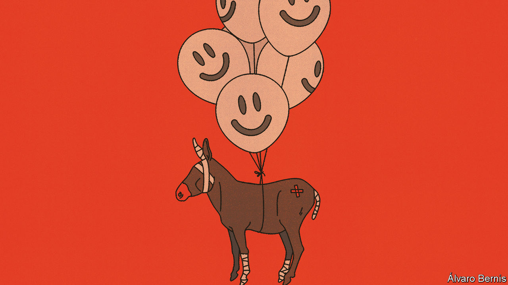
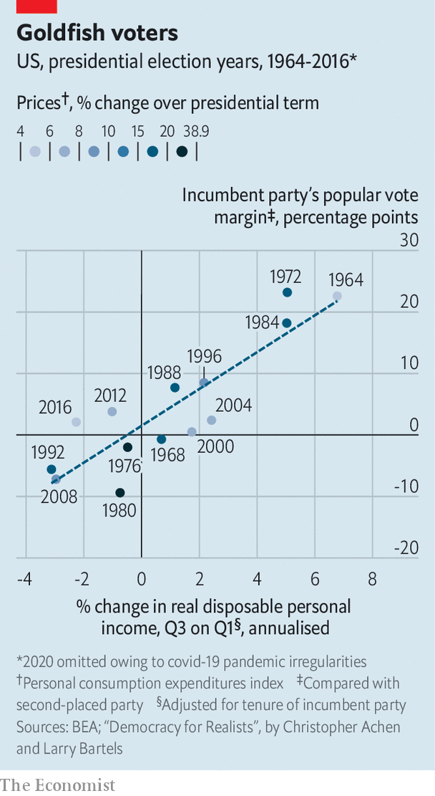

###### Free exchange

# Biden’s chances of re-election are better than they appear 

##### The economy is providing a headwind at present. That could soon change 

 

> Feb 1st 2024 

AMERICANS HAVE not been impressed by President Joe Biden’s handling of the economy. In fact, according to polling averages, nearly 60% disapprove of it. Meanwhile, Donald Trump’s ratings on economic matters are considerably better. The gap in perceptions augurs ill for Mr Biden’s chances of winning the presidential election in November, especially since voters rank the economy as the most important issue facing the country. 

But the economy is itself improving fast. Inflation is falling, growth is strong, the stockmarket is booming and, if investors are right, the Federal Reserve will cut interest rates by a percentage point before voters go to the polls—an expectation that is reducing the cost of mortgages. Despite Mr Biden’s poor approval ratings when it comes to economic management, could the state of the American economy actually boost his chances of re-election?

Three lessons emerge from studies that look at the relationship between economic fortunes and election results. The first two are bad for Mr Biden: opinions about the economy matter a great deal and voters hate inflation. Ten months before the vote, Mr Biden has already presided over a 14.4% rise in prices, as measured by the personal-consumption-expenditures index—more than at the equivalent point in any presidential term since 1984. The stain of inflation appears to blot out today’s healthy labour market and real wage growth that has hewn to the trend of the late 2010s, despite the disruption of the covid-19 pandemic.

 


The third lesson, however, is a lot better for Mr Biden: voters have short memories. “The clear consensus in the literature is that recent economic performance is much more relevant at election time than earlier performance,” write Christopher Achen and Larry Bartels, two political scientists, in their book “Democracy for Realists”. Americans, they argue, “vote on the basis of how they feel at the moment” and “forget or ignore how they have felt over the course of the incumbent’s term in office”. The authors show that increases in real disposable income per person in only the two quarters before a vote can, with an adjustment for tenure in the White House, predict the vote share of parties that are governing America to a striking degree of accuracy (see chart).

It is an important finding, particularly as inflation has recently tumbled. In the second half of 2023 prices rose at an annual pace of 2%, down from a peak of 7.7% in the first half of 2022. Even if the hot economy brings a resurgence in inflation, it is highly unlikely to match the earlier peak, especially since futures markets suggest that oil prices—and hence the cost of filling up a car—will stay flat during 2024. Because inflation has fallen without a recession, tight labour markets continue to produce strong real wage growth. In the last quarter of 2023 real disposable income per person grew at an annualised rate of 1.9%. If maintained until the election, that pace would be associated with a winning margin equivalent to Bill Clinton’s in 1996. “Recent widespread pessimism about Biden’s prospects seems to me excessive,” argues Mr Achen. “The economy appears likely to help [him].” 

Don’t blame me

The impact of inflation just before elections is less studied than that of growth. America does not have many episodes of high inflation to draw on. That said, economists have long supposed that politicians in emerging markets attempt to win votes by temporarily suppressing price rises ahead of polls. A classic example is Brazil in 1986, when the government implemented price and wage controls and fixed the exchange rate in February, causing monthly inflation to fall from 22% to less than 1%. Only six days after winning parliamentary elections in November, the government had to abandon the plan amid huge economic imbalances. By the middle of 1987 annual inflation exceeded 1,000%. These “stop-go” strategies would fail if voters did not reward governments for bringing inflation to heel.

Are such examples relevant to America, where the inflation problem is more novel but far less severe? Calculations by Ray Fair of Yale University suggest that things may be more complicated. He finds that presidential elections are best predicted by a model including inflation over the entire term of the incumbent party, even while recent economic growth is given special weight. The memory of inflation being painful would explain why the usual relationship between consumer confidence and the economy broke down in 2023, with survey respondents staying gloomy even amid strong growth and lower inflation.

There are signs, though, that Americans are starting to feel better about their economy. Consumer confidence, as measured by the University of Michigan, rose strongly in December and in January’s preliminary data—and is at its highest since July 2021 (a definitive reading will be released shortly after this column is published). Such improved sentiment is consistent with analysis by Ryan Cummings and Neale Mahoney, two former Biden-administration economists now at Stanford University, whose model allows the psychological impact of inflation to decay gradually over time. They calculate that, if inflation in 2024 is 2.5%, then by the end of the year the drag on consumer sentiment will be 50% lower than it is today and 70% down on the peak in mid-2022. Such an effect would surely spill over into Mr Biden’s polling numbers. 

Even Mr Fair’s model—in which the high inflation of 2022 and the probably low inflation of 2024 weigh equally—predicts that economic growth will propel Mr Biden to victory in the popular vote. There is no guarantee that the economic forecasts feeding such models are right. Indeed, since covid struck they have often been wrong. The electoral college contains a bias towards Republicans; Mr Trump won in 2016 despite losing the popular vote. And Mr Biden is starting from a weak position, not just in terms of his economic reputation. But as the president tries to close the polling gap, the economy should provide him with a tailwind. ■


