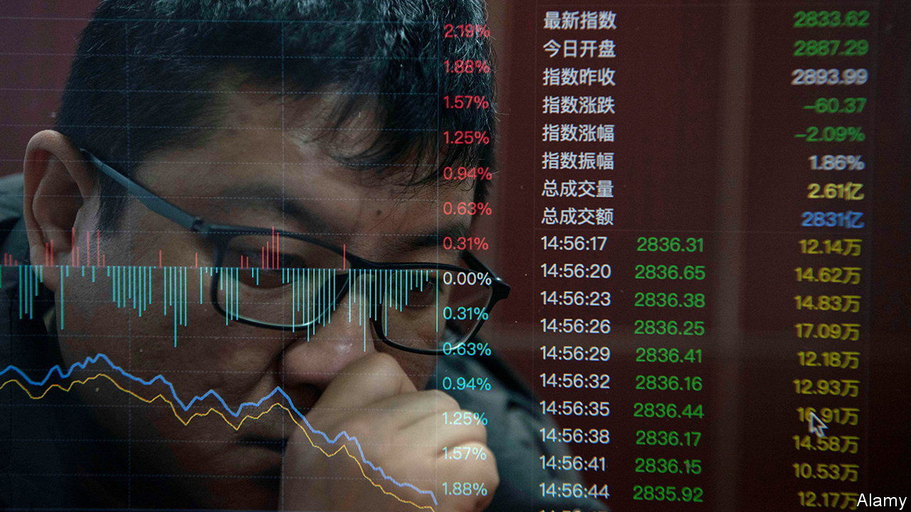

###### Game changing

# China’s leaders are flailing as markets drop 

##### The government is not used to being bullied 

 

> Feb 1st 2024 

In recent weeks, China’s economic policymaking has been not just inadequate but a little skittish. On January 23rd draft rules on video games disappeared from the regulator’s website a month after their appearance, as if they had never existed. The regulations, which would have sprinkled games with pop-up warnings against “irrational consumption behaviour”, had triggered a steep sell-off in the shares of tech companies like Tencent. 

The following day, Pan Gongsheng, governor of China’s central bank, held an unusual press conference in which he cut reserve requirements for banks by more than expected, and vowed to “strive to stabilise the market”. It was an attempt to reassure investors after the bank had failed to cut interest rates earlier in the month.

Whereas other governments are used to being bullied by the markets, China’s prides itself on keeping finance in its place. These concessions to market sentiment were therefore notable. They were not, however, very effective. Data on January 31st showed a slowdown in construction and unremitting declines in manufacturing prices. China’s stockmarkets fell again, returning to levels reached before Mr Pan spoke. According to Bloomberg, the stockmarkets of mainland China and Hong Kong have lost over $1trn in value this year.

China’s policy inconsistency has thus been expensive. And there are other examples. The central government has, for instance, ordered 12 provinces and cities to halt infrastructure projects, according to Reuters. Its worries about wasteful behaviour are understandable. But such strictures will make it all the harder for China’s government to provide the fiscal easing required to revive confidence and growth. 

Indeed, China is enduring “de facto fiscal austerity”, reckons Robin Xing of Morgan Stanley, a bank. On-balance-sheet borrowing has “failed to offset” tighter off-balance-sheet local-government borrowing. Along with a property slump, this has led to a slowdown in China’s nominal growth. The GDP deflator, a measure of prices, has fallen for three quarters in a row—the longest spell of deflation since the Asian financial crisis reached China in 1998. 

The stockmarket’s weakness reflects this economic predicament. It also reflects uncertainty about how the government will respond. The draft gaming rules brought back memories of the “regulatory storm” of 2021, when officials cracked down with relish on internet firms and what they called the “disorderly expansion of capital” into realms like private tutoring. The economy is now weaker than it was then, and the government seems more sensitive. But if business were to recover, would such regulations return? The fear of what might happen if the market rebounds makes such a rebound less likely.

There are also doubts about just how far the government will go in order to rescue the property market. For now, it has set aside concern about speculation, giving cities freedom to scrap restrictions on owning several flats. Last week Guangzhou removed purchase limits for larger flats. This week Suzhou went further, abandoning restrictions for all flats.

Yet such rules are not the biggest obstacle to homebuying. Of more importance is fear that a flat bought in advance will not be delivered, as the property developer might . Some economists therefore think that the central government will need to set up a fund to take over unfinished projects or guarantee property prepayments, much as bank deposits are guaranteed. 

It is also unclear how much fiscal stimulus the central government is prepared to provide. In October, when it increased its budget-deficit target and said it would issue an extra 1trn-yuan-worth ($140bn) of bonds in its own name, it was possible to believe that a signal was being sent. After years of relying on local governments to prop up the economy, the central government was now willing to use its stronger balance-sheet to put a floor under growth. 

Since then, the central government has been slow to spend the 1trn yuan. At the World Economic Forum in Davos, Li Qiang, China’s prime minister, boasted about how little stimulus China had required. In March he will reveal the official growth target, budget deficit and bond quotas for the rest of this year. Perhaps the government will be ambitious. Yet with markets falling, March seems a long time away. 

Although stockholdings do not represent a big share of household wealth in China, and equity issuance contributes a small share of corporate financing, the confidence of consumers, homebuyers and entrepreneurs is crucial to the country’s recovery. Spirits are unlikely to revive if the market continues to deliver such a grim verdict on the economy’s prospects. 

Mr Pan, Mr Li and He Lifeng, China’s economic tsar, have all stressed the importance of a stable stockmarket in recent days. But their words alone have not impressed investors. One image circulating online shows a case full of horns, trumpets and other blowhard instruments. They represent all that China’s policy toolbox has to offer. ■


