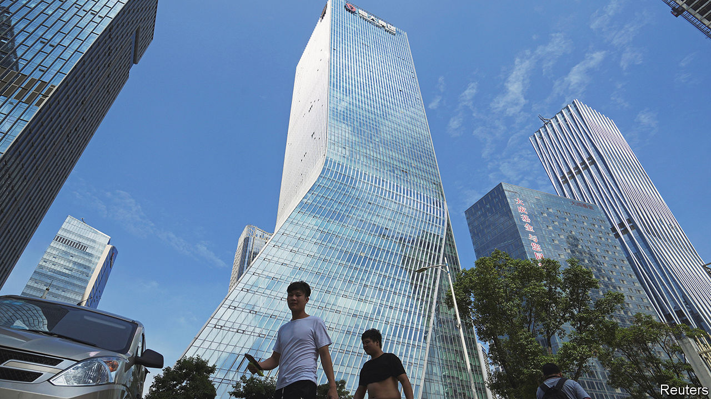

###### Never grand

# Evergrande’s liquidation is a new low in China’s property crisis 

##### A judge in Hong Kong surprises the mainland 

 

> Jan 29th 2024 

“Enough is enough,” declared a Hong Kong judge on January 29th of Evergrande, a failing Chinese , and its two-year struggle to avoid repaying its creditors. In a landmark ruling, the court ordered the liquidation of the firm, which is the world’s most indebted property developer, with over $300bn in liabilities. A provisional liquidator will be appointed, assuming management of the company. Foreign creditors will have to recoup losses from a firm that holds most of its assets in mainland China. The ruling thus pits Hong Kong’s courts against a Chinese government anxious to restore public confidence in a struggling market.

No company has been more central to China’s , which kicked off in mid-2021 when Evergrande first showed signs of weakening. Rules intended to wean developers from debt pushed the company to default later that year. Since then most of China’s listed property developers have either failed to pay back their investors or been forced into restructuring. Their access to credit has been virtually cut off, causing builders to stop working on projects. Prospective homebuyers have delayed purchases, leading to a 6.5% decline in the sale values, year on year, and unnerving a population that stores most of its wealth in property.

Policymakers had hoped that restructuring Evergrande would pave the way for a steady revitalisation of the market. Instead, Evergrande missed important deadlines and, when it did offer a restructuring proposal, underwhelmed investors. Its plan, which was panned by bondholders, involved giving creditors a stake in some of its other businesses, such as an electric-vehicle line. Far from restoring confidence, the battle became increasingly ugly. At one point a group of bondholders demanded that Hui Ka Yan, Evergrande’s chairman, put up $2bn of his own money. Mr Hui was later detained by Chinese authorities. His whereabouts are now unknown.

China’s housing crisis has drained global investors of confidence in the country’s policymaking. It is now doing similar damage to Hong Kong. For decades, investors have accessed China via Hong Kong. One of the city’s distinct features has been a legal system, separate from China’s, that is based on common law. But court rulings in Hong Kong have no guarantee of being upheld in mainland China, where almost all of Evergrande’s assets are based. 

The liquidator appointed by a Hong Kong court will be forced to deal with local authorities that may not recognise an order drawn up outside China’s legal system. Although a pilot project to recognise cross-border rulings was set up in 2021, qualification requirements are tough and the scheme is recognised only in a few cities. Hong Kong rulings can easily be shot down by mainland courts if they have the potential to disturb public order. 

As Tommy Wu of Commerzbank, a German lender, has written, a full liquidation of Evergrande’s Chinese assets would probably send a shockwave through the Chinese economy. Property developers have sold properties to ordinary Chinese folk that they have not yet provided. Investors’ claims on Evergrande’s projects or any cash holdings it still has could get in the way of delivery. This would work against Beijing’s efforts to restore market confidence, almost guaranteeing that the liquidation process would be drawn-out.

The Hong Kong ruling leaves room for restructuring, with the judge noting that Evergrande could still offer it to creditors. The firm says it is aiming to produce a new plan. Since a liquidator will be taking over, there may now be a better chance of a deal. But it will not be one that includes many Chinese assets. And for a company that mainly owns Chinese property, that is a problem. Evergrande’s liquidation marks a new low in China’s property crisis—it is far from the end of it. ■


