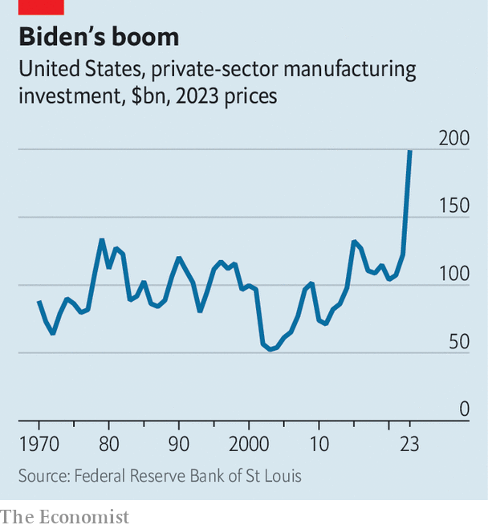
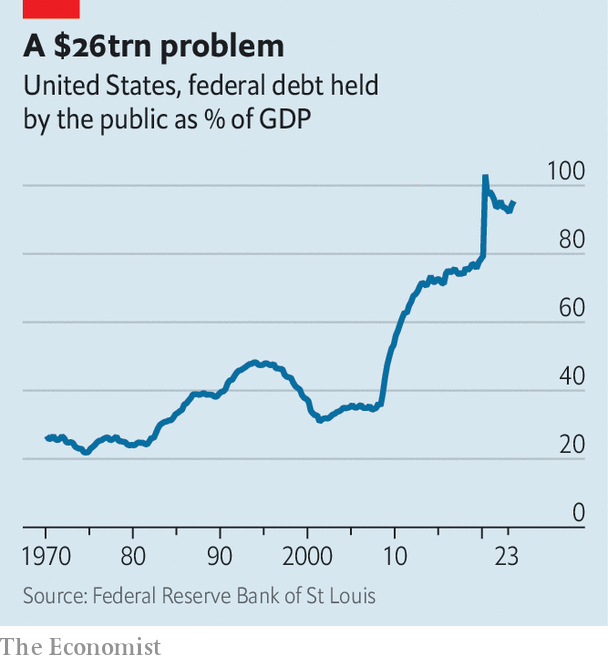

###### The octogenarian radical

# What four more years of Joe Biden would mean for America’s economy 

##### Bigger government, for a start 

 

> Jan 30th 2024 

Joe Biden’s opponents focus on his age as something that makes him doddering, confused and ultimately unfit for office. So the great paradox of the 81-year-old’s first term is that he has presided over perhaps the most energetic American government in nearly half a century. He unleashed a surge in spending that briefly slashed the childhood poverty rate in half. He breathed life into a beleaguered union movement. And he produced an  that aims to reshape the American economy.

There is plenty to debate about the merits of all of this. A steep rise in federal spending has aggravated the country’s worrying fiscal trajectory. Subsidies for companies to invest in America have angered allies and may yet end up going to waste. But there is no denying that many of these policies are already having an impact. Just look at the boom in factory construction: even accounting for inflation, investment in manufacturing facilities has more than doubled under Mr Biden, soaring to its highest on record.

 


What would he do in a second term? Mr Biden’s re-election motto—“We can finish the job”—sounds more like a home contractor’s pledge than the rhetoric of a political firebrand. Yet to hear it from the president’s current and former advisers, Bidenomics amounts to little short of an economic revolution for America. It would be a revolution shaped by faith in government and a mistrust of markets.

 


Five elements stand out. The first is a desire to boost workers, mostly through unions. The second is more social spending, especially on early-childhood education. Third is tougher competition policy to restrain big business. Fourth, a wave of investment intended to make America both greener and more productive. Last, Mr Biden wants to tax large firms and the wealthy to pay for much of this.

As with any president, Mr Biden’s agenda thus far has been limited by Congress. The five elements were all present in the $3.5trn “” bill that Democrats in the House of Representatives backed in 2021, only to run smack into a split Senate. The result is that the most prominent part of existing Bidenomics has been the investment element, comprising three pieces of legislation focused on infrastructure, semiconductors and green tech. Signing three big spending bills into law nevertheless counts as a productive presidential term. They add up to a $2trn push to reshape the American economy.

If Mr Biden returns to the White House for a second term but Republicans retain control of the House or gain the Senate, or potentially both, advisers say that his focus would be on defending his legislative accomplishments. Although Republicans would be unable to overturn his investment packages if they did not hold the presidency, they could chip away at them.

Take the . Along with some $50bn for the chips industry, it also included nearly $200bn in funding for research and development of cutting-edge technologies, from advanced materials to quantum computing. But that giant slug of cash was only authorised, not appropriated, meaning it is up to Congress to pass budgets to provide the promised amount. So far it is falling short: in the current fiscal year, it is on track to give $19bn to three federal research agencies, including the National Science Foundation, which is nearly 30% less than the authorised level, according to estimates by Matt Hourihan of the Federation of American Scientists, an advocacy group. If Congress refuses to work with Mr Biden, these shortfalls will grow.

The funding directed at infrastructure and semiconductors is more secure, but much of it will run out by 2028, before the end of a second term. Without Republican support for funding, the investment kick-started over the past couple of years may ease off. High-cost producers will struggle to survive. Critics may see no reason to devote so much treasure to manufacturing when a modern economy based on professional, technical and scientific services already generates plenty of well-paying jobs.

But Mr Biden will have some leverage if Republicans try to water down his policies. Many of the big tax cuts passed during Donald Trump’s presidency expire at the end of 2025. Republicans want to renew them, to avoid income-tax rates jumping up. So one possibility is that Mr Biden could fashion a deal in which he agrees to an extension of many of the tax cuts in exchange for Republicans in Congress backing some of his priorities, including his industrial subsidies—never mind that such an agreement would be fiscally reckless.

The White House is also hoping that Mr Biden’s investment programmes will develop momentum of their own. “We are very pleasantly surprised by the extent to which private capital has flowed in the direction of our incentives,” says Jared Bernstein, chair of the president’s Council of Economic Advisers. Much of the money is going to red states, spawning constituencies of businesses and local politicians who would object to cuts. Meanwhile there is, in principle, bipartisan support for federal spending on science and technology as a way of safeguarding America’s competitive edge over China. That is why a few dozen Republicans in the House and Senate, albeit a minority, voted for the semiconductor package. Given this constellation of interests and leverage, the industrial policies that defined Bidenomics in the president’s first term would probably survive his second term, albeit in somewhat more limited form.

But what if Mr Biden is less constrained? To really understand the potential scope of Bidenomics, it is worth asking what the president would do if the Democrats ended up controlling both houses of Congress. Once they came down from their elation at such an outcome, the team around Mr Biden would know that they had a limited window—probably just two years, until the next set of midterm elections—to get anything of note done.

For starters they would turn to the social policies left on the Build Back Better cutting-room floor. These include free pre-school for three- and four-year-olds, generous child-care subsidies, spending on elderly care, an expanded tax credit for families with children and paid parental leave. Janet Yellen, the treasury secretary, has described this agenda as “modern supply-side economics”. She argues that investments in education would make American workers more productive, while investments in care would free up people, especially women, to work, leading to a bigger labour force. But it would also be costly, running to at least $100bn a year of additional spending—adding half a percentage point to the annual federal deficit (which hit 7.5% of GDP in 2023). And implementation would be challenging. For instance, funding for child care would fuel demand for it, which in turn would exacerbate a chronic shortage of caregivers.

Mr Biden’s desire to strengthen unions would also receive fresh impetus. The president describes himself as the most pro-union president in American history—a claim that may well be true. In his first term support for unions was expressed most clearly through words and symbolic actions: when he joined striking car workers near Detroit in September, he became the first president to walk a picket line. Mr Biden would have liked to have done more. He had at first wanted to make many industrial subsidies contingent on companies hiring unionised workers, a requirement that did not make it into law. The labour movement’s big hope for a second Biden term is passage of the PRO Act, which would boost collective bargaining by, among other things, making it harder for firms to intervene in union votes. That would represent a gamble: the flexibility of America’s labour market is a source of resilience for the economy, which has been good to workers in recent years. 

The flipside of Mr Biden craving approbation as a pro-union president is that he has also come to be seen as anti-business. Members of his cabinet bridle at this charge, noting that corporate profits have soared and that entrepreneurs have created a record number of businesses during his first term. Yet the single biggest reason why Bidenomics has got a bad rap has been his , led by Lina Khan of the Federal Trade Commission (FTC). Although her efforts to cut down corporate giants have sputtered, with failed lawsuits against Meta and Microsoft, she is not done. The FTC has introduced new merger-review guidelines that require regulators to scrutinise just about any deal that makes big companies bigger, which could produce even more contentious competition policy. Excessive scrutiny of deals would also use up regulators’ scarce resources and poison the atmosphere for big business. An alternative focus, on relaxing land-use restrictions and loosening up occupation licensing, would provide a much healthier boost to competition.

Captain of industry

At the same time, Mr Biden may double down on the manufacturing policies of his first term. The $50bn or so of incentives for the semiconductor industry has been a start, but it is small relative to how much investment is required for large chip plants. Advisers talk of a follow-on funding package. There would also be a desire to craft new legislation to smooth out bumps in the implementation of industrial policy. Todd Tucker of the Roosevelt Institute, a left-leaning think-tank, advocates a national development bank, creating a reservoir of cash that could be channelled to deserving projects. 

How to pay for it all? Mr Biden has long made clear that he wishes to raise taxes on the rich, in particular on households earning over $400,000 a year and on businesses. The president’s advisers argue that he truly believes in fiscal discipline. His budget for the current fiscal year, for instance, would cut the deficit by $3trn over a decade, or by 1% of GDP a year, according to the Committee for a Responsible Federal Budget (CRFB), a non-profit outfit. That, however, is predicated on Democrats exercising restraint as tax receipts increase—something that is hard to imagine, says Maya MacGuineas of the CRFB.

Notable by its absence in Mr Biden’s first term has been any serious trade agenda, apart from an aversion to traditional trade negotiations. Perhaps Mr Biden may be somewhat less encumbered by the daunting domestic politics of trade deals in a second term. One test will be if America and Europe can establish a critical-minerals agreement, working together to secure inputs for battery production and curbing reliance on Chinese suppliers.

But Mr Biden’s apparent mistrust of globalisation will probably rule out anything more ambitious. The president’s decision on January 26th to  for liquefied-natural-gas exports was the latest demonstration of his protectionist instincts. And he will almost certainly maintain a tough line on China. For much of his first term there was speculation that he would lower tariffs on China. Now, some in his orbit talk instead of adjustments: reducing duties on basic consumer goods, while raising them on high-tech products. 

Most of the action, then, would be in the domestic arena—the battleground for everything from child-care spending to semiconductor subsidies. Supporters argue that these policies would make America more equal, propel its industry and tilt the playing-field towards workers and away from bosses. To others, they look like a lurch back to bigger government, with an outdated focus on both manufacturing and unions, which may strain ties with allies. Mr Biden was a most unlikely radical in his first term. If the polls head his way, he may go further yet in a second. ■


