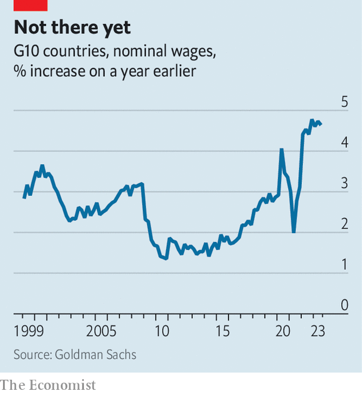
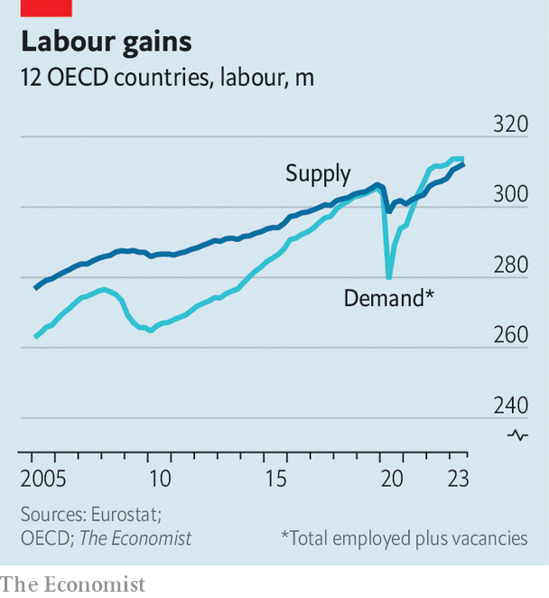

###### Prices and wages

# Your pay is still going up too fast 

##### Why the last part of the inflation fight may be the hardest 

 

> Jan 28th 2024 

Central bankers are entering the final stretch. Rich-world prices are rising by 5.4% year on year, down from a peak of 10.7% in October 2022. Although this is impressive progress, the last part of their quest—getting inflation from 5.4% to official targets of around 2%—could be the most difficult. That is because labour markets are . 

 


Until recently employers wanted to hire many more workers than they could find, resulting in an unprecedented surge in unfilled vacancies (see chart). In 2022-23 Google searches related to “labour shortage” jumped to their highest-ever level. With plenty of other options, workers asked for big pay rises. Year-on-year wage growth across the rich world doubled from its pre-covid rate to close to 5% (see chart), adding to firms’ costs and in turn encouraging them to raise the prices they charged consumers. 

 


In order to get inflation under control, wage growth therefore had to come back down. Given  across the rich world, a 2% inflation target is probably achievable only if nominal wages grow by 3% a year or less. Central bankers hoped that by raising interest rates they would cause demand for labour to fall—ideally cooling wage inflation without wrecking people’s livelihoods. 

The first part of the plan has worked. Demand for labour (ie, filled jobs plus unfilled vacancies) is now only 0.4% higher than the supply of workers, down from 1.6%. Searches for “labour shortage” have fallen by a third. Almost everywhere you are less likely to see “help wanted” signs.

Lower demand for labour has also caused surprisingly little damage to people’s employment prospects. We estimate that, over the past year, falling vacancies have accounted for the entire decline in labour demand across the rich world. During the same period the number of people actually in work has increased. The unemployment rate across the rich world remains below 5%. Some countries are even beating records. In Italy the share of working-age people in a job recently hit an all-time high—the country has swapped  for 

Nevertheless, despite falling labour demand, there is less evidence of the final part of the plan: lower wage inflation. Although American pay growth has subsided from more than 5.5% year on year to around 4.5%, that is probably still too high for the Federal Reserve’s 2% inflation target. And elsewhere there is little sign of progress. In recent quarters wage growth across the rich world has hovered at 5% year on year. British wage growth is more than 6%. “Very early indications for January show negotiated pay deals slowing only modestly,” reported analysts at JPMorgan Chase, a bank, last week. Euro-area pay is growing similarly fast.

Is high wage growth, and thus above-target inflation, now baked into the economic cake? Some evidence suggests it is—especially in Europe. Spanish workers, for instance, have used their extra bargaining power to change their contracts, so that the share of workers whose pay is indexed to the inflation rate has risen from 16% in 2014-21 to 45% last year. A recent study by the OECD, a club of mostly rich countries, on Belgium worries about “more persistent inflation due to wage indexation”. 

More generous wage agreements today could mean higher inflation tomorrow, leading in turn to even more generous agreements. Across the rich world strikes have become more common as workers seek higher wages. Last year America lost almost 17m working days to stoppages, more than in the previous ten years combined. Britain has also seen a . On January 30th Aslef, a union for train drivers, began a series of walkouts, to the dismay of commuters. 

There is, however, a more optimistic interpretation of these developments. Just as in 2021-22, when wages took a while to accelerate after labour demand rose, so today they could take time to lose speed. After all, companies and workers renegotiate wages infrequently—often annually—meaning that workers may only slowly realise that they have less bargaining power than before. Indeed, estimates for America published by Goldman Sachs, another bank, suggest that it can take a year or so for declines in labour demand to show up in lower wage growth—suggesting that the final stretch of disinflation will be annoyingly slow, but will pass. ■


