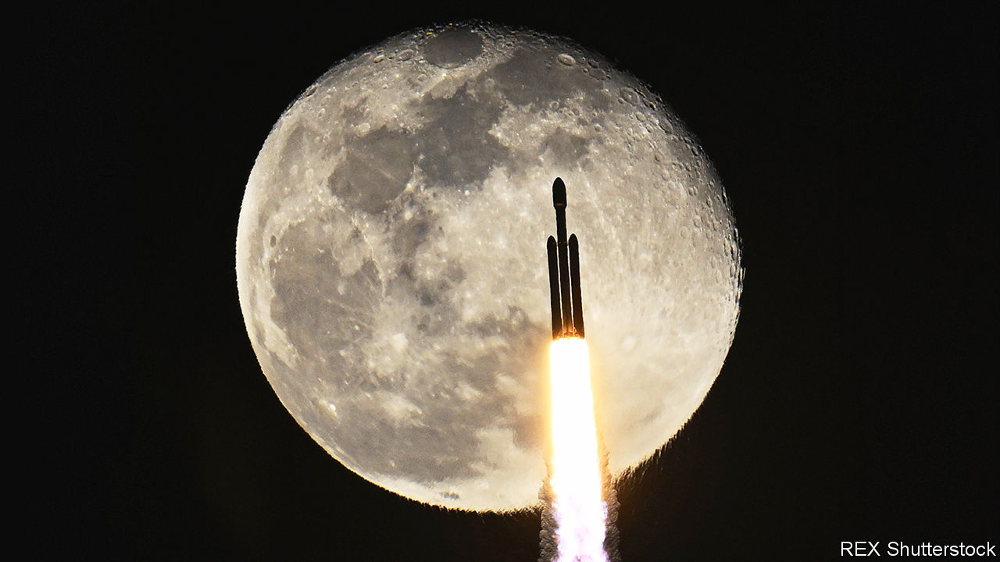
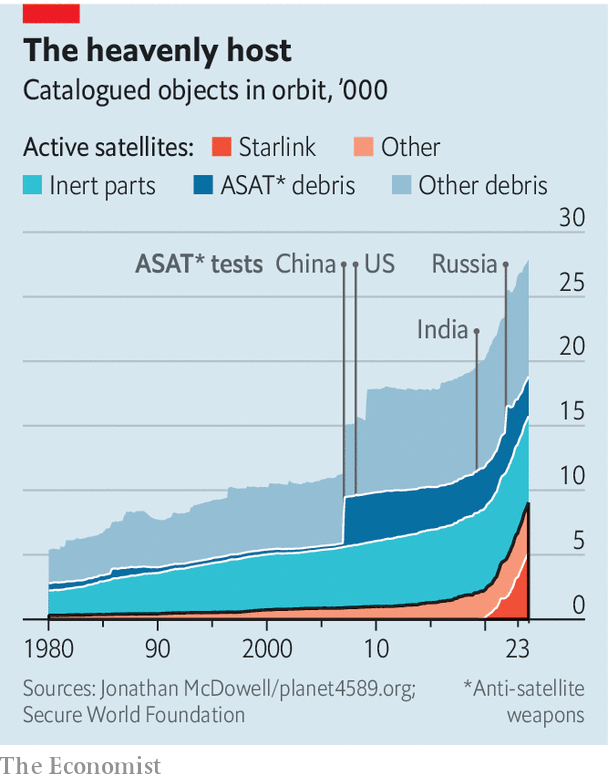

###### Combat in orbit

# War in space is no longer science fiction 

##### Inside America’s celestial struggle against China and Russia 

 

> Jan 31st 2024 

THE FIRST shot of the next war between the world’s big powers, it is often said, will be fired in space. As conflict spreads on Earth, ill omens are emerging in the firmament. As countries race to develop new capabilities in space, some are also building the forces and weapons to fight beyond the atmosphere. On January 28th Iran said it had launched three satellites; Western countries fear they could be used in its ballistic-missile programme. Russia’s  has opened a new chapter in space war. But America’s biggest dread is China, which seeks to  America’s primacy in the heavens. Admiral Christopher Grady, vice-chairman of America’s joint chiefs of staff, explains it bluntly: “Space has emerged as our most essential warfighting domain.”

American generals scrutinise the cosmos from Space Command’s headquarters in Colorado Springs. “Guardians”, as America’s new breed of space warriors call themselves, monitor about 15 daily missile launches, from Ukraine to Iraq and North Korea, at the Joint Operations Centre (JOC). They also watch the fast-growing deployment of satellites, heaps of orbiting junk and the re-entry of objects into the atmosphere. Above all, they look for danger. 

Among the most closely observed objects are two recently launched robotic space planes, smaller versions of the space shuttle. America’s X37-B lifted off from Cape Canaveral on December 28th (pictured). China’s Shenlong, or Divine Dragon, was lofted a fortnight earlier. Both missions are largely secret. Space planes’ ability to undertake long missions, deliver and capture payloads, change orbit and return to Earth to refuel make them potentially important weapons. Russia launched Cosmos 2570 in October, the latest “nesting doll” in orbit: it released a second satellite, which then let out a third. To American commanders, such things look like a test of a “kill vehicle”, in other words a projectile for destroying satellites. 

A foretaste of space hostilities came on the evening of November 14th 2021, Colorado Springs time, when two electronic bells warned the JOC of a missile fired from Russia’s Plesetsk cosmodrome. Early-warning satellites detected the fireball, ground radars tracked the missile and computers soon projected its unusual trajectory: neither a ballistic-missile nor a satellite launch, but a Nudol anti-satellite weapon aimed at a defunct Soviet spy satellite.

Some in the JOC thought Russia would aim close to the target. Others reckoned, correctly, it would blast the bird. This may well have been a Russian warning to America: stay out of the impending war in Ukraine or risk conflict that will stretch into space. Never mind the 1,800 bits of debris that forced astronauts in the International Space Station (including two Russians) to shelter in their escape craft.

Put your helmet on

Russia’s second shot was unambiguous: shortly before its tanks assaulted Ukraine on February 24th 2022 malware spread through part of the KA-SAT network owned by Viasat, an American firm, and operated by a partner. It disabled the satellite-internet modems of some 50,000 European users, among them many Ukrainian military units. Within weeks, however, Ukrainian forces were back online thanks to the vast constellation of smaller Starlink broadband satellites launched by SpaceX, another private company. Russian attempts at hacking and jamming satellite signals persist, and the country has warned that commercial systems “can become a legitimate target for retaliation”. 

All this shows that space is not just a place for peaceful exploration, but an arena for future combat. Control of space has become as important as dominance on land, sea and air. Space technology makes military forces in all other domains more powerful. Lose primacy in space and you risk losing wars on Earth. In any future conflict between America and China, for instance, satellites would be essential to finding and destroying targets across the vast distances of the Pacific Ocean (see China section). Much about warfare in space remains hidden, and most of what is known comes from America. What is clear, though, is that America is intensifying its effort to preserve its edge in space.

General John Shaw, a former deputy head of Space Command, argues that the world has entered “the third space age”. The first, in the cold war, was dominated by superpowers with large national-security satellites. Intelligence-gathering, early-warning and communications spacecraft were bound with nuclear deterrence. In the second stage, private firms became more prominent as they delivered communications, television and other services from space. Satellites such as the Global Positioning System (GPS) revolutionised conventional warfare, starting with the war in Iraq in 1991. Later on, especially in Iraq and Afghanistan, they made possible precision bombing and long-distance drone operations. Space itself, though, was regarded as a sanctuary. 

Not so in the third age. Space services are woven ever more tightly into civilian life—GPS enables everything from financial transactions to mapping apps. Commercial firms such as SpaceX have reduced the cost of launches and satellites. Above all, the era features threats and potential conflict in space, says General Shaw.

Countries are beefing up military space branches. America’s Space Force, the youngest military service, seemed to be a whim of the then president, Donald Trump, when it was launched in 2019. In fact the germ of the idea had been around since at least 2001, when a bipartisan commission warned of a potential “space Pearl Harbour”. Carved out of the air force, and administratively tied to it, Space Force is by far the smallest American military service, but is growing fast. It counts just 8,600 active personnel, compared with 322,000 for the air force, but is likely to expand by 9% this year. Its budget of $26bn last year, compared with $180bn for the air force, is set to grow by 15%. Some worry about unnecessary duplication. Others question how far it has succeeded in overcoming a legacy of slow and costly procurement. 

Like the air force, navy and other branches, Space Force is placing specialist units within America’s combatant commands, the headquarters responsible for military operations in the Indo-Pacific, Europe and other regions. Abutting them all is Space Command, also newish, which oversees the “astrographic” domain from 100km above sea level to, in theory, infinity. Among other things, it defends against long-distance missiles and manages satellite services for other commands. 

But forget Star Wars, hyperspace-faring spaceships and zapping ray guns. War in space is part of earthly strife. It is also in its infancy. Like hot-air balloons and dirigibles in early aviation, satellites are invaluable platforms for observation but are usually easy to spot, hard to manoeuvre and largely defenceless. 

In space offence has the advantage over defence, argues Space Force’s chief, General Chance Saltzman; the side that delivers the first blow can quickly gain the upper hand. “There’s nothing to hide behind in space,” he explains. Satellites move in predictable orbits, and lines of communication with them are exposed. 

 


America, China and India have all tested Earth-based anti-satellite (ASAT) missiles like Russia’s Nudol (see chart). Other threats include ground-based “directed energy” weapons: lasers, high-power microwaves and radio-frequency jammers. All this can be done in orbit, too, which is why “rendez-vous and proximity operation” satellites, which get close to other ones, cause particular jitters. A nuclear blast in space is another worry. America says its satellites are regularly dazzled, jammed and probed remotely.

America’s intelligence agencies say China has fielded ground-based lasers and ASAT missiles “intended to disrupt, damage and destroy target satellites.” Orbital weapons are under development, too. Chinese documents speak of using “surprise, swift, limited-scale, overawing strikes” in space—not as part of war, but to deter one or to force early capitulation. China has the second-largest number of satellites and the country has stepped up the pace of its launches in recent years. 

The Outer Space Treaty of 1967 bans territorial claims on celestial bodies and the stationing of nuclear weapons in space, but it is silent on conventional weapons. It has not prevented echoes of the cold war and earlier imperial land-grabs as America and China seek to establish lunar bases. Some have compared celestial bodies to contested islands in the Pacific. 

Space “is increasingly congested, contested and competitive”, says recent military space doctrine from America’s joint chiefs of staff; America should preserve “space superiority”, not least through “offensive and defensive space operations”. Only a few guardians have direct experience of their domain. Some compare themselves to submariners, who must rely on sensors in order to fight shadowy, lurking foes. There is much about space that seems counterintuitive.

On Earth objects need propulsion to keep moving. In space they keep moving because friction is negligible, their orbits determined by gravity. A destroyed plane falls to the ground; a sunken ship goes to the bottom of the sea. The remains of a satellite struck by a missile stay in orbit for years or decades, endangering everything in their path. With enough junk, a collision could start a chain reaction of impacts, known as the “Kessler syndrome”, rendering some orbits all but unusable.

Your circuit’s dead

Instead of rivers and communications nodes, ”key terrain” in space consists of orbital regions (see diagram on the next page). Low-Earth orbit (LEO), up to a height of 2,000km, is where most functioning satellites operate. They pass overhead only briefly, so large constellations are needed to ensure continuous coverage.  has more than 5,000 in LEO, with plans to grow to perhaps 12,000. Meanwhile China is creating rival mega-constellations.

 


Geostationary orbit (GEO), about 36,000km away, is a vital but increasingly crowded band. Satellites circle the equator once a day, so appear fixed in the sky, which favours broadcasting, missile-warning and more. In-between, medium-earth orbit (MEO) is used for GPS. The poles are best served by highly elliptical orbits (HEO), looping out to about 40,000km. Beyond, in “cis-lunar” space, lie Lagrange points where the gravitational interplay of the Earth and Moon allows satellites to keep stable positions with little fuel. 

Even at orbital speeds—7.8km per second in LEO—actions in space can still seem rather painfully slow. An ASAT missile takes about ten minutes to strike in LEO, and hours to reach GEO. Co-orbital weapons may take days to approach their targets. Friend and foe, private and military users, are intermingled. 

Space Command’s mission is to ensure there is “never a day without space”. That requires it to do three things: detect threats, deter attacks and defeat enemies. Begin with detection. Just understanding what is happening beyond the atmosphere—space domain awareness—is demanding, slow and imperfect. Space Command tracks and publicises the movement of 45,000-odd objects ten centimetres in diameter and wider, of which only 9,400 are active satellites. Radars do not continuously watch all objects in LEO; telescopes monitoring GEO often cannot see in daylight or through clouds or when objects pass in the Earth’s shadow; and there are few telescopes in space. Such observation gaps afford foes a chance to act unseen.

The stars look very different today

Surveillance involves predicting the orbit of each object, and confirming it when it passes a sensor. If one goes missing, it must be found and “custody” restored. The more eyes the better. America’s main space-monitoring systems have long been concentrated in the northern hemisphere, a legacy of the cold war. But Space Command draws data from any radar it can, eg, those on warships. It is placing more sensors in Australia to cover the southern half of the globe, and is working with allies to share data. America, moreover, operates five satellites called GSSAP that wander in GEO to monitor objects. Guardians have enlisted commercial space-monitoring firms, too. What they lack in high-end sensors they make up for in numbers, global distribution and automation. 

One company, LeoLabs, with six radar sites to monitor LEO, gave notice in December of Russia’s latest “nesting doll” test. Another, ExoAnalytic Solutions, which specialises in watching GEO with hundreds of telescopes, recounted a striking Chinese satellite-removal manoeuvre in 2022. The SJ-21 satellite, seemingly equipped with a grappling arm and a net, captured a satellite tumbling in GEO and towed it to a graveyard orbit before returning. The manoeuvre was so abrupt that it was lost for some hours. “Like a magician’s sleight of hand,” in the words of one expert. Another trick is “zombie” objects: supposedly dead rocket motors and satellites that unexpectedly come back to life. 

All this causes nervousness about what lurks in the vastness. A clean-up technique in peacetime could quickly turn into a crippling attack. “Deep space” beyond GEO, where it is harder to spot things, is a particular worry. Ultimately, though, any object able to manoeuvre can be steered into the path of another one to destroy it. 

All of which emphasises the importance of deterrence. A vital step is to lower the benefit of an attack through greater resilience. A long-standing priority has been to shift jobs done by a few “big, fat, juicy” satellites in GEO to myriad smaller satellites in LEO, akin to Starlink. The loss or jamming of any one makes little difference, and satellites can be replaced faster than ASAT missiles. 

What if a set of orbits is rendered unusable? The answer is to have satellites in different orbits. America’s new sensors to detect and track missiles, including hypersonic ones, will rely on constellations in LEO, MEO and HEO, supplementing older systems in GEO. 

It helps if lost capabilities can be replaced quickly. On this front America enjoys an advantage. SpaceX alone conducted more launches in the past year than all other operators—private and state-run—combined. But such dominance also raises worries about America’s dependence on a single provider, especially one run by an unpredictable CEO, Elon Musk. 

Meanwhile, an exercise called Victus Nox in September showed that Space Force could mount and launch a new satellite within about a day, down from a typical 6-12 months. Guardians say they are trying to develop a “tactically responsive” mindset that involves making do and improvising with what is available, and fielding new systems rapidly by tapping into commercial technology. In times of need, they will also look to private firms and allies to provide back-up capabilities. 

Space warriors are most cagey about the “defeat” aspect of their mission (a new Pentagon policy on declassifying space and other systems is itself classified). Projectiles are the most visible means to destroy spacecraft. But this may be self-defeating if debris makes parts of space unusable. “It’s almost like saying, how do you win a nuclear war?” argues General Saltzman. “There’s really just no winner when you go into a destructive on-orbit conflict.” 

The quest is to develop nimbler defences and surgical strikes. “Dynamic space operations”—the ability to manoeuvre—will require spacecraft to carry more fuel, or have the ability to be repaired and refuelled in orbit. “Directed-energy weapons are likely to be the primary weapon of choice in space in the future,” reckons General Shaw. Such weapons act at the speed of light. If based in space, they are unencumbered by land obstacles or the atmosphere. Satellites will need better protection, too. Some talk of “bodyguard” satellites to detect and counter foes. In time, General Shaw adds, satellites will feature artificial intelligence to act on their own. 

Satellites are only one part of a space system, and may be the hardest part to attack, notes Craig Miller of Viasat. Going after ground stations or communications links may be more effective. Indeed, commanders speak of a triad of military tactics involving space weapons, special forces and, especially, cyberattacks. 

Without the experience of real war, guardians must learn from exercises and simulations. The Pentagon’s wargames are classified. A recent one explored requirements for dynamic space operations. Henry Sokolski of the Nonproliferation Policy Education Centre, a think-tank in Washington, DC, notes several lessons for America from unclassified games he has run. One envisaged North Korea detonating a nuclear bomb in space, highlighting the need to harden commercial satellites against electromagnetic pulses. Another imagined Pakistani terrorists using commercial satellite imagery and communications to hit India with drones, showing that muddy regulations could play a part in drawing America and China inadvertently into a conflict in space. “The frontline of strategic deterrence is gravitating away from the surface of the Earth and into space,” Mr Sokolski says.

If war does break out between America and China, the world will have to worry about much more than the fate of satellites. Perhaps the biggest near-term danger is miscalculation. The contest in space is novel and ambiguous. Nobody is certain what space weapons exist, not least because many civilian technologies have military uses. Rules of the road are ill defined or non-existent, with little prospect for arms control. “Grey-zone” attack, short of war, might thus be tempting. Like cyberattacks, disabling satellites does not usually kill people directly. But were an American early-warning satellite over the Pacific to be attacked, warns Brian Weeden of the Secure World Foundation, an American group that compiles public information on space weapons, perilous escalation might follow. “Washington would freak out and might think it was part of a nuclear attack. The understanding we had with the Soviets in the cold war is that interference with warning satellites would be interpreted as a sign of an impending nuclear attack.” ■

