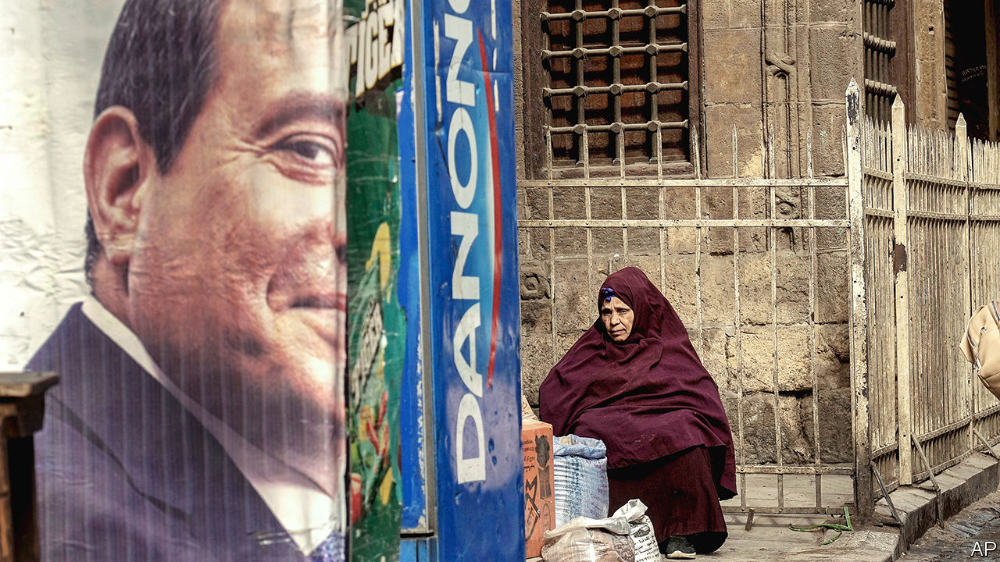

###### Financial crisis in Cairo

# Egypt doesn’t deserve a bail-out, but should get one 

##### The Middle East cannot afford the collapse of its most populous country 

 

> Feb 1st 2024 

The prospects for  depend on many actors: America, the Houthis, Iran, Israel, the Palestinians, Saudi Arabia and others. But one country is more important than most people realise: Egypt. 

It is huge, with 110m people. It runs the Suez canal, shares a land border with Gaza, maintains a peace treaty with Israel and has helped to broker peace talks. Egypt could yet play a vital role to help underwrite statehood for the Palestinians and provide security in the Gaza Strip. Were the country to collapse, however, it could further destabilise the entire Middle East. And such a collapse is terrifyingly plausible, as the country faces a mounting financial crisis. Its feckless regime does not deserve a bail-out. But Egypt should receive one nonetheless. 

Its leader, Abdel-Fattah al-Sisi, is a strongman who led a coup in 2013 and assumed the presidency the next year. He has proved to be an atrocious economic manager. In the past decade monopolies run by the army and its cronies have tightened their chokehold on Egypt’s already feeble economy. Spending has served the generals. Foreign investors have fled. The fiscal and balance-of-payments deficits are persistent. Mr Sisi has borrowed far too much: public debt is 89% of gdp; external debt is 37%. The IMF has bailed out his government four times. Mr Sisi always promises economic reforms, and then does .

The fallout from the war between Israel and Hamas has made everything worse for Egypt. In a normal year the country earns hard-currency revenues worth 2% of gdp from operating the Suez canal, and receipts from foreign tourists add a further 3% of gdp. Both sources of cash have shrunk dramatically. The official exchange rate of 30 Egyptian pounds to the dollar is a mirage. The black-market rate, reflecting what willing buyers will pay, is 70. The country needs to devalue its currency formally, but doing so would mean the value of its dollar debts would surge relative to its gdp. It would also raise the price of food, particularly grains, which Egypt mostly imports. 

If economic logic was the only consideration, Egypt would be prescribed some bitter medicine. Any further lending by the imf or foreign governments would be contingent on it restructuring its debts, living within its means and getting the army out of business. However, such austerity would be highly dangerous. Egypt could spend years in default, a financial no-man’s-land: China, its third-biggest bilateral creditor, typically tries to block debt restructuring. Mr Sisi would struggle to feed his people or pay his civil servants. Egypt’s young, frustrated population might launch mass protests, which would meet with violent repression. 

Any disorder would be hard to contain. Jihadism is already a grave problem in Egypt’s Sinai peninsula, which abuts Israel and Gaza. It could spread to cities, threatening Mr Sisi’s government. The wider Middle East, already burning, cannot afford a conflagration in Egypt, too. At a minimum, it would render Egypt incapable of helping broker or implement a peace deal between Israel and the Palestinians. 

So the world should hold its nose and bail Egypt out yet again. The country probably needs at least $10bn of short-term funding to roll over its debts and ease the shock of a huge devaluation. Western countries, the imf and wealthy Gulf Arab states should all pitch in. In return, they should publicly press the army to give up its grip over the economy. They will do so in the full knowledge that the army is unlikely to comply, especially because Mr Sisi is himself an ex-general. However, Egypt will never prosper until the men in uniform make way for everyone else, and ordinary Egyptians need to hear it. ■

