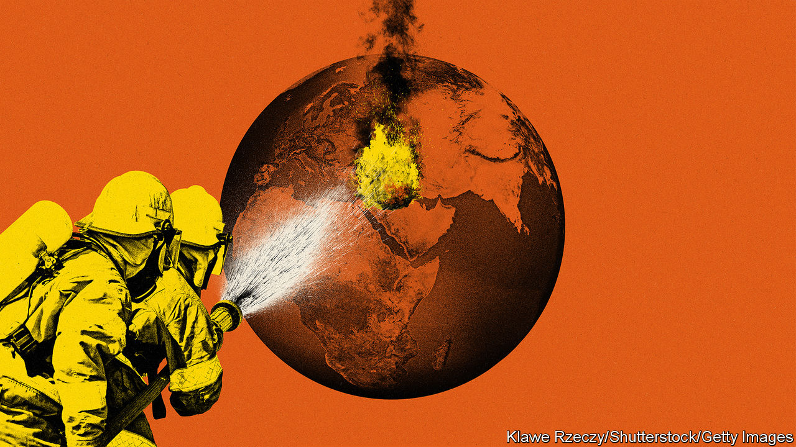

###### The war between Israel and Hamas

# How to end the Middle East’s agony 

##### War is spreading across the region. There is an alternative 

 

> Feb 1st 2024 

IN THE MONTHS after Hamas committed the  against Jews since the Holocaust, conflict has spread across the Middle East. In all, ten countries are now caught up in fighting. In Gaza Israeli soldiers and Hamas are still killing each other, even as 2m people face famine. Across the border with Lebanon,  and Israel are in a low-grade war. The  in Yemen are attacking cargo ships, aggravating a  in Egypt and triggering retaliation by America and Britain. The killing of three GIs in Jordan on January 28th by militias in Iraq could spark a clash between America and Iran, which sponsors the “axis of resistance”. 

It is easy to despair, but there is a way out. Amid intense diplomacy, led by America and Saudi Arabia, a transformative deal is taking shape. Its novelty, we have learned, is to use a proposed hostage-release to reset Israeli politics; to use that reset to open a path to a Palestinian state; and then to use Israel’s commitment to that as the basis for a deal between it and Saudi Arabia, in which mutual recognition is underpinned by American security guarantees. Officials say the odds of a hostage deal may be 50% and, with that in place, the odds of a Saudi-Israeli deal could also be 50%. The prize is far from certain, obviously, but it promises a new economic and security architecture in the Middle East.

One reason for hope is that Israel may wish to pause the campaign. Many Israelis are desperate to get their hostages home, and fighting won’t free them. Israel has advanced towards its military goals. Hamas has lost half its territory, half its fighters (says Israel’s army), possibly a third of its tunnels and many of its leaders (but not the most senior). From now, Israel faces diminishing returns, plus an ever higher civilian toll in Gaza and corresponding harm to its reputation. 

Another reason for hope is that America, Egypt, the Gulf states and Saudi Arabia also have good cause to work together. As the war has spread, all those countries have seen the full extent of Iran’s malign influence. Through its regional proxies, armed with drones and missiles, Iran is attempting to sow regional chaos even as it seeks to avoid a direct war with Israel or America. All want to stop Iran’s scavenger regime from emerging as the regional power, capable of threatening Israel and the Gulf and holding world trade to ransom. That would make a mockery of American deterrence. None wants to see a ruinous war pitting America and Israel against Iran. Peace is the only way out.

The plan begins with a  brokered by America, Qatar and Egypt. The first truce, in November, lasted just seven days; this one could endure for one or two months and free many or all of the remaining 100 or more Israeli hostages in stages. That could reset Israeli politics and help the Israeli public look beyond the horror of October 7th. America and Saudi Arabia are asking Israel to commit itself to a Palestinian state, and prove its resolve by, for example, freezing settlements on the West Bank.

The next step, our reporting reveals, involves Muhammad bin Salman, Saudi Arabia’s autocratic but modernising leader. Before October 7th he was working on a deal that recognised Israel in return for a Saudi-American defence treaty. Indeed, one probable motive behind Hamas’s assault was to sabotage his plans. Against the odds, Saudi Arabia is still striving for this vision. A deal would mark the biggest Arab commitment to peace in three decades. It would also bind in Israel and offer Palestinians a concrete commitment to statehood. In time, this could evolve into a regional American-led alliance to contain Iran.

Two big obstacles stand in the way: Binyamin Netanyahu, Israel’s prime minister, and Yahya Sinwar, Hamas’s leader in Gaza and the terrorist-architect of October 7th. Mr Netanyahu is a lifelong sceptic about a Palestinian state. He has indulged the violent aims of extremist settlers. However, polling suggests that only 15% of Israelis think he should remain in power after the war. A long ceasefire and hostage release may create an opening for rivals. Benny Gantz, say, could free himself from the war cabinet with honour. Israel’s next leader may be someone who can tell his people that the best foundation for their security is not unending war, but strong alliances and a path to peace. 

President Joe Biden should speed up this transition by appealing over Mr Netanyahu’s head—just as Mr Netanyahu has sometimes spoken over the head of American presidents. He should open an embassy in Jerusalem for the Palestinians, to match the one Donald Trump opened for Israel. He should also set out how America sees the parameters for a Palestinian state and, if Israel doggedly refuses to engage, be ready to recognise one himself.

What about the other obstacle, Mr Sinwar? He is thought to be holed up beneath south Gaza, with Israeli troops overhead. Although he has unleashed a catastrophe upon Gaza, he will claim a great victory simply by surviving. It is possible that Hamas’s armed and most fanatical wing would emerge after a ceasefire as the dominant force in Gaza and lay claim to broader Palestinian leadership. With Iran’s encouragement, Mr Sinwar may well attack Israel, provoke reprisals and thereby sabotage any progress towards peace.

To deter such attacks and continue dismantling tunnels, Israel will retain a military presence in Gaza for some time. That will disappoint those wanting an immediate withdrawal. But Israel should be clear that, if its security is guaranteed and Hamas remains out of power, then it will withdraw. Mr Sinwar may be asked to leave Gaza for a country such as Qatar—as Yasser Arafat left Lebanon for Tunisia. He is likely to insist on staying. That would underline the value of international peacekeepers, including from Arab states, tasked with providing security in Gaza so as to create the space for a moderate government to emerge.

For that to be possible, momentum is urgently needed. The more Israel curbs its West Bank settlers and the more credibly it commits itself to a Palestinian state, the more leeway it will have to contain the rump of Hamas fighters. The more Arab states are willing to spend money and provide security, the more confident ordinary Israelis and Palestinians will be of change. And the more America pushes all sides the better. Peace and stability in the Middle East will always be hard-won. But the world must seize this chance, because the pull towards war is unrelenting. ■


