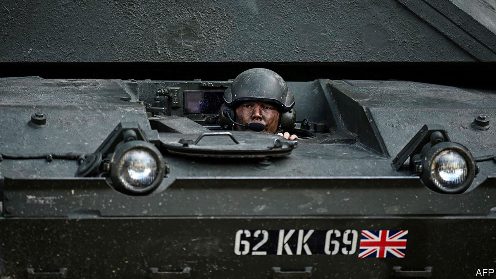

###### Beating retreat

# How to fix British defence 

##### It needs more money and more people, but also reform 

 

> Feb 1st 2024 

BRITAIN’S ARMED forces have much to be proud of. The Royal Navy is engaged in some of the most intense naval skirmishing since the Falklands war, knocking Houthi missiles out of the sky above the . The Royal Air Force (RAF) is still flying over Iraq and Syria to keep Islamic State in check. The army has trained more than 60,000 Ukrainian soldiers in the past ten years and . 

Yet something is rotten in British defence. Even though the country is the sixth-largest military spender in the world and the largest in Europe, it is not always clear where the money goes. The navy’s fleet operates fewer frigates and destroyers than Japan, South Korea or France. The army, at its smallest in centuries, would struggle to deploy a single heavy division. Britain has admirably emptied its cupboard to arm Ukraine, but its meagre ammunition holdings are now a matter of grave concern. What has gone wrong? 

The first problem is cash. In 2020 the government boasted of the biggest sustained increase in defence spending for 30 years. It spends just over £50bn ($64bn) on defence, a sum that crosses NATO’s threshold of 2% of GDP. But a fifth of the budget goes on nuclear weapons. The conventional forces that Britain needs are being cannibalised to pay for nuclear cost-overruns. Strip out the nuclear bits and defence spending stands at around 1.75% of GDP, in the middle of the European pack. 

The second problem is a lack of manpower. In 2010, when the Conservative Party entered government, the British Army was over 100,000-strong. It is now due to fall to 72,500. The government says that technology means fewer people are needed than in the past. This is casuistry. The Royal Navy is decommissioning ships for want of sailors. New technology often requires more personnel to maintain and operate it, not fewer. Even at its reduced scale, the army is struggling to recruit; beefing up the army reserve would be one way to help. 

British defence cannot be fixed without more money and more people. But the country’s defence woes are also rooted in deeper problems of culture, outlook and process. , penny-pinching and short-termism have resulted in Britain buying high-end kit and then economising on the things that make it work properly. 

The Treasury bears some responsibility for this state of affairs. It has incentivised services to delay expensive projects. That balances the books in the short run but causes costs to balloon overall. Its strictures can have absurd results. Reducing an order of Wedgetail airborne command aircraft from five to three means that the RAF may not have one available in a crisis.

Yet the services also deserve much of the blame, having repeatedly botched major projects. That is hardly unique to the armed forces or to Britain. But if Britain is serious about re-arming, it may have to buy more foreign equipment off the shelf rather than demanding new features and insisting on domestic design and manufacturing. The ill-fated Ajax armoured vehicle—whose excessive vibration deafened crew—was supposed to be based on a pre-existing Austrian-Spanish platform. After the army unwisely added 1,200 requirements, it was essentially bespoke. 

The Tories have had 13 years in office and four defence reviews. They will not, as an election approaches, solve problems that have festered for years. But with Ukraine in peril and Russia rearming fast, defence is once again too important to suffer from neglect. Like one of Britain’s ageing fleet of armoured vehicles, the country’s defence system is no longer good enough. The next government should act quickly and boldly to fix it. ■

