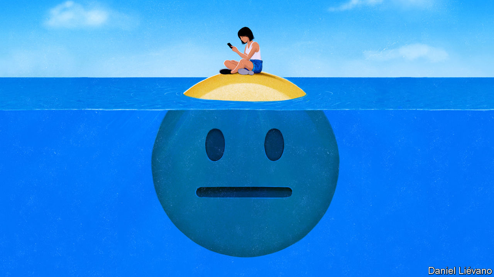

###### Online media

# The end of the social network 

##### As Facebook turns 20, social apps are being transformed 

 

> Feb 1st 2024 

Facebook may be turning 20 on February 4th, but it is just as much of a magnet for controversy and cash today as when it was a brash, break-everything teenager. On January 31st , the social network’s founder, was harangued by American senators over the spread of harmful material. The next day, as we published this, he was poised to announce another set of glittering results for Meta, Facebook’s parent company, which is now valued at $1trn. Yet even as social media reliably draw vast amounts of attention from addicts and critics alike, they are undergoing a profound but little-noticed transformation. 

The weird magic of online social networks was to combine personal interactions with mass communication. Now this amalgam is . Status updates from friends have given way to videos from strangers that resemble a hyperactive tV. Public posting is increasingly migrating to closed groups, rather like email. What Mr Zuckerberg calls the digital “town square” is being rebuilt—and posing problems. 

This matters, because social media are how people experience the internet. Facebook itself counts more than 3bn users. Social apps take up nearly half of mobile screen time, which in turn consumes more than a quarter of waking hours. They gobble up 40% more time than they did in 2020, as the world has gone online. As well as being fun, social media are the crucible of online debate and a catapult for political campaigns. In a year when half the world heads to the polls, politicians from Donald Trump to Narendra Modi will be busy online.

The striking feature of the new social media is that they are no longer very social. Inspired by TikTok, apps like Facebook increasingly serve a diet of clips selected by artificial intelligence according to a user’s viewing behaviour, not their social connections. Meanwhile, people are posting less. The share of Americans who say they enjoy documenting their life online has fallen from 40% to 28% since 2020. Debate is moving to closed platforms, such as WhatsApp and Telegram. 

The lights have gone out in the town square. Social media have always been opaque, since every feed is different. But TikTok, a Chinese-owned video phenomenon, is a black box to researchers. Twitter, rebranded as X, has published some of its code but tightened access to data about which tweets are seen. Private messaging groups are often fully encrypted. 

Some of the consequences of this are welcome. Political campaigners say they have to tone down their messages to win over private groups. A provocative post that attracts “likes” in the X bear pit may alienate the school parents’ WhatsApp group. Posts on messaging apps are ordered chronologically, not by an engagement-maximising algorithm, reducing the incentive to sensationalise. In particular, closed groups may be better for the mental health of teenagers, who struggled when their private lives were dissected in public. 

In the hyperactive half of social media, behaviour-based algorithms will bring you posts from beyond your community. Social networks can still act as “echo chambers” of self-reinforcing material. But a feed that takes content from anywhere at least has the potential to spread the best ideas farthest.

Yet this new world of social-media brings its own problems. Messaging apps are largely unmoderated. For small groups, that is good: platforms should no more police direct messages than phone companies should monitor calls. In dictatorships encrypted chats save lives. But Telegram’s groups of 200,000 are more like unregulated broadcasts than conversations. Politicians in India have used WhatsApp to spread lies that would surely have been removed from an open network like Facebook. 

As people move to closed groups, the open networks left behind are less useful because of the decline in public posting. During the covid-19 pandemic, scientists and doctors contributed to an online debate which contained real insight as well as misinformation. Open-source intelligence flowed when Russia invaded Ukraine. Today those conversations are disappearing or moving to closed channels, slowing the spread of ideas. The people still weighing in on the public networks, meanwhile, are disproportionately male and likely to describe themselves as very left- or right-wing: bores, in plain English.

What’s more, the open-network algorithms driven by users’ behaviour seem primed to spread the spiciest videos. For something to go viral on a social network, people had to choose to share it. Now they endorse it simply by watching, as the algorithm rewards content that attracts the most engagement. Deliberate curation has been replaced by a system that taps straight into the id. Provocateurs like Mr Trump or Nayib Bukele, the favourite in this week’s election in El Salvador, stand to benefit, as do misinformation merchants. Platforms say they are better at weeding out fakes. Taylor Swift, the latest high-profile victim of a deepfake, might disagree.

More urgent even than the rise of fake news is a lack of the real sort. Mr Zuckerberg once said he wanted Facebook to be like a personalised newspaper. But since the network’s pivot to entertainment, news makes up only 3% of what people see on it. Across social media only 19% of adults share news stories weekly, down from 26% in 2018. Publications like BuzzFeed News, which relied on social distribution, have perished. That is their lookout (and ours). But it is everyone’s problem when nearly half of young people say that, just as the platforms decide news is no longer interesting, social media are their main source of news.

WhatsApp and WhatsDown

Some people argue that social networks’ defects can be fixed by better governance, clever coding or a different business model. Such things can help. But the problems raised by the new generation of apps suggest that social media’s flaws are also the result of the trade-offs built into human communication. When platforms swing back towards private groups, they inevitably have less oversight. When people escape their echo chambers, they may well face more extreme content. When users embrace harmless entertainment, they see less news. As social networks wither, platform operators and users should devote less time to the old battles and more to grappling with the new. ■


