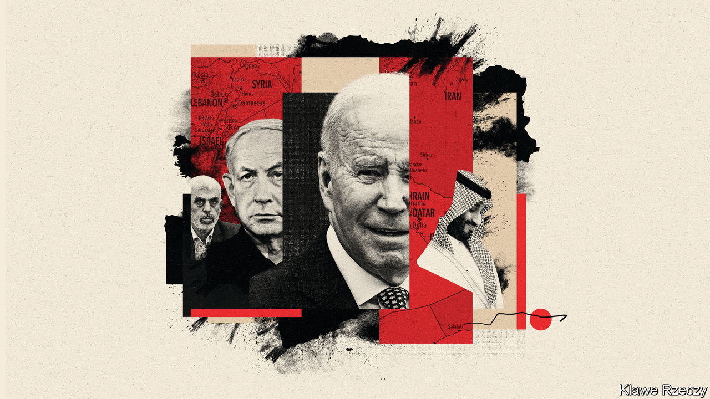
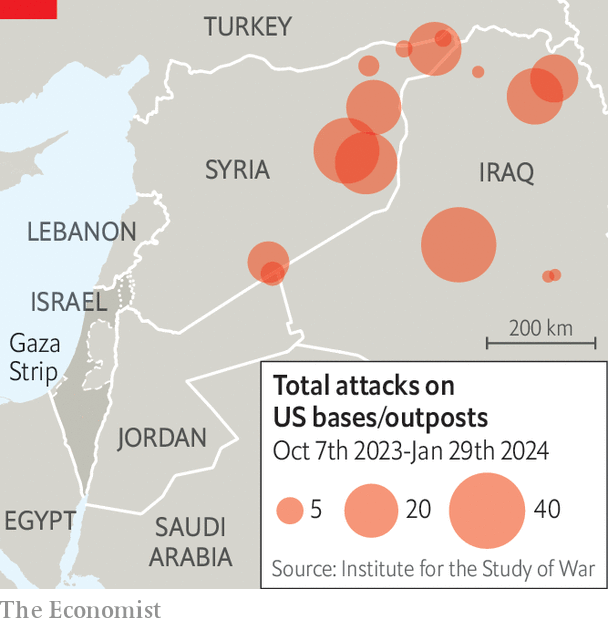
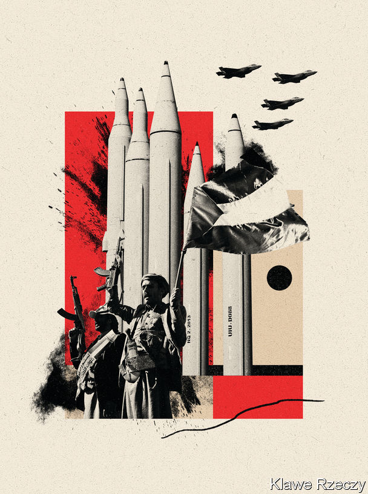

###### Gaza and its reverberations

# America’s shuttle diplomacy to wind down the war in Gaza 

##### And maybe to bring a lasting peace, too 

 

> Feb 1st 2024 

Massacre, rape, war, hunger, disease, regional escalation, disruption of global trade: the Middle East is living through apocalyptic times. But after death and hell, might peace come? To hear American officials talk about the four-month war between Israel and Hamas, and its reverberations that claimed the lives of three American soldiers in Jordan on January 28th, there is a modest but growing chance of turning catastrophe into opportunity. President Joe Biden’s administration is working hard to bring it about, with senior figures shuttling between Washington, European and Middle Eastern capitals.

Their immediate aim is to secure a long humanitarian pause in the fighting, lasting a month or two, that allows for the exchange of Israeli hostages and Palestinian prisoners. A parallel and more ambitious objective is to turn that pause into a permanent ceasefire and secure a regional peace deal. This package would comprise Israel’s acceptance of a Palestinian state, Saudi Arabia’s recognition of Israel, Palestinian reform and American measures to sweeten the deal.


American officials give even odds on securing the hostage deal in the coming weeks. If it succeeds, they reckon the broader agreement then has a similar chance. They are operating under two clocks. First, they want to calm the situation before Ramadan, the Muslim month of fasting. It starts around March 10th and is often a time of heightened religious passion and violence. Second, they think the best opportunity to secure regional peace is before America’s presidential election in November. They also know that the danger of uncontrolled escalation is ever present. 

 


All this helps to explain why Mr Biden is taking his time in retaliating “at a time and in a manner our choosing” against a drone strike that killed three American soldiers and wounded 40 others at Tower 22, a base in Jordan which supports us operations in Syria and Iraq. Republicans demand retribution against Iran and its proxies in the “axis of resistance”, responsible for the latest of about 160 attacks on American forces (see map) in the region since the start of the Gaza war. “Hit them hard,” said Lindsey Graham, a hawkish Republican senator. Instead Antony Blinken, the secretary of state, promises a response that “could be multi-levelled, come in stages, and be sustained over time”.

Mr Blinken warns of “an incredibly volatile time” in the Middle East: “We’ve not seen a situation as dangerous as the one we’re facing now across the region since at least 1973, and arguably even before that.” The crisis began on October 7th with Hamas’s assault on Israeli communities that killed around 1,150 people. About 250 hostages were seized. Israel’s military campaign to crush Hamas has destroyed much of Gaza and killed almost 27,000 Palestinians (including fighters). Some 2m people are displaced within the narrow territory. The un warns of spreading disease and possible famine. The International Court of Justice has been hearing accusations of genocide by Israel.

A worsening conflict with Iran and its allies is under way across the region. Amid daily cross-border strikes, some in Israel want to go to war in Lebanon against Hizbullah, a Shia militia. America and Britain have also started bombing the Houthis, who control much of Yemen and have been attacking ships passing nearby. 

Senior Americans have been running a diplomatic relay. Brett McGurk, Mr Biden’s Middle East adviser, was in the region last week. William Burns, the cia director, was in Paris on January 28th to consult spooks from Israel, Egypt and Qatar and co-ordinate the hostage deal. Mr Blinken is expected in the Middle East once again in the coming days. Jake Sullivan, the national security adviser, has been working the phones with Saudi and other leaders.

Think of the problem as a set of nested boxes. The key to ending the Israeli-Palestinian conflict is a “two-state solution”, with a Palestinian state alongside Israel; the key to a two-state solution is the Saudi normalisation deal; the key to Saudi normalisation is ending the war in Gaza; and the key to ending the war in Gaza is the hostage agreement.

Let my people go

Begin with the hostages. Both sides seem closer to a deal that, like the previous exchange in November, would see hostages freed in return for the release of Palestinian prisoners. Binyamin “Bibi” Netanyahu, Israel’s prime minister, faces street protests and demands to do more to bring back the captives. And Yahya Sinwar, the Hamas leader in Gaza, is under military pressure now that the Israel Defence Forces (idf) are operating in Khan Younis, in southern Gaza, above the tunnels where he is thought to be hiding.

It would be a phased process involving the release of different categories of hostages: the wounded, women, children and the elderly. There is a particular urgency to get young female Israeli soldiers out. Male soldiers will be last. 

The main hold-up is that Hamas insists on a cessation of hostilities and the complete withdrawal of Israeli forces; Israel is offering only a temporary pause. On January 30th Mr Netanyahu proclaimed: “We will not remove the idf from the Gaza Strip and we will not release thousands of terrorists. None of this will happen.” Instead, Israel would seek “absolute victory”.

The pause, if it happens, may be Mr Netanyahu’s moment of truth. His far-right cabinet members reject a long truce. But pragmatic members of the smaller war cabinet, among them the former defence minister, Benny Gantz, demand that priority be given to freeing the hostages, even if it means accepting a long or permanent ceasefire. If abandoned by either wing, Mr Netanyahu could face the dissolution of his cabinet and the countdown to an early election. In those circumstances polls indicate he would lose to Mr Gantz. 

The signs are that Israel’s war in Gaza is reaching a point of diminishing returns. The dismantling of Hamas is proving difficult. The idf reckons it has destroyed 60-70% of the group’s battalions. But the intense fighting in Khan Younis is evidence that it is far from defeated. The fact that Hamas can still fire the odd rocket at Israeli cities from northern Gaza, where the idf has thinned out its forces, suggests it can reconstitute itself. It is not just Mr Netanyahu, but much of the war cabinet that has pleaded for more time to deal with Hamas.

But some figures are starting to shift. Gadi Eisenkot, a member of the war cabinet and a former idf chief of staff whose son and nephew were killed fighting in Gaza, has said that talk of total victory and rescuing the hostages by military means amounted to “tall tales”; securing the release of captives was more important than continuing the fight. “The enemy can be killed afterwards,” he said. Yair Lapid, leader of the opposition Yesh Atid party, says he would be ready to join the government in place of the far right “to save the hostages”.

An extended period of calm would allow more aid to enter Gaza, and permit planning for reconstruction. America is pushing to get a un assessment team into northern Gaza, where conditions have so far proven too perilous. Above all, American envoys will be hoping a pause will help Israel turn its mind to the “day after”.

Lost in transition

The two-state solution has been the holy grail of peace mediators since the Oslo accords of 1993, which gave Palestinians interim autonomy in parts of the occupied West Bank and Gaza Strip. The main population centres were run by the Palestinian Authority (pa). Israel and the Palestinians were then meant to negotiate “final status issues” such as statehood, borders, the return of refugees, water and the status of Jerusalem, ie, how it might be shared. The temporary became permanent as security collapsed during the second intifada of 2000-05. Israel left Gaza, and Hamas expelled the pa from the enclave in 2007. Divided and weak, the Palestinians were largely ignored. Instead America promoted the Abraham accords, instigated by the Trump administration, under which Bahrain and the United Arab Emirates (uae), then Morocco and Sudan, established diplomatic ties with Israel in 2020-23. 

The Biden administration has tried to finalise a similar Saudi-Israel accord, with commitments from America such as a us-Saudi defence treaty and an American-supplied civil nuclear programme (including uranium enrichment) for the Saudis.

But then came the cataclysm of October 7th. The Biden administration talks more pointedly now about the need for a “credible, irreversible and time-bound” Israeli commitment to a Palestinian state. It also wants an early down-payment—perhaps a withdrawal from some West Bank territory or a real halt to settlements in the West Bank. David Cameron, the British foreign secretary, says Britain would consider recognising a provisional Palestinian state before a final deal. Mr Blinken is said to be contemplating such an option.

Despite the ordeal of Gazans playing nightly on Arab television and social-media channels, Saudi Arabia remains keen on an agreement. Indeed, Muhammad bin Salman, the crown prince and de facto ruler, seems to be a man in a hurry. 

For one thing, he is aware of the American political calendar. A defence treaty would require ratification by a two-thirds majority in the Senate—this in a Congress that struggles to agree on anything, notably Mr Biden’s request for more money to help Ukraine, Israel and others. Nonetheless, a deal done this year under Mr Biden ought to secure bipartisan support, even if some left-wing Democrats and isolationist Republicans oppose it. Were Mr Trump to win a second term, Democrats would probably vote en masse against a defence treaty. 

An agreement would allow Prince Muhammad to claim credit for ending the Gaza war and giving Palestinians their state. He could show up Iran and outdo the uae, which has been unable to use its ties with Israel to advance any diplomatic solution.

All that said, Saudi Arabia’s price for peace with Israel is now steeper: not just a vague “Palestinian dimension”, as previously discussed, but a firm commitment to Palestinian statehood, with unambiguous steps and a clear timetable. “We are going for gold,” says one Saudi source. 

There are countless obstacles to such a plan. The two biggest are Mr Netanyahu and Mr Sinwar. The Israeli prime minister has ruled out a Palestinian state, saying Israel must have security control over all lands between the Jordan river and the Mediterranean. Mr Netanyahu may be deeply unpopular, but he scarcely faces demands for “peace now”. His far-right allies are recycling ideas of the “transfer” of Gazans to other countries, or at least a return of Jewish settlements to Gaza. Centrists such as Mr Gantz are careful not to mention two states. Indeed he tells foreigners to stop talking about Palestinian statehood, as “you are only helping Bibi”.

Mr Netanyahu is said to be signalling his interest in a deal—in private. He has bowed to American pressure to restore the flow of tax revenues to the pa (indirectly and partially). Israeli officials do not exclude the possibility that Mr Netanyahu may be more forthcoming than he sounds. Few world leaders trust him, though. 

Hamas, for its part, has a history of undermining peace efforts through violence. Its revised charter rejects the Oslo accords and commits itself to “armed resistance” against Zionism. Some diplomats reckon exiled Hamas leaders in Qatar might be biddable. But Mr Sinwar is a hardliner and has become a heroic resistance figure to many Arabs. Israeli officials say he ultimately has only two options: die fighting or go into exile. It seems unlikely that he would emulate Yasser Arafat, the late Palestinian father-figure, who went to Tunis after Israel besieged him in Beirut in 1982. 

Mr Sinwar is said to be signalling via Egypt that Hamas is not interested in retaking administrative control of the Gaza Strip. Perhaps, think some Israelis, he now wants to emulate Hizbullah, letting a hollowed-out government run civilian life while retaining military capacity. Some talk of a transitional council in Gaza that could be set up with a formal mandate by the pa, or from Arab states.

All of which raises the question of “revitalising” the pa, which America has been demanding. Nothing suggests that Mahmoud Abbas, the Palestinian president, is serious about reforming an authority widely reviled as corrupt and ineffective. He may appoint a new prime minister—whether it will be another lackey or a credible figure remains to be seen. 

America is considering the creation of a “contact group” to press for reform, involving Egypt, Jordan, Saudi Arabia, the uae and maybe Turkey and Qatar. Arab officials say Jordan could oversee security-sector training, while Gulf states could help with administrative reforms. In Gaza the hope is that eventually enough Gazan ex-policemen—currently on the pa’s payroll—can be retrained to take over. But the process will take many months.

For now, Israel says it is not interested in allowing the return of the pa to Gaza. The authority is “incapable” of taking over the area, says one Israeli official. “We have not shed blood in Gaza to give it to this corrupt entity.” Others privately disagree.

Instead, Israel has been hoping that Arab states would rebuild Gaza and send a peacekeeping force to control it. Without progress towards Palestinian statehood, it looks like a delusion. “No Arab country is going to come and save the day,” says one Arab diplomat bluntly. At most, they will provide short-term humanitarian aid. 

Some speculate about the possibility of bringing private Western military contractors for narrowly defined tasks such as protecting a reconstruction project. In the meantime Israel is telling the Americans it can get by with local potentates—clan leaders or businessmen, say—running particular districts under overall Israeli control. The danger is that, if there is no progress towards statehood, this may lead to anarchy.

Biden their time

Nevertheless, America and Saudi Arabia are trying to agree on the details of a normalisation deal to present to Israel at the right moment. If Mr Netanyahu turns it down, as he might, Mr Biden will have to decide whether to turn the screws on his government. In an election year, Mr Biden must balance two political dangers: one is that supporting Israel’s war turns off progressives, young voters and Muslim Americans, particularly in swing states like Michigan. The other is that pressure on Israel pushes centrists and independents towards the loudly pro-Israeli Republicans.

Despite his dislike of Mr Netanyahu, the president’s instinct has been to embrace Israel. It has won him popularity there, which he has used to mitigate the damage done by the war, for example pushing Israel to permit more humanitarian supplies to reach Gaza.

America has many more means of exerting pressure on Israel. Beyond private suasion, Mr Biden could go public with his criticism, suspend or halt military supplies and deny Israel protection from hostile resolutions at the United Nations. 

For all the special bond between America and Israel—home to the world’s two largest Jewish communities—there have been many moments of tension. Dwight Eisenhower threatened economic sanctions against Israel if it did not withdraw its forces from Sinai during the Suez crisis of 1956, when it plotted with France and Britain to overthrow Egypt’s nationalist leader, Gamal Abdel al-Nasser. Ronald Reagan allowed many un Security Council resolutions critical of Israel and repeatedly interrupted (temporarily) the delivery of f-15 and f-16 jets to Israel because of its actions in Lebanon and the bombing of an Iraqi nuclear reactor in 1981. George Bush senior blocked loan guarantees over the construction of Jewish settlements.

 


Mr Biden, in contrast, has twice vetoed Security Council resolutions related to the latest war and has hastened the delivery of weapons. Many Arab diplomats long for America to act once more as a “big power”—perhaps by summoning regional leaders to Washington for a conference, or by going to Jerusalem to appeal over the head Mr Netanyahu (as Mr Netanyahu did to Barack Obama, in a speech to Congress urging it to block a nuclear deal with Iran). 

Many pine for a new James Baker, secretary of state to the elder Mr Bush, who orchestrated a coalition that expelled Iraq from Kuwait in 1991 and then summoned Israeli and Arab leaders to a peace conference the same year in Madrid. Admittedly Mr Baker did not bring peace. But the conference set the ground for progress after the Israeli election of 1992. Yitzhak Shamir, an obdurate Likud prime minister, lost power in part because he was seen to undermine relations with America. His successor, Yitzhak Rabin of the Labour Party, signed the Oslo accords on the White House lawn in 1993.

The Biden administration will no doubt bristle at such demands. It is also managing a war in Ukraine and a looming crisis with China over Taiwan. America will want to maintain influence on Mr Netanyahu for as long as he is in office. Mr Biden may part ways with him—but not yet.

American envoys will strive for the diplomatic prize, knowing it may be out of reach. “The Middle East is where America’s big ideas go to die,” cautions Aaron David Miller, a veteran Middle East peace negotiator now at the Carnegie Endowment for International Peace, a think-tank in Washington, dc. “That applies both in war—in Iraq and Afghanistan—and in peace.” Diplomacy has only two speeds in the region, “slow—and slower”. The best America can do this year, he says, is to set the parameters for a future peace. The chance for gold, if it ever comes, may have to wait for a new Israeli government, a new Palestinian Authority and a second Biden term. ■

