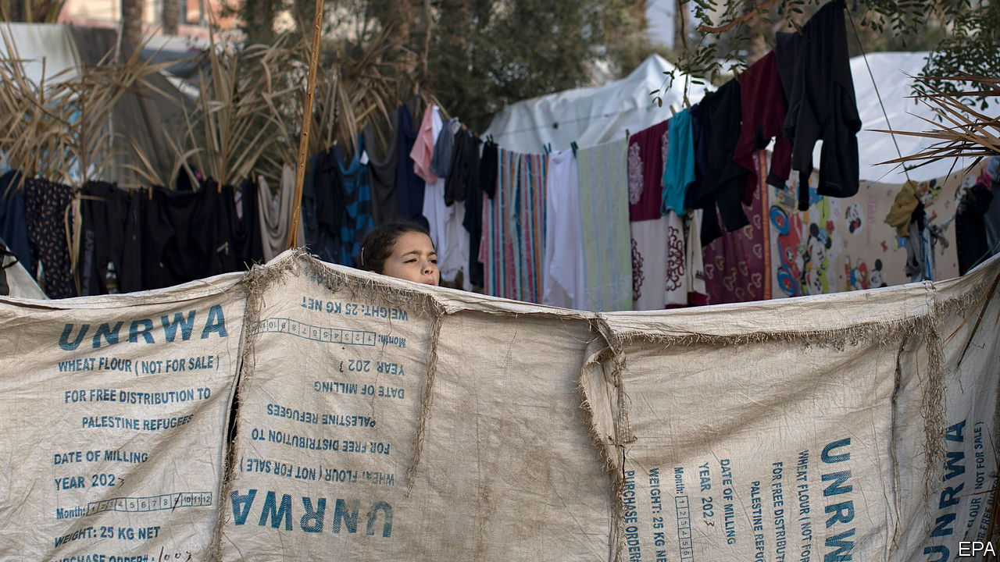

###### The United Nations and Gaza

# Did UN workers participate in the October 7th attacks? 

##### The allegations against UNRWA threaten aid flows to Palestinians 

 

> Jan 29th 2024 

THE UNITED NATIONS Relief and Works Agency (UNRWA) is almost as old as the conflict between the Israelis and Palestinians. And it has often found itself at its heart. Hundreds of thousands of Palestinians have sought safety in its schools and compounds during the war between Israel and Hamas in Gaza. And more than 150 of the agency’s staff are among the 26,000 people who have been killed.

The agency is now in crisis. On Friday January 26th Israel said it had evidence that at least a dozen of the organisation’s 13,000 staff members based in Gaza were involved in Hamas’s assault on Israel on October 7th. In response more than ten governments, including those of America and Germany—its two largest funders—have announced that they are freezing donations. It is unclear exactly how much cash is being withheld and how long the freeze will last. But UNRWA says that without the money it will be forced to cease operations at the end of February.

Some of the evidence for Israel’s allegations came from interrogations of Palestinians captured during and after the Hamas attack. Israeli officials said that intelligence was also gained from computers and documents that Israeli troops have found in Gaza. Israel said that UNRWA IDs were found on the bodies of some of the Palestinian militants killed in Israel. Phone intercepts place other employees inside Israel at the time of the attacks. Those implicated are accused of participating in the abduction of a woman, distributing grenades, and helping bring the body of a dead Israeli soldier back to Gaza.

Philippe Lazzarini, the head of UNRWA, sacked nine of them. At least one has been confirmed dead. What has happened to the other two is unclear. On January 26th Mr Lazzarini said that he had decided to “launch an investigation in order to establish the truth without delay”. On January 28th the United Nations itself said there would be an investigation by the UN’s Office of Internal Oversight Services.


Whether this satisfies the agency’s critics or some donors remains to be seen. On January 29th the European Union demanded a separate audit of UNRWA by EU-appointed external experts into whether its control systems are capable of preventing “the possible involvement of its staff in terrorist activities”, and also asked for a review of all UNRWA staff to confirm that they did not participate in terrorist attacks. 

This is not the first controversy to beset UNRWA. In 2017 the head of one of its schools was fired shortly after being elected to the Hamas politburo. Israel has long said the organisation’s school textbooks incite hatred against Jews; an investigation by UNRWA which was presented to America’s State Department in 2018 found “anti-Israel bias” in 3% of the pages of its books. UNRWA has admitted in the past to finding Hamas weapons stored in its schools. The Trump administration suspended funding in 2018, saying the organisation was fundamentally misguided. Joe Biden, the current American president, restored it in 2021.

UNRWA is markedly different from other UN bodies. It was founded in the aftermath of Israel’s war of independence in 1948 to care for the 700,000 Palestinians displaced from their homes (in its first four years it also helped Jewish refugees displaced in the same war). It now caters to the almost 6m descendants of those Palestinians and operates in Gaza and the West Bank as well in Jordan, Lebanon and Syria. It is the only UN agency that serves a specific group of refugees in a specific geographical area. Some of the controversy over it stems from the broadness of its definition of a refugee. The 1951 refugee convention defines one as a person who is actually “fleeing conflict and persecution”. UNRWA, by contrast, deems as refugees the descendants of all those whose “normal place of residence” was historic Palestine between June 1st 1946 and May 15th 1948 before being displaced.

As a result UNRWA’s position is politically sensitive. Israeli officials have long thought of shutting it down. They accuse it of needlessly perpetuating the refugee status of Palestinians and preventing their integration into their host countries. To many Israelis UNRWA’s very title sustains the idea that the Palestinian refugees might one day return to their old homes in Israel, a right that Israel does not recognise; its prospect would undermine the Jewish nature of the state. For Palestinians, UNRWA’s perpetuation of their refugee status keeps alive the idea that they might one day return to the homes they fled in 1948. 

UNRWA is also a lifeline for millions, especially in Gaza and especially during the current war. It is the backbone of humanitarian logistics in the strip. Much of the aid going into Gaza, wherever it comes from, is distributed by UNRWA’s lorries, warehouses and staff. Its collapse would make the humanitarian crisis far worse and create longer-term problems too. UNRWA is a major employer in Gaza; the vast majority of its 13,000 staff are local. If the organisation went under, another outfit would have to take on its work. As a UN official in Jerusalem puts it: “You can cut all the funding in the world, but it isn’t going to make the Palestinians disappear.” 

It is hardly surprising that some members of an organisation that has been embedded in Gaza so deeply and for so long have links to Hamas. But that defence of UNRWA in turn raises difficult questions about whether it is sufficiently neutral, transparent and accountable. UNRWA is probably essential in the short term in order to avoid an even deeper humanitarian crisis in Gaza. Whether it should be an essential part of Gaza’s long-term future is far less clear. ■


