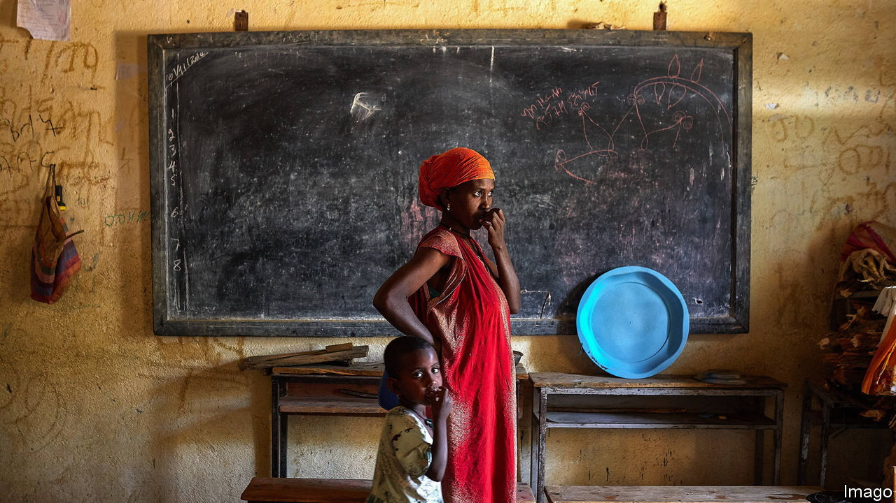
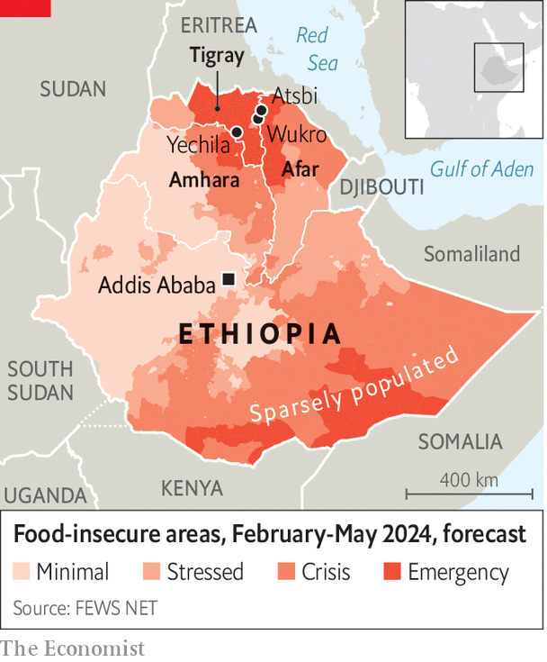

###### Hunger returns

# Northern Ethiopia is again sliding into starvation 

##### A region ravaged by war is now hit by drought 

 

> Feb 1st 2024 

Bullet holes riddle the door and walls of Tedesse’s grain shop in Yechila, a small town in the northern Ethiopian region of Tigray. During the recent civil war, Ethiopian and Eritrean soldiers looted his stores and emptied his cash box. Now peace has returned but buyers have not. He scoops up a handful of maize and lets it slide through his fingers. People cannot afford even to buy this much, he explains.

From 2020 until 2022 war raged across northern Ethiopia, pitting Tigrayan forces against the Ethiopian and Eritrean armies and regional militias. A land pillaged by soldiers is now parched by drought. Some farmers have harvested enough to last for a few months; others nothing at all. The next main harvest is still eight months away. Viewed from the crumbling hillsides, the barren terrain has the same sepia tint as an old photograph. On the maps drawn by aid workers, it is coloured in shades of red.

 


The Famine Early Warning Systems Network, which is funded by the American government, predicts that most of Tigray will experience “emergency” levels of hunger in the coming months, one notch below famine. The recent harvest was barely a third as big as expected. The situation is just as bad in parts of the neighbouring Afar and Amhara regions, which also saw fighting, and in southern grazing areas. Nearly 16m Ethiopians are short of food.

The rains are always fickle in the northern highlands, especially in years when the El Niño weather pattern appears. But marauding armies have robbed farmers of their assets and disrupted the economic networks that might once have kept hunger at bay. When Eritrean soldiers first arrived in Yechila, they nabbed livestock so that they could eat, says an official. Then they killed the remaining animals so the locals would starve. Farmers talk of soldiers burning ploughs, stealing sickles and slaughtering oxen. The federal government and its allies obstructed aid deliveries, cut electricity and blocked banking transactions. A UN inquiry found that starvation was used as a weapon of war. 

Although most services are now restored, a million people in Tigray are unable to return to their homes in areas still occupied by forces from Amhara or Eritrea. Gebremariam sleeps in a school classroom in Wukro town after fleeing from western Tigray, which is claimed by Amhara. “Many young people died and we were not allowed to bury them,” she says. Eritrean soldiers kidnapped one of her adult sons, who has not been seen since; another escaped to Sudan. Her jewellery was taken at knifepoint by Amhara militiamen. She gets by on sporadic handouts of wheat and on the generosity of the local townsfolk, which is starting to wear thin. A survey last year found that 30% of displaced children under five were acutely malnourished. 

In normal times young people could follow the rains, finding seasonal farm work in the fertile lowlands of the west, where Gebremariam once lived. That is no longer an option. Migration to the Afar region has also dried up. Kifle (we have withheld full names of all those interviewed to protect them), a Tigrayan day-labourer, fled Afar during bitter fighting and dares not return. The landowners in his home village are no longer hiring farmhands, so he has sold all his sheep to buy food.

Hunger may be most severe in parts of Amhara, where 1.7m people are affected by the drought. The situation there is made worse by continuing war as the Ethiopian army battles a regional militia. Armed groups have attacked food trucks and some areas are hard for aid workers to reach. Parts of the region had already been devastated by Tigrayan forces in the war.

Elders in the worst-hit areas of the north draw comparisons with the catastrophe of 1983-85, when hundreds of thousands starved to death. So does the regional administration in Tigray, which warns of an “unfolding famine” and estimates that thousands have already died of hunger-related causes. The federal government considers such claims alarmist. Aid workers avoid “the F-word”, as they coyly refer to famine, and think the number of deaths is overstated. Rainfall data indicate that this drought is not as extensive as in the worst historical episodes, but just as severe in places. The true picture is hard to establish because the federal government has not allowed an Integrated Food Security Phase Classification—the gold-standard analysis—since it disagreed with the conclusions of the previous one, in 2021.

It is clear, in any event, that more people will die if sufficient help does not arrive soon. The government’s well-regarded Productive Safety Net Programme, which gives cash, food and work to about 8m needy people across the country, used to provide around a quarter of the calorific needs in the areas now blighted by drought. But it is so underfunded that transfers will stop entirely for two months this year.

International aid has also faltered. Last year the UN’s World Food Programme and the American government suspended food handouts for eight months in Tigray and six months nationwide after uncovering what an American official describes as “multiple, concurrent schemes to divert humanitarian assistance away from its intended beneficiaries”. Food aid was being stolen all over the country to feed soldiers or be sold for profit. Distribution has slowly resumed since December, at lower levels than before. Aid agencies and the government gave food to 6.5m people in January. It is not enough.

In the hills near Atsbi, in eastern Tigray, Meles is trying to feed his two cows on the thin grass beside a dry watering hole. Then he will sell them for whatever price he can get. During the war Eritrean soldiers killed and raped people here, camping for months at the village school. It is as though, he says, the drought has come to finish off the work the soldiers started. ■

