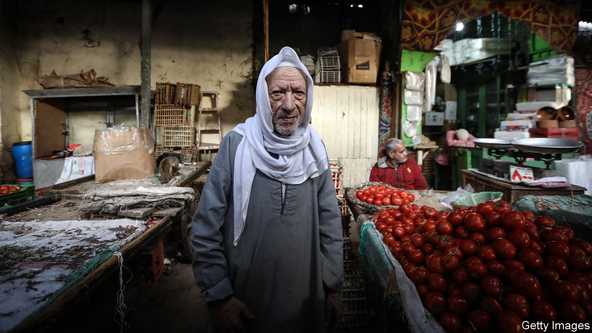

###### Egypt’s economic woes

# The war in Gaza is exacerbating Egypt’s economic collapse 

##### But the government hopes the conflict could be its salvation 

 

> Feb 1st 2024 

How better to boost the ego of a latter-day pharaoh than by rebuilding a pyramid? After almost a millennium bereft of its cladding, the third great pyramid of Giza is to be covered with granite tiles. The intent, say officials, is to link Egypt’s imperial past with its illustrious present under the president, Abdel-Fattah al-Sisi.

 


For all Mr Sisi’s pretensions, Egypt has been on the brink for some time. It was hit badly by a sharp rise in food prices from the war in Ukraine and its currency is one of the world’s worst-performing (see chart). Repayments on its external debts are forecast to reach $29bn (8% of gdp) this year. To stay afloat Egypt has relied on deposits from the Gulf and frequent infusions from the IMF: it is now the fund’s second-biggest debtor. True to form, imf officials are back in Cairo to stave off a default.

Egypt’s economic problems predate the war in Gaza, but the conflict and its overspill in the Red Sea are threatening to tip it over the edge. At the same time, they are boosting its negotiating power. 

Tourism revenues, which peaked last year at almost $14bn (about 14% of Egypt’s dollar inflows), have plummeted since the start of the war. The attacks on shipping in the Red Sea by the Houthis have cut traffic through the Suez Canal by about half. It usually carries some 30% of global container traffic and earned Egypt $9.4bn in transit fees in the 12 months to June. Meanwhile a hot summer drove up electricity use, cutting Egypt’s exports of oil and gas.

Egyptians abroad, nervous of transferring money into a tanking currency, are withholding remittances. In the third quarter of 2022 they fell by about 30% compared with a year earlier. Foreign investors are withdrawing their capital, or demanding high interest rates to keep it there. 

Since wheat and oil prices spiked in 2022 after Russia invaded Ukraine, Mr Sisi has devalued the Egyptian pound three times. Officially the currency has fallen by about 50% over this period, but on the black market it is worth 70 to the dollar, less than a quarter of its former value. That is fuelling inflation, which reached an annual rate of 34% in December, up from 6% two years ago. The falling pound also means the government now spends 60% of its budget servicing its debts.

Since Mr Sisi took power in 2013, Egypt’s external debt has quadrupled. That is partly because of the president’s costly megaprojects, which include a gleaming new capital, lots of other cities and highways. The capital, into which Mr Sisi has sunk $60bn (15% of gdp), stands empty. 

Some spending has slowed; work on a monorail to the new capital has stopped. But mostly the president continues to justify splashing his cash on the grounds of social stability, not economics. “I employ 5m-6m people…how could we shut all this down?” he asked in January. Without such jobs, the unemployment rate of 7% would soar, his officials insist. So new projects keep coming and handouts, such as the annual bread subsidy which eats up $2.9bn, or 2.6% of the state budget, persist. “We’re bankrupt but still spending like no tomorrow,” says one financial analyst in Cairo.

The army is also to blame. Under Mr Sisi, Egypt’s generals have tightened their grip on its economy. They hide away in compounds, ignoring the moans of poor Egyptians beyond their gates. Food prices rose by 72% in the year to September.

Mr Sisi seems unsympathetic. He recently suggested Egyptians were lucky not to be in Gaza:“Things are expensive and some things are not available? So what?” His security forces guard against trouble. Tens of thousands of suspected opponents languish in jail. 

To judge by December’s election, Mr Sisi remains popular. He won the poll, which was surely rigged, by almost 90%, with the highest turnout in years. But the streets heave with discontent. “May presidents fall,” protesters chanted in January. Support for the army has faded since 2011, when it allowed a revolution to topple Hosni Mubarak. Then, as now, rising bread prices fuelled anger. But the economic crisis is far worse today.

Economic weakness also hampers the army’s ability to project strength abroad. Qatar, a tiny but rich Gulf emirate, is supplanting Egypt as the main negotiator between Israel and Hamas. Despite the threat to the Suez Canal’s revenues, Egypt has recoiled from joining America’s coalition against the Houthis. Mr Sisi has been powerless to stop landlocked Ethiopia damming the Nile and leasing a Red Sea naval base in Somaliland, a breakaway enclave.

Still, strongmen can benefit from wars. The security forces prey on refugees. Palestinians pay them $5,000 or more to escape Gaza. Egypt hopes to capitalise on fears of the crisis that would follow if conflict spilled over its borders or it defaulted on debt. After the election, the imf had been expected to demand the economic reforms Mr Sisi had promised in late 2022 as a condition for the fund to release most of a $3bn loan. Another devaluation of the pound was widely predicted, or even its free float, together with a shift in investment away from vanity megaprojects.

Instead Mr Sisi appears to have won a reprieve. When so much of the region is aflame, he reasons, its foreign allies will deem Egypt too big to fail. Neither its Western nor Gulf creditors are rushing to collect their debts. And as  went to press, the imf was expected to double or more its original $3bn package, beginning with a $3bn loan with few strings attached. “Dive deeply and you’ll see Egypt has benefited a lot from war,” says Ahmed Aboudouh, an Egyptian expert at Chatham House, a think-tank in London. That will bring short-term relief. But it will also further entrench the generals who have hollowed out the economy. “The same people who are benefiting from the system are asked to change it,” says a former Egyptian finance official. “In the long term it will never work.” ■

