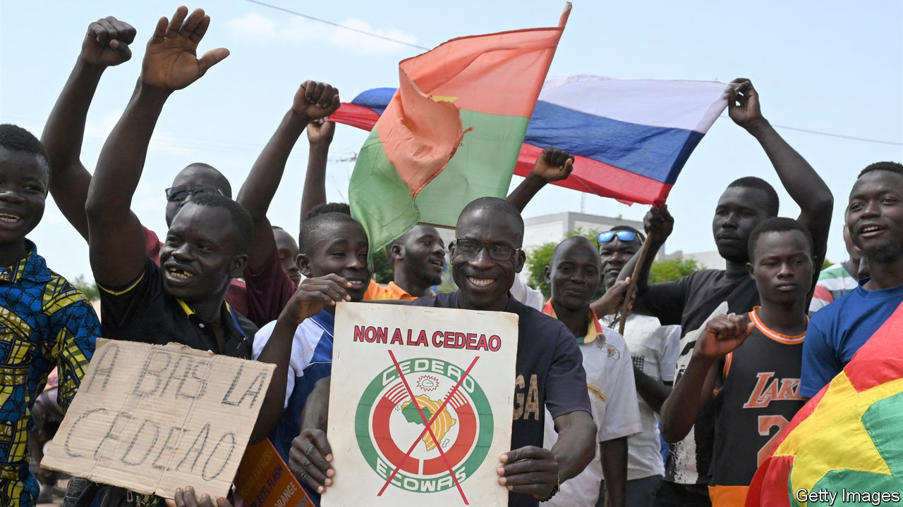
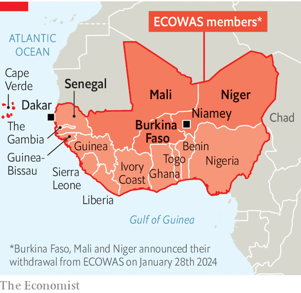

###### Disunity in west Africa

# Three countries hit by coups are leaving west Africa’s main bloc 

##### Burkina Faso, Mali and Niger inflict more misery on their people 

 

> Feb 1st 2024 

“It’s a historic decision!” said Sido Ibrahim as he celebrated in the streets of Niamey, Niger’s capital, after Burkina Faso, Mali and Niger declared their immediate withdrawal from the Economic Community of West African States (ECOWAS), the region’s main bloc. “We are united and stronger than ever,” claimed Mr Ibrahim. Others were less happy. “Things really are falling apart!” wrote Comfort Ero, the head of Crisis Group, an international think-tank, on X. “This looks like an earthquake!” 

Founded in 1975, ECOWAS allows the free movement of its citizens between its 15 member countries and largely the free movement of goods. Yet it has been floundering since a spate of coups toppled the governments of Burkina Faso, Guinea, Mali and Niger. Each time, ECOWAS imposed sanctions and demanded elections. Yet the juntas flagrantly broke promises and cosied up to Russia. A return to democracy in the Sahel is now a distant dream. The damage goes wider still. 

 


The juntas claim they are taking their 75m people out of the bloc because it has not helped them fight terrorism. That is nonsense. ECOWAS sent thousands of soldiers to help Mali when it began to buckle under a jihadist onslaught in 2013. They were then the leading troop contributors to a UN peacekeeping mission, before the junta kicked it out last year.

The real reason is almost certainly to escape pressure to return to democracy. Mali and Burkina Faso had promised to hold elections this year, and ECOWAS had told Niger to provide a timetable for doing so.

The bloc deserves blame, too. After last year’s coup in Niger, ECOWAS imposed economic sanctions and threatened to invade if it was not reversed. The junta instead stirred up crowds and the trio formed a mutual defence pact. ECOWAS backed down, though it kept sanctions in place. 

Russia’s backing matters, too. The three states believe they have enough foreign support to ditch ECOWAS, even though they have also severed ties with France, which had been helping them fight the jihadists. Russian mercenaries have operated in Mali since late 2021. About 100 Russian soldiers arrived in Burkina Faso last week—the first major deployment of Russians in the country—to prevent any counter-coup. Niger’s prime minister recently visited Iran, Russia, Serbia and Turkey, looking for weapons and cash. 

ECOWAS is struggling to respond. The bloc’s rules say leaving takes a year. Nigeria’s foreign ministry slammed unelected leaders who “engage in a public posturing to deny their people the sovereign right to make fundamental choices”. But a highly-placed Nigerian official sounded more emollient, emphasising that every member country is “vital to our union…All avenues to engage members that are aggrieved will be explored”. But it is unlikely that any of the juntas will reverse course. The real question is what sort of relations ECOWAS will maintain with the leavers. If it is too soft, Guinea’s junta might quit too.

The implications are many, large and bad. Though far from perfect, ECOWAS cares about democracy and human rights and carried some influence. Without its involvement there is little hope of restoring democracy. The juntas will also have a freer hand to fight jihadists and target dissidents without pesky complaints about human rights, says Crisis Group’s Ibrahim Yahaya. Human rights are already widely abused. In just one massacre in Mali in 2022 soldiers and Wagner mercenaries killed about 500 people, almost all civilians. In Burkina Faso the junta rounds up critics and sends them to the front.

The exit from ECOWAS will make it harder to stop the jihadists in the Sahel and may threaten the security of the bloc’s remaining members. The border areas between the three leavers and their southern neighbours are already hotspots for jihadists, who are also attacking Ivory Coast, Benin and Togo. Countries need to co-operate closely to beat them. The eviction of French troops and UN peacekeepers has already worsened security. Last year was the bloodiest ever in Mali, Burkina Faso and Niger. Almost 14,000 people, some 5,000 of them civilians, were killed in conflict, 

It is also bad news for the trio’s economies, which account for less than a tenth of the bloc’s GDP, as they will lose free movement and preferential trade with Ghana and Nigeria, which account for about two-thirds of it, notes Charlie Robertson of FIM Partners, a fund manager. 

Niger, with its tight links to Nigeria, stands to lose most. “This scares us,” says Mahamadou Salifou, a market trader in Niamey. “I import all my products from Nigeria.” Mali and Burkina Faso are more closely linked to Ivory Coast and Senegal, whose ports they rely on. Crucially, they will not yet lose trade and free movement to these countries because they (along with Niger) remain part of the West African Economic and Monetary Union, whose eight members share a common currency and allow free movement of people and goods. 

Yet their next step could be to leave the monetary union, which has also imposed sanctions, says Ornella Moderan of the Clingendael Institute, a think-tank based in The Hague. That would be a savage economic blow, complicate access to ports and throw into question the status of millions of Sahelians who live in other countries of the union. The three juntas have already discussed launching their own currency and have talked to Morocco about ambitious plans to use its ports. 

This year is meant to be a year of tighter integration across all of Africa, as the African Continental Free Trade Area expands beyond its pilot phase. Instead, west Africa’s regional unity is splintering.■

