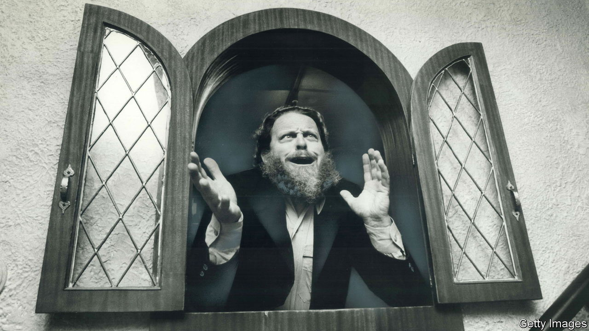

###### The short-tempered klavier

# Peter Schickele and P.D.Q. Bach were sides of the same coin 

##### The American musical satirist and his bibulous creation died on January 16th, aged 88 

 

> Feb 1st 2024 

HIS OWN musical career looked fairly good on paper. He had more than 100 serious works to his name. The National Symphony, the Minnesota Opera and several string quartets had all commissioned works from him. He wrote film scores, too, including tracks for “Silent Running” in the 1970s. But Peter Schickele could indulge his dream of serious composing only because, for half the year, he was touring the concert halls of America with the much more celebrated part of his persona, a bibulous, cranky, chaotic remnant of the 18th century called P.D.Q. Bach.

 This last gasp of the Bach family had been mercifully forgotten until, in 1954 or so, Mr Schickele found the score of P.D.Q.’s “Sanka Cantata” being used as a filter in a caretaker’s percolator in a castle in Bavaria. From that moment, in taverns, attics, trash cans, even the East River, scores kept turning up. All were in surprisingly fresh condition, though also much scribbled over. As self-proclaimed professor of musical pathology at the University of Southern North Dakota at Hoople, Mr Schickele was now on a mission to uncover and promote this mystery composer. It took up the rest of his life, and entertained audiences hugely along the way. 

 Research into the Bach family revealed that there was indeed a 21st child, born in Leipzig on April 1st 1742. So backward did he prove that his dates were often given as 1807-1742. His very name, P.D.Q. (presumably “Pretty Damn Quick”), suggested his usual mode was the sulky reverse. Though his father never trained him, and he gave up music at three, the illustriousness and sheer productivity of “Big Daddy Bach” made it hard to avoid that life. The struggle was immense. P.D.Q.’s Chorale Preludes on “Ah” and “Should” could not find anything more to say. His “Short-Tempered Clavier” was subtitled “Preludes and Fugues in All the Major and Minor Keys Except for the Really Hard Ones”. And no one could mistake the rage that animated his “versus” concertos: Concerto for bassoon [his own instrument] v Orchestra, Concerto for Piano v Orchestra, Concerto for Two Pianos v Orchestra, where the final final final all-marmalising chord from the orchestra was inevitably answered by some mocking keyboard twiddle or other.

 Besides the burden of the name, P.D.Q.’s life was sadly undisciplined. Some works evoked the expected chaos of a large household: “Breakfast Antiphonies”, for example (played in stereo, strings on one side of the room, winds and brass on the other), or “Allegretto Gabinetto for Plumber and Keyboarder”, or his famous Canine Cantata, “” 

But his principal problem was drink. When Mr Schickele divided his doppelganger’s musical life into just-about-coherent periods, he called them “The Initial Plunge”, “The Soused (Brown-Bag)” and “The Contrition”. In the first, which lasted about six days, P.D.Q. learned all he ever would about the craft of music. Most of the second, almost foolishly productive spell was spent face-down in a gutter in Wein-am-Rhein. In the third, he nursed his hangover in hopes it would end. An unexpected portrait of him, found in an alleyway in Leipzig, showed an august, bewigged patriarch at first glance. But the knees of his breeches were muddy and his tankard, in a minute, was about to tip into his lap.

 Years of work on the scores left Mr Schickele with two main conclusions. The first was that P.D.Q. was an utterly shameless plagiarist of other people’s works. Forgetting for a moment the all-pervading Bach connection, he was a merciless filletter of Mozart (“Eine Kleine Nichtmusik”), and Haydn (“Half-Nelson Mass”). Yet he was often so drunk as he did his borrowings that he forgot how the notes actually went, and in his fumblings could be dazzlingly original. Though Mr Schickele insisted on his “absolute and utter lack of talent”, in his heart of hearts he did not always think so. 

 P.D.Q.’s originality with instruments was perhaps a sign of genius, too. After all, what lovely sounds might emerge from a pastaphone, a dill piccolo, a shower hose or a tromboon, which had the slide of a trombone and the reedy top end of a bassoon? A favourite with both men was the lasso d’amore, one of those whirly whistling plastic tubes developed by Viennese cowboys who found that, once made musical, they were useless to round up cattle.

 The louche Leipziger was also a seer of sorts. Internal evidence suggested that, though he never went there, he knew the United States and its musical future curiously well. How else to account for the title of his most celebrated cantata, “Iphigenia in Brooklyn” (with Orestes’s poignant aria, “Oh ye gods, who knows what it is to be running?/Only he who is running, running, running knows”)? Or the rousing harmonica-led “Blaues Gras” cantata, or the mini-opera “Oedipus Tex”? How to explain the tenderness of the Christmas carol “Oh Little Town of Hackensack”, or the vibrant “Concerto for Horn and Hardart”, America’s first dispenser of hot mac n’ cheese through an Automat? 

 Yet prescience could work two ways. Mr Schickele had speculated on the possibility of another Bach son while, as a bluff and frisky midwesterner, he was doing his music studies at the Aspen Music School and Julliard. Already, like P.D.Q., he enjoyed larking around with the styles of other composers, expertly noodling popular songs into serious sections, letting weird sounds intrude wherever useful and generally shocking people. Nobody was better than P.D.Q. at that, and luckily the works kept coming. Something already in Mr Schickele led him to just those insalubrious spots where his kindred spirit had left an offering. Even the piece of paper he skidded on once in New York, as he walked home from the baker’s, turned out on close inspection to be the score of P.D.Q.’s “Four Next-to-Last Songs”. 

 When friends sympathised with his strange condition—rescuing one highly dubious composer from neglect, while getting mostly neglected himself—it was hard to know what to reply. P.D.Q. had indeed netted four of his five Grammys. But they had joyously broken most of the musical rules together, twinned in “a satire of love”. The best response was probably a sigh and a wink, followed by a rousing tootle on the left-handed sewer flute. ■

