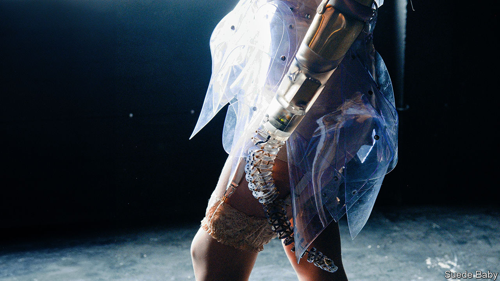
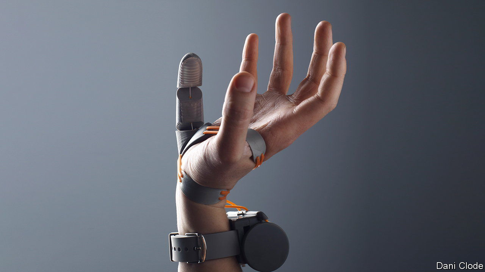

###### Embodying the future

# Why prosthetic limbs need not look like real ones 

##### Designers are experimenting with tentacles, spikes and third thumbs 

 

> Feb 1st 2024 

In a photoshoot Kelly Knox—a British model and disability-rights advocate—poses with a prosthetic limb unlike any other. Ms Knox was born with her left arm missing from the elbow down. From the point her arm terminates, dozens of vertebrae-like structures extend to form a long, sinuous tentacle.

The limb is certainly striking. It is dextrous, too. Ms Knox can control its movements via pressure sensors in her shoes, which connect to the limb wirelessly. Artificial tendons can tighten or loosen, allowing the tentacle to reach and grasp. The limb—detached from Ms Knox and titled VINE 2.0—is due to go on display at “BODIES…The Exhibition at the Luxor, a hotel and casino in Las Vegas, later this year. 

The limb was designed by Sophie de Oliveira Barata, an artist, and Dani Clode, a designer and engineer. Although it is an art piece, it is one inspired by some intriguing recent developments in neuroscience that suggest there is no reason—at least from first neurological principles—why prosthetic limbs need to look or behave like the biological ones they replace. 

The developments concern a phenomenon called “embodiment,” which is of interest to both neuroscientists and makers of prosthetic limbs. Embodiment is the way in which a brain identifies with the body it is located in, and determines the borders of what counts as “self” and what counts as “other”. 

Sometimes, embodiment can go wrong. Most amputees—between 60% and 80% worldwide, according to several papers—experience the continued presence of their missing limbs, often for years after they were first removed. This “phantom limb syndrome” (PLS) demonstrates that the brain’s idea of the body’s boundaries does not always match up with physical reality. 

Prosthetic limb-makers have long hoped to take advantage of embodiment to make their designs feel like extensions of the body rather than foreign objects attached to it. Therapies for PLS, which use mirrors to create the illusion that a missing limb is still present, hinted that the brain could be persuaded to embody a prosthetic limb if it matched the form and function of the limb it was replacing. 

But scientists’ understanding of embodiment has started to change. In a series of experiments in 2018 and 2020 Tamar Makin, a neuroscientist who runs the Plasticity Lab at the University of Cambridge, used functional magnetic-resonance imaging, which records blood flow in different parts of the brain, to peer into the heads of one-handed amputees. 

Not what you think

Dr Makin had them look at pictures of three different types of object: biological hands, prosthetic ones and hand-held tools such as brushes and spoons. By comparing which bits of the subjects’ brains responded, Dr Makin hoped to establish whether the brain interprets prosthetic hands as something like a biological hand or an object closer to a tool.

To Dr Makin’s surprise, the answer appeared to be neither. Instead, she says, the brain “places prosthetics into a category entirely of their own, clearly distinct from the others”. That held true whether the prosthetic was a cosmetic one, designed to look like an organic hand, or a functional one, whether a sophisticated robotic version or even a simple hook. 

This does not mean that a prosthetic limb cannot be embodied. Many amputees report embodying their artificial limbs to some degree. But what it does demonstrate is that whether a prosthetic is embodied or not does not have much to do with whether it looks like a biological arm or leg.

This has several implications for the design of prosthetics. One is to open it up to all sorts of innovations in material, colour and form. This is where Ms de Oliveira Barata comes in. She runs the Alternative Limb Project (ALP), a British studio that makes custom prosthetics. Ms de Oliveira Barata, who has a background in make-up and special effects, started by making realistic limbs for amputees. But a project with a young girl who was determined to have her replacement leg covered in cartoons shifted her perspective. 

These days the ALP creates striking, high-concept prosthetics for its clients. Its first major commission came from Viktoria Modesta, a British singer whose leg had been amputated below the knee. Inspired by an idea that came to Ms Modesta in a dream, Ms de Oliveira Barata designed a metallic black prosthesis in the shape of a long, conical spike vaguely reminiscent of a giant stiletto heel. Ms Modesta performed at the closing ceremony of the 2012 Paralympic games with a silver and glass crystal-covered leg, another of Ms de Oliveira Barata’s creations. 

And if a prosthetic need not mimic the limb it is replacing, then perhaps prosthetics could be more than just replacements? Ms Clode is an expert in the design of robotic prostheses controlled by artificial tendons. She is keen to explore the possibility of augmenting existing bodies with new capabilities, making prosthetics “a technology that could be of use to everybody, not just amputees”. To that end she has designed the “Third Thumb”, a small and robust prosthetic digit that does exactly what it says on the tin. Controlled, like Ms Knox’s vine-arm, by pressure sensors in a pair of shoes, the thumb can be used to replace a missing one. But it can also be added to an intact hand on the opposite side from its existing, biological thumb. 

 


Having two thumbs “extends what the human hand can do in surprising ways,” says Ms Clode. Many involve holding an object and manipulating at the same time, such as peeling a banana or opening a soft-drink bottle one-handed. Using toe controls might seem primitive compared with some of the more sophisticated prosthetic hands on the market, which are designed to be controlled by picking up signals from the wearer’s remaining muscles. 

But Ms Clode says the opposite is true. Myoelectric prostheses can be slow and clunky. And since the muscles remaining at the site of an amputation are unlikely to be the same as those that were used to move the missing limb, learning how to use them with the prosthetic can take months. Shoe-mounted controls, by contrast, can be mastered relatively quickly. 

In future, it may be possible to give such prosthetics artificial sensory feedback. In November 2023, in a paper published in , a team of Chinese researchers led by Li Wen, a roboticist at Beihang University, described a flexible robotic arm that mimics an octopus tentacle. Although it was not designed as a prosthetic, the tentacle is controlled by a finger-glove that fits over the wearer’s index finger, and provides touch feedback through the same mechanism that controls it. 

Neither Ms de Oliveira Barata nor Ms Clode are neuroscientists. But academic researchers are starting to get interested, too. Ms Clode is working with Dr Makin to investigate how the brain adapts to bodily augmentation. They are particularly interested in how the brain reallocates its cognitive resources to accommodate new appendages and whether such appendages can be embodied. “I do not think we have come close to the limits of what is possible yet,” says Ms Clode. “But we certainly intend to find out.” ■


