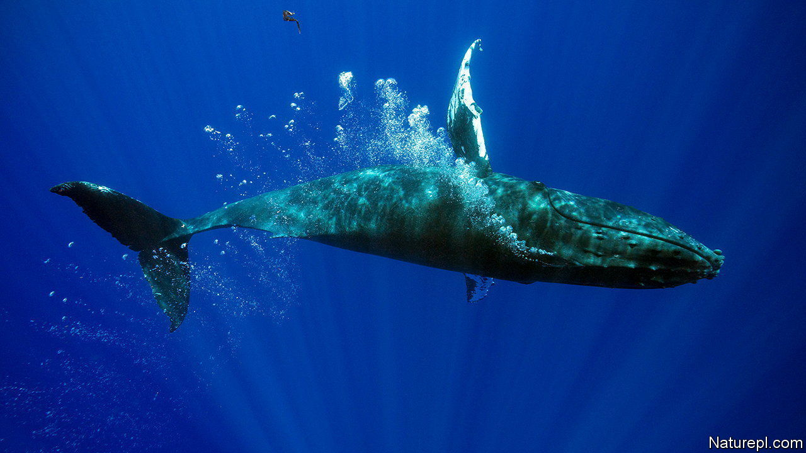

###### Bloodhounds of the sea

# Why some whales can smell in stereo 

##### One nostril is good. But two can be better 

 

> Feb 1st 2024 

ANY SCHOOLCHILD knows that a whale breathes through its blowhole. Fewer know that a blowhole is an adapted nostril, tweaked by evolution into a form more useful for a mammal that spends its life at sea. And only a dedicated cetologist would know that while toothed whales, such as sperm whales and orcas, have one hole, baleen whales, such as humpback and Rice whales, have two. 

Even among the baleen whales, the placing of those nostrils differs. In some species they are close together. In others, they are much further apart. In a paper published in  Conor Ryan, a marine biologist at the Scottish Association for Marine Science, suggests why that might be. Having two nostrils, he argues, helps whales smell in stereo. 

Many types of baleen whales eat tiny crustaceans known as zooplankton, which they catch by filtering them from seawater using the sheets of fibrous baleen that have replaced teeth in their mouths. But to eat something you first have to find it. Toothed whales do not hunt by scent. In fact, the olfactory bulb—the part of the brain that processes smell—is absent in such creatures. But baleen whales still have olfactory bulbs, which suggests smell remains important. And scent can indeed give zooplankton away. Zooplankton like to eat other tiny critters called phytoplankton. When these are under attack, they release a pungent gas called dimethyl sulphide, which scientists know is capable of attracting hungry seabirds. 

Most animals have stereoscopic senses. Having two eyes, for instance, allows an animal to compare the images from each in order to perceive depth. Having two ears lets them locate the direction from which a sound is coming. Dr Ryan theorised that paired blowholes might bring baleen whales the same sorts of benefits.

The farther apart the sensory organs are, the more information can be extracted by the animal that bears them. The researchers used drones to photograph the nostrils of 143 whales belonging to 14 different species. Sure enough, baleen whales that often eat zooplankton, such as the North Atlantic right whale, have nostrils that are farther apart than do those, such as humpback whales, that eat zooplankton occasionally. Besides allowing them to breathe, it seems that some whales use their blowholes to determine in which direction dinner lies. ■


