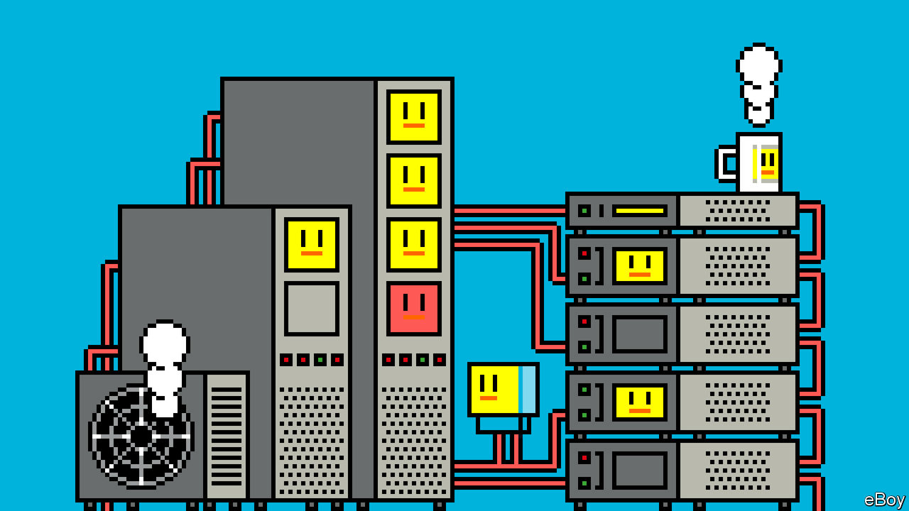
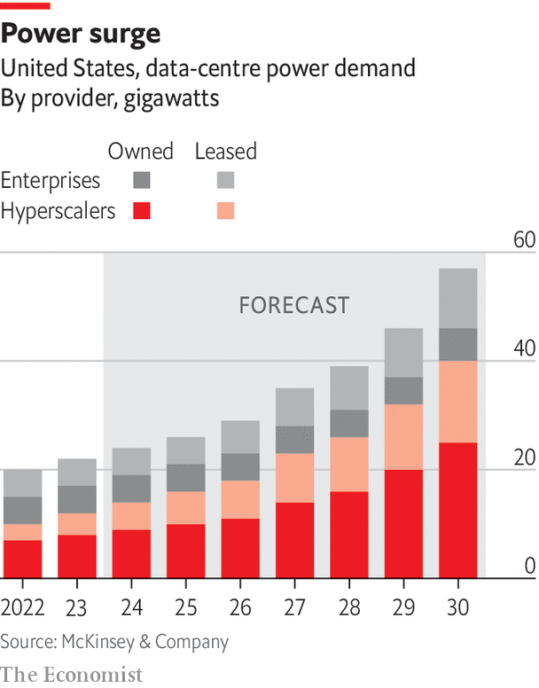

###### The internet and climate change

# Data centres improved greatly in energy efficiency as they grew massively larger 

##### But can this continue into the age of AI? 

 

> Jan 29th 2024 

As you step into one of 42 data halls on a plot of 74,000 square metres near Sydney, Australia, you become immersed in a sterile science-fiction world. Towering rows of black server cabinets stand in meticulous order, containing thousands of whirring hard drives, the beating metal hearts of a massive “hyperscale” data centre. Overhead, fibre-optic cables carry data down into each cabinet; metal wires, electricity. Outside a substation delivers power; batteries and generators provide backup. The digital world pulses unceasingly on an uninterrupted flow of electricity. 

In 2022 data centres used between 240 and 500 terawatt-hours of electricity, roughly 1-2% of that consumed worldwide, up from 0.5% in 2000. At the low end of estimates that is more than Australia used as a country; at the high end, more than France, the 10th-biggest consumer of electricity. 

Growing demand for digital experiences means more and bigger data centres. Amazon, Google, Meta and Microsoft used 72 terawatt-hours of electricity in 2021, more than double their usage in 2017, according to the International Energy Agency (IEA). By 2022 these four companies accounted for nearly 80% of global hyperscale data-centre capacity. A fair chunk of the rest is in China. Several hyperscale data centres are under construction in the remote northern city of Hohhot in the region of Inner Mongolia, on tracts as large as 140 football pitches. Huawei, a Chinese tech giant and cloud provider, is among the operators, along with major state-owned companies China Telecom and China Mobile. 

Outside China, the pace of data-centre construction has been taxing resources to the point that some governments have felt compelled to slow it down. In 2019 Singapore temporarily halted the construction of new data centres, concerned that building more might make it difficult to fulfil its commitment to achieving net-zero emissions by 2050. (It began issuing permits again in 2023, allocating power for several new data centres including for ByteDance, the parent company of TikTok.) In Ireland EirGrid, the national utility, has stopped issuing connections to new data centres until 2028 out of concern for running out of grid-connected energy capacity; data centres already account for 18% of electricity consumption there. (Microsoft may get around this issue by using a stand-alone gas plant to power a data centre in Dublin.) 

In northern Virginia, Dominion, a utility company, paused new power connections to data centres for several months in 2022 to, as the company put it, “make sure that the integrity of our system can support this growth”. Sometimes referred to as data-centre alley, northern Virginia is home to just over three square kilometres of data centres, most of which are within 75 square kilometres in Loudoun County. Delivering a lot of electricity to a small area is logistically tricky. And demand is set to grow by about 85% over the next 15 years, Dominion says. 

Pauses like these have not stopped data-centre growth, but rather shifted it elsewhere. More data centres are popping up in secondary markets that have fewer resource constraints, like Maryland and Malaysia. As data-centre activity grows in these areas, those governments may have to step in to protect their grids. 

Despite all this the internet’s use of electricity has been notably efficient. According to the IEA, between 2015 and 2022 the number of internet users increased by 78%, global internet traffic by 600% and data-centre workloads by 340%. But energy consumed by those data centres rose by only 20-70%.

Such improved efficiency comes partly from improved thriftiness in computation. For decades the energy required to do the same amount of computation has fallen by half every two-and-a-half years, a trend known as Koomey’s law. And efficiencies have come from data centres as they have grown in size, with increasingly greater shares of their energy use going to computation. 

Thirst traps

Unfortunately, some efficiencies of scale have come at the expense of another important resource: water. By the 2000s, as data centres evolved into tightly clustered racks of increasingly powerful servers, they began to require industrial-strength air-conditioning systems to cool the servers as they got hot from processing data. These systems require massive amounts of water to cool the air that cools the servers. In particularly hot places like Singapore, data centres’ thirst for water is even greater. 

As chips get increasingly powerful, they run hotter too—packing more transistors into a smaller area means you can move electrons around more quickly, generating more heat. This makes chips more efficient per unit of computation, but requires more cooling per chip. In 2022 Google and Microsoft consumed 32bn litres of water, mostly in their data centres, the same as about 700,000 people in a rich country. (It is generally cheaper and more energy-efficient to throw away old water than to clean it and recycle it through cooling ponds.)

The world has been fortunate that the tech giants are concerned about the resources they use up, and are investing heavily in renewable energy (or that they have decided appearing concerned aligns with their long-term financial interests). Tech companies are by far the biggest buyers of green energy by means of power-purchase agreements (PPAs). These are long-term contracts between a buyer (like a data-centre company) and a power producer (like a solar- or wind-farm operator) to buy electricity at a predetermined price, instead of bulk-buying from utilities. PPAs provide a level of financial security, making it easier for renewable projects to get built. The data-centre industry has collectively added (or will add) 74 gigawatts of capacity in this way.

Tech companies also buy large quantities of renewable-energy certificates (RECs), which are a way of financing the creation of renewable capacity. A power company is issued RECs for electricity that is generated and delivered to the grid from a renewable-energy resource. They are then free to sell RECs as they wish. Tech giants using RECs can claim data centres as carbon-free when the actual electricity they are using to power the data centres is not.

The nuclear option

Data-centre giants have also invested more directly in unproven energy technologies, making bets before it might otherwise have seemed financially sensible. In the late 2000s Google invested in over two gigawatts of early solar and wind projects to help scale the technology to drive down costs. 

Such investments are vital because renewable energy and data centres are far from a perfect match. A data centre is expected to be running 99.982% of the time, so it needs a steady and certain stream of power. Much of renewable energy is variable, dependent on the sun shining and the wind blowing. Running completely on clean energy will require other technologies to fill the gaps.

Nuclear technologies, like fusion or small modular reactors, could produce stable, limitless energy for data centres. They are not commercially available yet, but again data-centre companies are funding them. In 2023 Microsoft signed a PPA to buy fusion power from Helion Energy, a startup, by 2028. Tapping into geothermal energy is another possibility. Google first invested in the concept in 2008; in November the firm (along with Fervo, a startup) finished building a small, 3.5-megawatt geothermal plant in the Nevada desert. These technologies cannot yet compete at a commercial scale, but the same was true of wind and solar 15 years ago.

A big need right now is long-term storage, literally saving energy for a rainy day. Currently when a grid fails, a data centre will run on batteries for a few minutes until methane-fuelled generators kick in. Google, Microsoft and the like are investing in alternative storage technologies. Hydrogen, for example, can pack a lot of energy into a small space, and in theory could power a data centre for days instead of minutes. And data centres can alleviate the problem of variable load that afflicts renewables-based grids. In a practice called “load shifting”, data-centre operators move certain tasks that are not time-sensitive, like training an AI model, to different times or even to different data centres. Google has created a system that can shift computation jobs to when and where grids are cleanest. 

Tech firms are also playing a leading role in another emerging climate-friendly technology, durable carbon-dioxide removal (CDR). This involves taking carbon dioxide out of the atmosphere and storing it somewhere in a safe way that keeps it from ever getting back there. In 2020 Microsoft declared its intention to use the technology to help reach its goal of going “carbon negative”. 

Such innovations help explain why the tech giants are making big promises about their environmental sustainability. Google and Equinix, another operator of hyperscale data centres, say they will run completely on carbon-free energy by 2030. Microsoft has committed to becoming carbon-negative and water-positive by 2030—that is, using offsets like durable CDR and cleaning dirty water. Microsoft says it will remove the equivalent of all the carbon the company has ever emitted by 2050 (when asked how the gas plant in Dublin fitted into these plans, Microsoft said its intention had been to use gas as a backup power source, and that the company remains committed to powering data centres “in the most carbon-friendly way possible”). Amazon’s goal is to reach net-zero carbon by 2040, running its data centres on 100% renewable energy by 2025 (as with the other companies, only when including RECs). Apple has committed to being 100% carbon-neutral by 2030 across its data centres and supply chains, through a combination of reducing emissions by 75% and investing in carbon removal. Meta says it will be net zero by 2030. 

The tech giants will deserve plaudits if they can meet these goals. All the more so because the internet might be crossing an inflection point in electricity use after which it will grow even more quickly than it has to date. One factor in this surge in energy demand to come is edge computing. Bringing more computing power closer to the user means a lot more (smaller, less efficient) data centres. Several consultancies project, perhaps boosterishly, that the edge data-centre market will more than triple in value globally by the end of the decade, to about $30bn-40bn. 

Another big factor is AI’s ravenous appetite for energy. AI requires a lot more calculations than regular computing. A rack of normal servers might run on 7 kilowatts of electricity; for AI racks it can be 30-100 kilowatts. The reason for this discrepancy is that AI uses much more powerful hardware than is needed for, say, storing photos or maintaining websites. Because AI is based on matrix maths, it involves large blocks of computation being done at once, which means a lot of transistors have to change states very quickly. That draws a lot more power than normal computer tasks, which flip far fewer transistors at once for a typical calculation. 

 

This adds up fast. A large language model may be trained for weeks on tens of thousands of power-hungry special AI servers. And as models get more advanced they consume more resources. One estimate suggests that it cost OpenAI more than 50 gigawatt-hours of electricity to train GPT-4 (or 0.02% of the amount of electricity California generates in a year). That is more than 50 times more electricity than training its predecessor, GPT-3, required.

An insatiable hunger for power

The energy costs of actually using AI models will dwarf training costs, according to Nvidia, maker of the most popular AI chip. Researchers at the University of California, Riverside, found that GPT-3 consumes roughly a litre of water to generate 40-100 responses; GPT-4 probably consumes even more.

The tech giants are investing heavily in AI. It is no coincidence that many of the most advanced AI firms are big data-centre companies, or are partners with one. The future of AI, who will get ahead and who will lag behind, depends greatly on who can build out the necessary physical infrastructure to support it. Microsoft—a cloud provider, a major player in AI research and an investor in OpenAI—plans to spend more than $50bn per year on cloud infrastructure from 2024. Meta estimates that it will spend more than $30bn on data centres in 2024. CoreWeave, a startup which provides cloud infrastructure for AI companies, grew in 2023 from three to 14 data centres in North America.

 


This scale of construction portends a serious ramp-up in electricity consumption (see chart). A recent analysis in , an energy journal, suggests that at the rate they are being produced, AI servers could use about 100 terawatt-hours of electricity each year by 2027, between a quarter and a fifth of total data-centre consumption. Schneider Electric, a French firm that builds power supplies for data centres, projects that AI’s share of data-centre electricity use will jump from 8% in 2023 to 15-20% in 2028. 

Further gains in efficiency would help. Data centres may well achieve some through how they manage another challenge presented by AI chips: keeping them cool. Because they use up so much power, AI chips overheat more easily than normal ones and need special cooling technologies. One solution is to use liquid rather than air as a coolant, by circulating a fluid through a cold plate that is fixed directly to the chip. The heat from the chip goes directly into the coolant, which then flows through pipes to be cooled again. One study found that liquid cooling reduced the total power consumption of a data centre by just over 10%.

Such efficiencies will be helpful, but still amount to drops in the ocean compared with future energy demand created by the internet. No matter how efficient they get, you cannot stop data centres from needing power, because servers need power. Ultimately for data centres to become carbon-free, the electricity grids that power them will need to become carbon-free. Governments and the tech giants will have to work together towards that goal, but it will be a tall order. The geopolitics of climate change are not dissimilar to the geopolitics of the internet: convoluted and messy. ■

