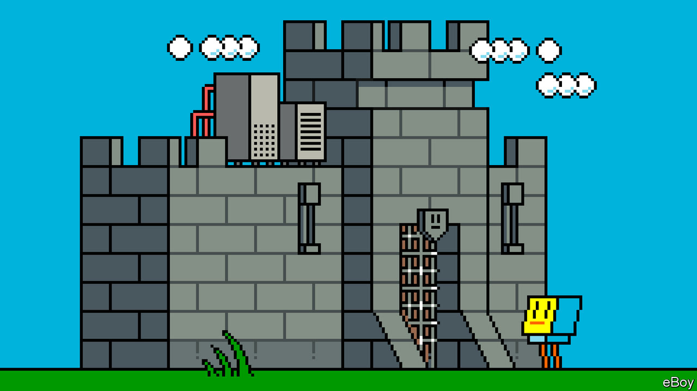

###### Securing the cloud’s future

# The internet is integrated into virtually every aspect of life 

##### It needs to be kept secure, and kept growing 

 

> Jan 29th 2024 

The sheer amount of gold in Fort Knox was so great that Auric Goldfinger, the villain of the 1964 James Bond film which carries his name, knew he could not simply steal it: instead he planned to use a nuclear device to irradiate it, destroying its value and thus increasing that of his own reserves. Casing the facilities of equivalent strategic worth to the world today—the hyperscale data centres of Amazon, Google, Meta and Microsoft—suggests that something almost as dramatic would be needed to take them down. They are fortresses with layer after layer of protection, from fences to airlock-style entrances to biometric scanners. 

Good thing, too. Much of the planet relies on these cloud fortresses, and will do so even more in years to come. Remarkable as the cloud is, there is no reason to think it is anywhere near completion. The generation of data and the need for its analysis continue to grow, and both storage and analysis are increasingly cloud-based. Hospitals use it to access patient records and share test results. Governments use it for elections, services and disaster alerts. The global financial system—bank transfers, stock trades—increasingly relies on it.

Because of abstraction and the distributed nature of cloud computing, no single data centre holds all the world’s valuables. No single cable keeps the entire internet connected. No single hack will wipe out everyone’s savings or turn everyone’s lights off. But as the internet becomes integrated into virtually every aspect of life, keeping its infrastructure secure will be ever more essential. Spending on cybersecurity globally is expected to surpass $200bn in 2024. Physical security for cloud servers is a big part of that bill. So is protecting servers from hackers, including those already inside otherwise secure buildings. All Google employees have a physical piece of hardware that they must use to log on.

Given that the internet came out of the Pentagon—its earliest incarnation was an American military research project, ARPANET —it may seem surprising that security is not built into its roots. But the goal of ARPANET, a project which began two years after “Goldfinger” hit cinema screens, was to develop a packet-switching system that would link the computers of various military-funded research institutions and, later, to ensure a multiplicity of routes such that the system could survive a nuclear attack. It was not to keep the system’s data safe. And as ARPANET gave way to the purely academic world of the early internet, the idealistic graduate students who fostered its growth focused on creating an open and accessible network. It was not until the first browsers became commercially available in the mid-1990s that a protocol designed to encrypt data, authenticate servers and verify that data has not been tampered with was added to the internet. It was soon outdated and replaced; the same process continues today.

Big is beautiful

As well as attempting to steal data, hackers can also try to paralyse the systems that distribute it. On October 10th 2023 Amazon Web Services, Google Cloud, Microsoft and CloudFlare, a CDN provider, all disclosed that they had been the targets of a colossal distributed denial of service (DDoS, pronounced “dee doss”) attack in August and September. Google reported receiving 398m requests for data each second during the two-minute-long attack, more than 4,000 times the rate at which search queries normally come in—and seven-and-a-half times larger than the previous record. 

The fact that the services under attack weathered the storm is just one more of the forces pushing the internet towards a more integrated business model, with companies operating at every level from cable and server to application, and thus favouring its giants. It is that sort of scale which allows firms to withstand and respond to attacks as well as they do now. 

This is just one of the ways in which, as the cloud grows, more and more of that growth will be seen in the companies that dominate it. The biggest tech firms are spending heavily to distribute computing power to the edge of the network, to push an evolution from electronics to photonics, and to buy the capacity to provide reliable renewable power. The physical business of moving and processing the data used by people, companies and governments increasingly operates on an ever grander scale. As the infrastructure allows computation to be ever better distributed, the companies behind the scenes will continue to get bigger and bigger. 

Perhaps, one day, that will stop. Perhaps, one day, the world will not need ever more computation to feed its appetite for services, for entertainment, for economic growth. In developed countries economic activity is increasingly decoupled from the use of energy; GDP can grow as energy use falls. It may be that, one day, the world will have all the computational power that it needs. But if that day ever dawns, it will not do so for decades to come. And until it does so, the abstracted world of human and artificial thought and communication will demand ever more investment and imagination from those who provide its underpinnings. ■

