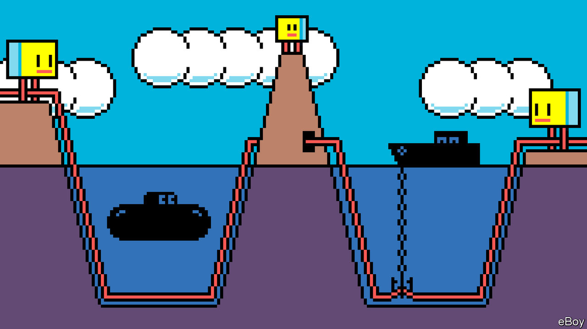

###### Politics

# The physical borders of the digital world 

##### To remain geopolitically robust as it gets more potent, the internet will need more diverse interconnections 

 

> Jan 29th 2024 

On June 7th 2022 Asia-Africa-Europe-1, a fibre-optic cable which connects Europe and Asia, was cut where it crosses land in Egypt. Somalia and Ethiopia lost 85% of their connectivity for several hours; the cloud services of Amazon, Google and Microsoft were all briefly disrupted, increasing latency for much international traffic; LinkedIn went down. And that was just one cable, on land, where the repair job was simple. Were all of the subsea cables to be severed at, say, the entrance to the Red Sea between Yemen and Djibouti, financial transactions would stutter. Zoom calls between London and Singapore would lag and glitch. Connectivity would persist—packets would be rerouted through America, or through space via satellites—but not without major slowdowns.


The submarine-cable system carries 99% of intercontinental internet traffic. A subsea fibre-optic cable gets cut every three days or so, according to TeleGeography, a consultancy, often because of fishing or an anchor dragging across the ocean floor. Yet the digital world rarely misses a trick for two very physical reasons. The first is that with 552 (active and planned) subsea cables spanning 1.4m kilometres, there is enough redundancy in most places to make up for cable failures (see map). The second reason is that a fleet of 60 repair ships around the world are on stand-by to fix broken cables. 

Fibre-optic cables run along various routes around the world, giving the internet options for directing traffic. In most cases if one path fails, packets of data will find their way around without users being the wiser. That is part of the beauty of abstraction. But in the Red Sea and Egypt, abstraction has masked a physical bottleneck. Just about all information sent from Asia to Europe flows through 11 fibre-optic cables at the bottom of the Red Sea, then mostly through Egypt via land cables controlled by one company, Telecom Egypt, before reaching the Mediterranean. If something disastrous were to happen to this route, people would notice. 

Such a digital choke-point might seem alarming given that the Suez Canal has been a vulnerable physical choke-point, as shown by the badly parked Ever Given container ship in 2021, or by the recent attacks on shipping by the Houthis. In many ways, though, the physical shape of the internet—where wires are laid, where they stop, who is connected with whom—is dictated by geography, politics and inertia. It is sensible to lay tracks where others have put them before. The British Empire opened the Red Sea route in 1870, when it laid telegraph cables to connect with its colonies. Telegraph was replaced by co-axial cable, then by fibre-optic.

Whenever a subsea cable is broken somewhere in the world, a repair ship will be dispatched. A pulse of light may be sent down the line to help pinpoint a rupture in a cable that is a few centimetres thick. The repair ship then uses sonar and a remotely operated vehicle (ROV) to find the break and haul the ends of the cable onboard. There humans will splice on a new section of fibre with precision. It is like trying to align three pieces of hair. Then the cable is lowered and reburied (often by an ROV) at the bottom of the ocean. In most cases users have no idea a cable was broken. Repair jobs generally take just a few days or a week, during which time internet packets automatically get re-routed anyway. 

But where there is a choke-point, especially in a remote spot, a cable break can be locally catastrophic. When the Hunga Tonga-Hunga Ha’apai volcano erupted in 2022, underwater mudslides severed the Tonga Cable, leaving Tongans without reliable internet for five weeks, until a repair ship could be wrangled. Many islands in the South Pacific have only one fibre connection, if any. Where there is no redundancy, there is vulnerability. 

Building routes other than through the Suez Canal would be wise. But it is not easy. In the 2000s a cable was proposed that would link Jeddah and Istanbul, connecting by way of Amman and Damascus. Just after it launched, it was reportedly blown up during the civil war in Syria and never repaired. In 2021 Google started work on a new overland route through Israel, Jordan and Saudi Arabia; now that project appears to be on hold.

Adding more connections will also help the one in three people globally who do not have or cannot afford the internet. Many African countries lack sufficient data centres to store information, or internet exchanges to route traffic. As a consequence many packets of data must make a slow intercontinental trip. Long-distance land cables help, but they are hard to lay and maintain across rugged terrain. As more infrastructure gets built this problem will ease. In 2024 a route called 2Africa, which extends from Britain around the continent to India, will speed up service for many. Satellites help too, but users need . 

Laying fibre-optic cables is expensive. In the past, telecoms companies like AT&T formed consortiums to pay for the task. Now cloud companies like Google and Meta do so. Their hyperscale data centres need massive amounts of connectivity to keep clouds updated. They have come to want the “predictability” that ownership brings, says Frank Rey of Microsoft. 

Google funded its first transpacific cable in 2008. It has since invested in at least 25 more, 12 of which it owns fully. Meta has invested in 15, one of which it owns outright. Microsoft partly owns four. Alcatel Submarine Networks, one of three major submarine fibre-optic-cable manufacturers in the world, reckons that more than two-thirds of current projects are supported by big tech firms. There is more than a whiff of vertical integration to this trend. As the cable map diversifies physically, it is concentrating corporately.

China, perhaps a bit oddly, stands outside this trend. Chinese companies are currently not invested in new transpacific cables, and planned cable routes mostly steer clear of hot spots like the South China Sea. Operators prefer to limit the interplay of politics and connectivity and let data come and go; Chinese and American network operators use many of the same cables for internet traffic, and there are no signs yet of China’s role as a regional connection hub waning. But the question of who controls the physical connections of the internet—which few companies or indeed which countries—will become more urgent in times of real-world conflict. The centrality of the internet to modern life has made securing it an urgent necessity.■

