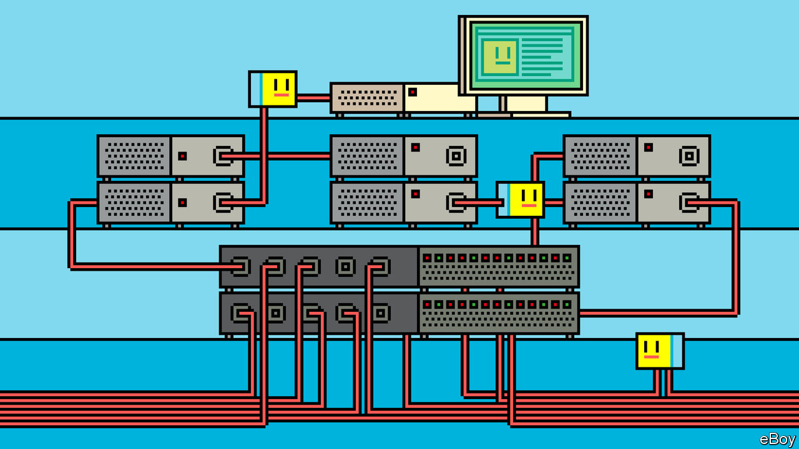

###### The foundations of the cloud

# Users of the internet need not think about its physical underpinnings 

##### But for technologies like artificial intelligence and the metaverse to work, others will have to, argues Abby Bertics 

 

> Jan 29th 2024 

In 1973 Bob Metcalfe, a researcher for Xerox at Palo Alto Research Centre, helped think up a way for the company’s computers to send information to each other via co-axial cables. He called this concept Ethernet after the medium by which, in 19th-century physics, electromagnetic forces were thought to be transmitted. Ethernet would become a cornerstone of the internet.

Despite his role in its foundations, Dr Metcalfe later doubted the hardiness of the internet as it became a global phenomenon. In late 1995 he noticed that a quarter of internet traffic was getting lost on its way, and that the system did not seem to be responding well to that volume of loss. He predicted that the whole shebang would “go spectacularly supernova and, in 1996, catastrophically collapse”. The collapse never happened, and Dr Metcalfe literally ate his words. At a conference in California, he produced a print-out of his prediction, pureed it in a blender and slurped it up with a spoon. “I learned my lesson,” Dr Metcalfe says now. “The internet is more robust than I had estimated.”

In its more than 40 years the internet as a whole has never completely stopped working. Parts of it break all the time, but resilience was built into the internet from day one. It is a decentralised, distributed network of billions of computers and billions of routers, connected to each other by perhaps billions of kilometres of cables. The network works seamlessly for end-users because of layers of software above this hardware that manage how the computers communicate, building in multiple redundancies and leaving no single point of failure. This power of abstraction—the ability to create, transmit and consume digital artefacts without needing to think about the physical realities behind them—is the secret sauce of the internet. And, indeed, of all computer science.

Abstraction is also the key to why Dr Metcalfe’s prediction ended up proving wrong. To see why, one has to grasp the internet’s layered structure. Some engineers think of the internet as having five layers (though others say there are four or seven depending on whether certain functions get layers of their own). At the bottom is the most physical of layers, where photons and electrical signals whizz from one server to another via routers and cables. Just above the cables are local-network protocols like Ethernet, Dr Metcalfe’s contribution, which allow computers and other devices near each other to interpret this traffic as groups of ones and zeros.

So many layers to this

Above the cables and local-network protocols are two communications layers, “transmission control protocol” and “internet protocol” (TCP/IP), which enable computers to interpret messages as “packets”: short strings of data with a tag at one end which describes their destination. TCP/IP interacts with Ethernet but need not know about the cables at the very bottom. Sitting above TCP/IP is the application layer of software and language that users will begin to find more familiar, like “http” (as seen on the world wide web). That allows webby stuff to interact with TCP/IP without worrying about Ethernet, cables and the like.

These levels of abstraction made the internet flexible and allowed it to scale beyond what many—including Dr Metcalfe—imagined. Each intermediate layer is designed to manage disruptions below and to present a clean image above. A well-designed layered system like the internet dampens chaos caused by errors, rather than spiralling out of control with them. And it didn’t hurt that, all the while, the physical foundation itself was strengthening. Optical fibre became increasingly available throughout the 1990s, which increased bandwidth to send more packets faster, losing fewer of them. The problem Dr Metcalfe was worried about got resolved without the rest of the internet really noticing. And as applications became more data-intensive, the plumbing below continued to hold up admirably.

 

To take an example, originally the internet was designed to carry text—a restricted set of 128 different characters—at a rate of 50 kilobits per second. Now video makes up more than 65% of traffic, travelling at hundreds of megabits per second, without gumming up the pipes. Changing web protocols from http to the more secure https did not affect lower layers. As copper wire is upgraded to fibre-optic cable, applications do not have to change. The internet’s seemingly limitless adaptability has been enabled by those layers of abstraction between the user and the cables. 

But Dr Metcalfe was not entirely wrong. The benefits of abstraction are still ultimately limited by infrastructure. In its early days Google was able to beat its competitors in part because it kept things simple. Others tried loading huge pages with lots of adverts. But they misjudged how much modems could handle at a reasonable speed. Since no one wants to wait for a web page to load, you now “google” things rather than “AltaVista-ing” them.

AltaVista learned the hard way that abstraction comes at a cost: it can obscure the frailties of hardware. Tech visionaries of today should take notice. Their most ambitious schemes will not work without the appropriate infrastructure to deliver them. From autonomous cars to augmented reality, from artificial intelligence (AI) to the metaverse, decisions at the physical layer constrain or expand what is digitally possible. Underneath all the layers of abstraction, the physical infrastructure of the internet is the foundation of the digital future. Without it, the internet is just an idea. 

This special report will demystify the physical building blocks of the internet in order to explain how they constrain what is possible in the abstractions which sit on top of them. It will explore what about the physical layer must change for the internet to remain sustainable—in the physical sense, but also environmentally—as the internet’s uses multiply far beyond its original remit. 

Fantastic voyage

A good place to start would be to explain how this article reached your screen. Each digital article starts somewhere in the “cloud”. To users this is the infinite attic where they toss their digital stuff—articles, photos, videos. But the cloud is actually composed of tens of millions of computers connected to the internet. 

Your click on a mouse or tap on a screen created packets that were turned into signals which travelled tens or thousands of kilometres through metal, glass and air to a machine in a data centre.

Depending on where you are in the world, the data centre that your article will have come from will be different. This is because , along with most content providers on the internet, gets to users via something called a content-delivery network (CDN). This stores ready-to-read articles in data centres across the world, rather than having our main servers in northern Virginia put all the components together every time. This spreads out the load so that the main servers do not get overwhelmed. And it helps an article get to your screen faster because memory devices with the data needed are physically located much closer to you. 

This means that when your correspondent just clicked on an  headline while on her laptop, it came from a data centre in London, made a short trip through fibre-optic cable and then, for the “last mile”, perhaps by way of old-fashioned copper wiring until arriving at a cable box and Wi-Fi router in her flat. An instant later, packets of data reassembled on her laptop in front of her eyes, a digital article rendered on a digital screen.

If your correspondent had been the very first person in a region to ask for the article, the trip would have been slower, as if over the primordial internet of decades ago, because a cached copy would not yet have been available at a data centre nearby. Instead her request would have travelled through thin strands of glass that lie at the bottom of the Atlantic Ocean, to a data centre in northern Virginia, and back again. These fibre-optic cables form the backbone of the physical internet. It is through them that nearly all intercontinental internet traffic flows. 

The internet relies on these cables, but not on any single cable; it relies on data centres, but not any single one. Its distributed nature and its abstractions make the internet difficult to pin down. But not so for the tech giants. They are vertically integrating the internet: laying cables, building data centres, providing cloud services and AI. As the internet becomes more powerful, it is becoming crucial to grasp both its physical and corporate composition. Only by peeling back the layers of abstraction can one lay bare the internet’s foundations and understand its future.■

