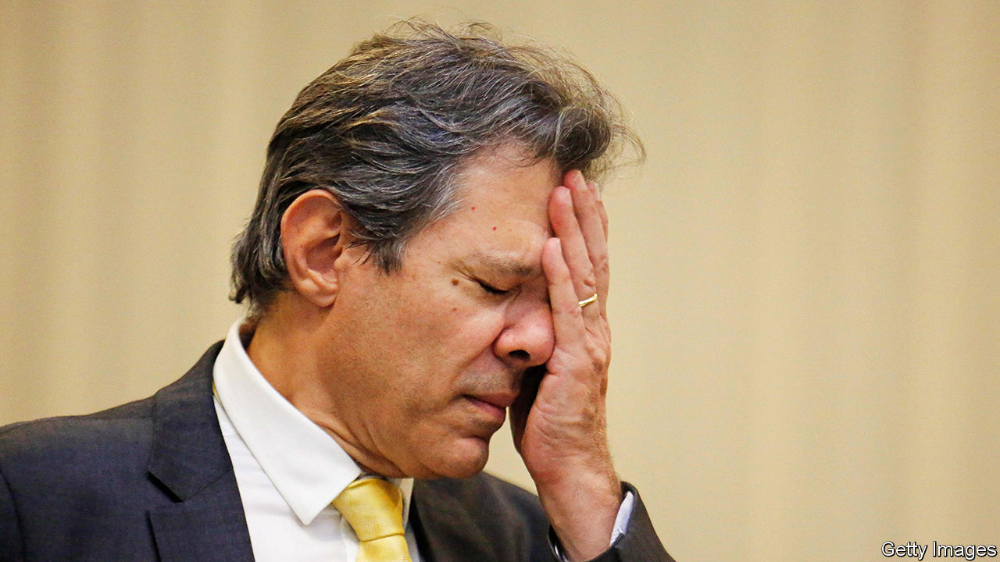

###### 5,000 tax rates and counting

# Can Lula fix Brazil’s fiscal mess? 

##### Reform of the world’s most complicated tax system will cut businesses’ costs—if lobbies permit it 

 

> Jan 29th 2024 

An overhaul of consumption taxes passed by Brazil’s Congress in December has been called “historic”, “revolutionary” and a “miracle”. “Nobody believed this would be possible,” boasted President Luiz Inácio Lula da Silva, known as Lula, to a standing ovation in Congress. For once, the superlatives are not misplaced. More than 30 years in the making, the reform will simplify the world’s most complicated tax system. But can Lula’s government withstand the pressure from special-interest groups in order to implement it fully?

The tax overhaul is the latest and most telling in a series of structural reforms in Brazil. In 2017 labour laws were modernised under Michel Temer, a centre-right president. Under Mr Temer’s right-wing populist successor, Jair Bolsonaro, Congress approved a pension reform that raised the retirement age. The flurry of reforms is happening because “frankly, the state ran out of money,” says Tatiana Ribeiro of the Competitive Brazil Movement, a research and advocacy group. A deep recession in 2014 was made worse by fiscal profligacy and prompted giant protests in Brazil’s biggest cities. 

To understand why the tax reform is considered revolutionary, consider the current system. The constitution, enacted in 1988, gave all three levels of government—federal, state and municipal—the power to levy consumption taxes. This makes Brazil an outlier. Of the 174 countries that have value-added taxes (VAT), the most common consumption tax, the vast majority collect them at the national level. Brazil is unique in allocating responsibility for taxation of services to municipalities and giving them a high degree of freedom in how to do it. As Brazil has a grand total of 27 states and 5,570 municipalities, the country became “a madhouse for taxes”, says Maílson da Nóbrega, a former finance minister.

This chaotic system has generated copious litigation. In 2019 the World Bank estimated that it took companies 1,501 hours a year to comply with Brazilian tax law, compared with a global average of 234. Many businesses are unsure which taxes they must pay, and to which entity. The value of current cases in Brazilian courts involving tax credits is over 5trn reais ($1trn), equivalent to 75% of the country’s GDP. 

Many companies go to court to have their products reclassified in order to avoid taxes. Crocs, a maker of plastic clogs, has been in a legal battle since 2015 to have its flagship product recognised as “slippers”, which are exempt from certain taxes, rather than “footwear with outer soles and uppers of rubber or plastics”, which are not. 

The tax system also introduces distortions. Unusually Brazil charges VAT where a good is produced, rather than where it is consumed. This has led states and cities to offer tax breaks to attract companies. It is impossible to quantify their cost, since most local governments do not tally them. But the IMF has estimated that such breaks amount to lost revenue of more than 5% of GDP every year. 

Stop suffocating us

The system also raises the cost of production and harms investment. Many of Brazil’s taxes are cumulative. This means that companies producing goods have to pay tax on each input that is bought without securing refunds, as happens elsewhere. Products which are more complex to produce, requiring more technology and inputs, are disproportionately burdened. 

Under the new system the five main consumption taxes will turn into two VAT rates: one collected by the federal government, the other by a steering committee with representatives from states and municipalities. Firms will now have to register only with the committee, rather than register and file tax returns in each state and municipality in which they operate. 

The committee will harmonise taxes across regions, ending the discretion of states and municipalities. Taxes will no longer be cumulative, credits for inputs will be automatic and taxes will be charged where products are bought. The simplification means that the standard VAT rate may end up at 27.5% by the end of 2033. By then the reform is due to be fully in force. 

That rate would still be the highest of any big economy, but a step down from the 34% which can apply today. EY, a professional-services firm, calculates that the typical number of hours needed to comply with consumption taxes alone will fall from 885 per year to 285. 

But the battle is not yet over. Though the reform will sharply reduce the number of “special tax regimes”, many exemptions will remain. Congress will define limits for these in the coming months. Lobbies have been hard at work. Tax benefits for Manaus, a manufacturing hub, will remain untouched. Agribusiness has wangled a 60% reduction from the general rate for its inputs. The “intellectual professions” will get a 30% reduction. This includes accountants, lawyers and journalists, many of whose jobs depend on tax chaos. 

Lula and Fernando Haddad, the finance minister, are fighting an uphill battle. In November Lula vetoed a bill extending payroll-tax exemptions for 17 sectors, including construction and retail. This exemption was introduced on a temporary basis in 2012. Instead of paying a 20% tax on payrolls for social security, companies in this scheme must pay only between 1% and 4.5% on their gross revenue. 

Studies have shown that the fiscal costs of the exemption far outweigh any benefits to job creation. Even so, the exemption has continually been renewed. Mr Haddad has pushed to scrap it, saying it is too expensive. But in December Congress overturned Lula’s veto. The exemption will now remain for another four years.

It can sometimes feel as if Mr Haddad has to fight against his own boss, too. Mr Haddad has been repeatedly criticised by his party for trying to keep fiscal accounts in order. On January 22nd Lula announced a new industrial policy that will involve deploying 300bn reais in grants and subsidised loans to national companies between now and 2026. As part of the announcement, the government mentioned it could introduce import-tax exemptions for inputs. Such moves undermine the idea of a simplified tax system. 

 “Brazil’s elites are in favour of reform as long as it maintains their privileges,” says Mr Nóbrega. For the tax reform to be considered truly revolutionary, Congress will have to resist the lobbies that have helped sustain the current morass. ■

