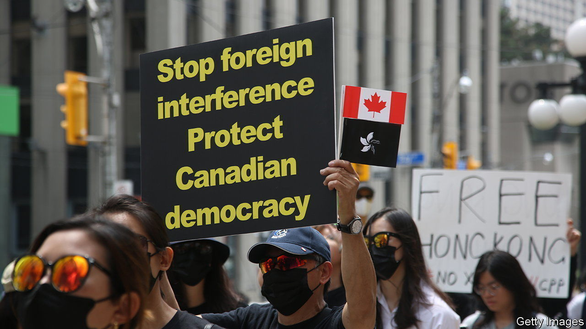

###### All eyes on Five Eyes

# Did spies from China, India and Russia meddle in Canada’s elections? 

##### A new inquiry seeks to find out the extent of foreign interference 

 

> Feb 1st 2024 

Justin Trudeau, Canada’s beleaguered prime minister, has had a tough few months. In September the Liberal Party leader made the explosive allegation that India was linked to the assassination of Hardeep Singh Nijjar, a Canadian citizen and Sikh separatist activist, on his country’s soil. India angrily denies this and diplomatic relations have soured. 

Now Mr Trudeau faces another test. On January 29th a public inquiry began probing the extent of foreign interference in the country’s last two elections. If it finds that Canada, a member of the “Five Eyes” intelligence pact, has been a playground for foreign spies, Mr Trudeau will have to answer accusations that his government failed to take threats to Canada’s democracy seriously.

The probe is overseen by Marie-Josée Hogue, a judge appointed to the bench by Stephen Harper, a former Conservative prime minister. The initial part of the inquiry will look at the role China, Russia and other countries attempted to play in the elections in 2019 and 2021 that returned Mr Trudeau to power in a minority government. Ms Hogue has also asked to see state documents that might point to meddling in those campaigns by India. Russian and Chinese officials have thunderously denied any interference in Canada’s elections. (India has not yet responded to the allegations.) 

Reporting by the , a newspaper, suggests that China attempted to use a network of diplomats, spies and proxies to invest money and political muscle to try and influence the election in 2021 in order for the Liberals to win a minority mandate. The implication appears to be that a weak Liberal government was more likely to serve Chinese interests than a more hawkish Conservative one. 

An earlier official inquiry also suggested there was a “well-grounded suspicion” that Han Dong, an MP in Toronto, may have unwittingly benefited from the support of the local Chinese consulate in 2019, when he won the Liberal Party’s nomination. Meanwhile Michael Chong, a Conservative MP, is thought to have been targeted by China, along with his family in Hong Kong, after condemning China’s treatment of Uyghurs.

Security officials say few should be surprised that there are foreign spies in Canada. The country’s generous immigration policies have created large diaspora populations. Canada’s proximity to the United States also makes it an attractive stomping ground for spooks. The two countries’ armed forces work closely together. “You can spy here and get intelligence benefits from the United States,” says Ward Elcock, a former director of Canada’s intelligence service. The inquiry’s final report is due before the end of the year. ■

